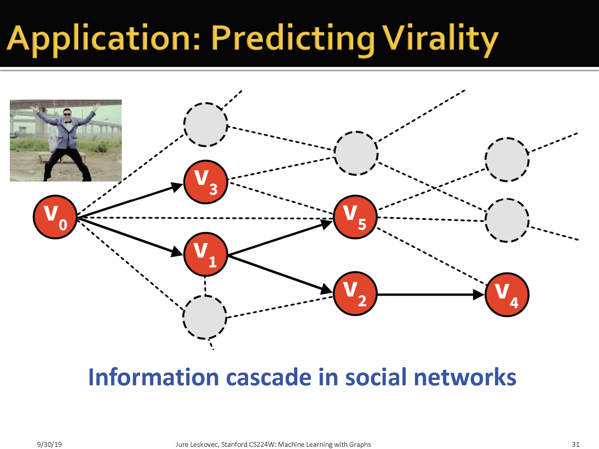

# Why Networks

Because networks are a general language for describing complex systems of interaction entities.

因为网络是表述具有实体交互的复杂系统的通用方法。

## 1.1 Types of Networks

> 身体的例子我们可以这样理解：我们的身体是由各种基因和蛋白质组成的图。药物研发就是找到可以改变图结构的过程。

## 1.2 Why Networks?

> 为什么要表示成图？
> + 图是描述复杂数据的通用形式
> + 在不同领域，它们可以共享vacabulary，容易做跨学科研究
> + 有大量的图数据
> + 真的很有效

# 2 Networks and Applications

> 社交圈是如何组合的？ 社交圈之间可能存在重叠

# 3 Structure of Graphs

## 3.1 网络组成

> 这里表示可以用网络表示演员合作关系、亲属关系等。

## 3.2 如何定义一个网络

## 3.2.1 网络表示形式

> Sink应该表示目的，即Target

> 这里定义了折叠图，即两个节点之间共享一个邻居节点，那么认为他们是有关系的（即相连的）

> 这里是解释如何将二部图转化为折叠图

### 3.2.2 如何用矩阵表示网络

+ 邻接矩阵
  + 每个元素表示任意两个节点之间的关系
  + 可能会稀疏
+ 链表
  + 每一行表示与该节点相连的节点
  + 每一行长度可能不一致

> 这里是说现实中，很多网络是稀疏的
> + 稀疏的标准：
> $$ E<<E_{max}(or \quad \hat{k}<<N-1) $$

