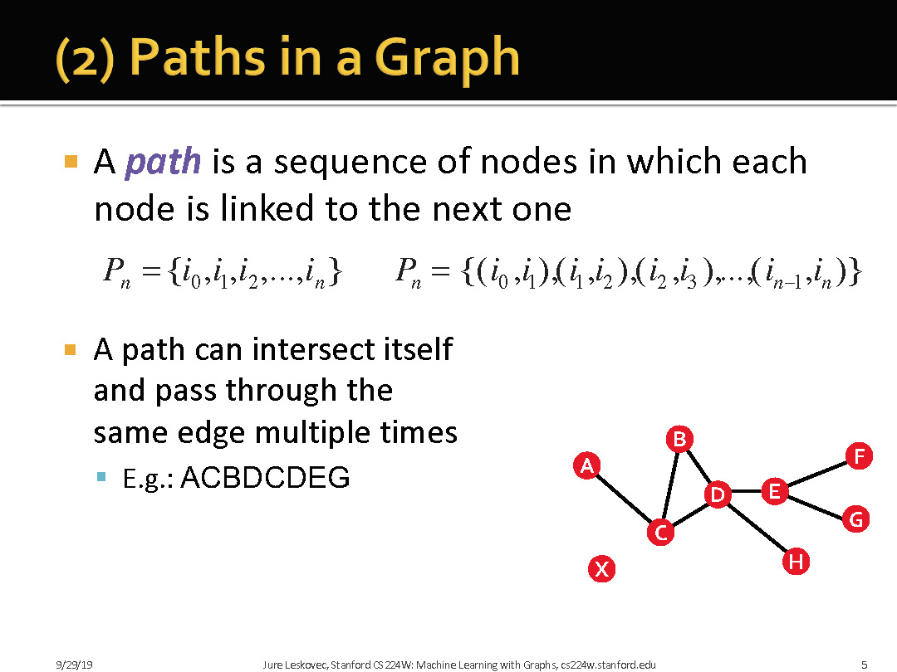
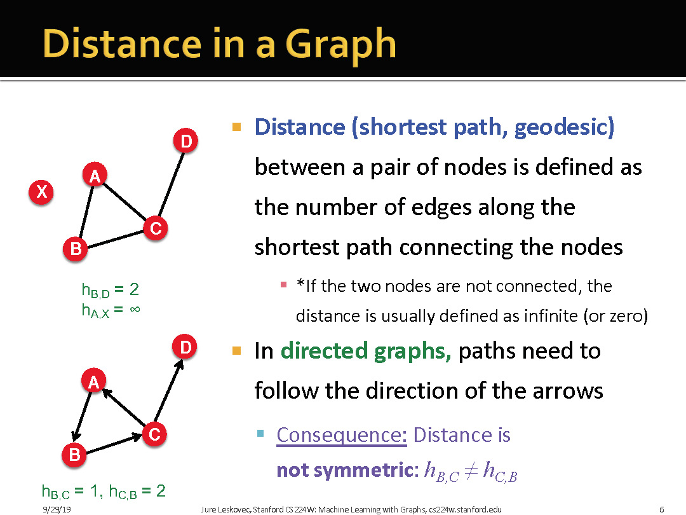
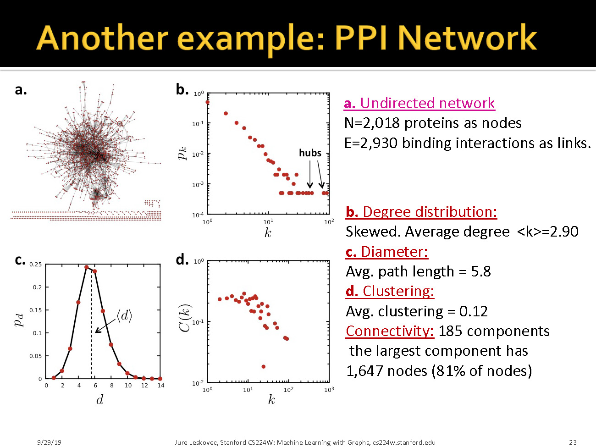
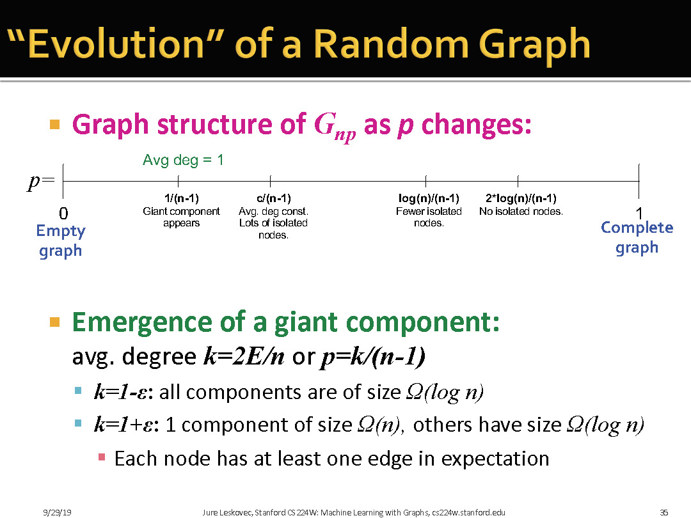
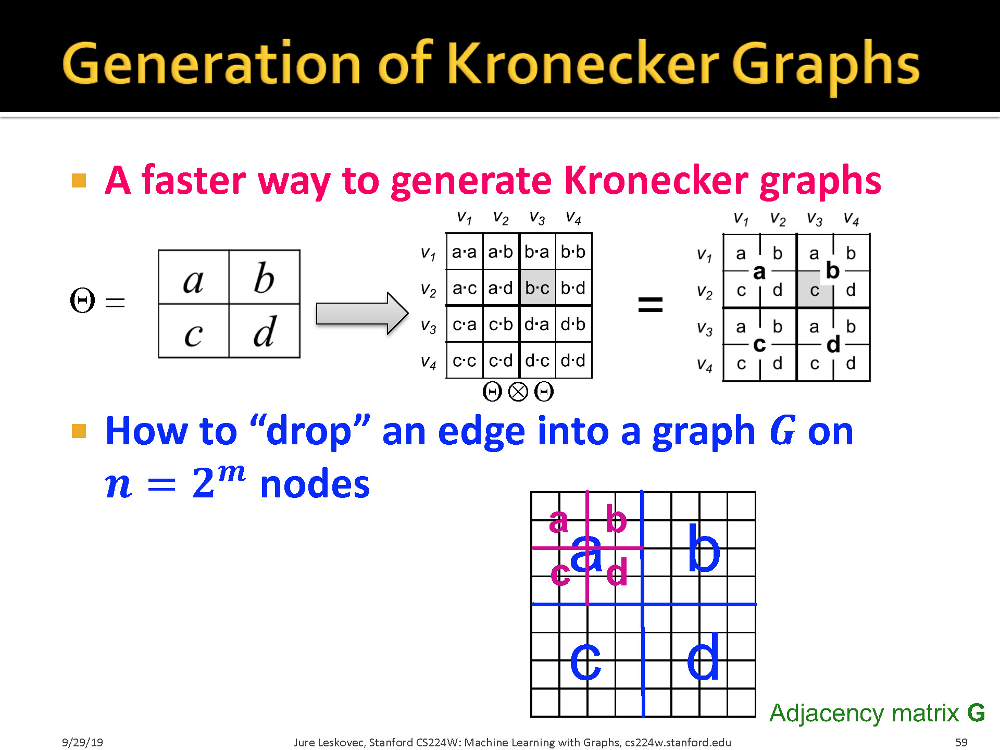

# Network Properties: How to measure a network

## 1.1 Plan: key network properties

### 1.1.1 Degree distribution

### 1.1.2 Path Length

### 1.1.3 Clustering coefficient

> 注意，这里是要衡量邻居节点之间互相认识的程度。即节点$i$的邻居之间边的数量除以节点$i$的度数。

### 1.1.4 Connected Componets

## 1.2 Measure these properties on real-world networks

> 这里是将度分布转化成log形式。

> 这里是说有一个巨大的连通子图将大多数人链接在一起，其他的边边角角组成枝叶。

# 2 Random Graph Model

## 2.1 E-R

> E-R图算法：
> + 初始化：
>   + 给定$N$个节点，以及连边概率$p\in[0,1]$
> + 随机连边
>   + 选择一对没有边相连的不同的节点
>   + 生成一个随机数$r\in(0,1)$
>   + 如果$r<p$，那么在这一对节点之间添加一条边，否则不添加
>   + 重复上述步骤，知道所有节点对都被选择

> E-R图的两个变种:

> $G_{np}$的度分布是二项式分布(Binomial)
> 最下面$\frac{\sigma}{\overline{k}}$意味着随着网络越来越大,$P(k)$分布会收窄

> Random Graph的聚集系数比较低. 而且在给定概率$p$的情况下, 随着网络的增大, Clustering coefficiency会逐步降低

> Expansion的目的是为了定义图的鲁棒性. 可以这么理解, 假定图的节点集合为$V$, 任选一个节点子集$S$, 去掉与集合$S$相关联的边的数目. 
> 或者可以这么理解, 为了让图中一些节点不具备连接性，需要cut掉图中至少多少条边？ 需要cut掉$\alpha$Num条边
>中间那个黑的就是 #edges leaving S

> 这张图解释了Expansion的意义.

> ER图可以扩展的很大,但他们的最短路径并不会爆炸增长

### 2.1.1 Comparison between E-R and MSN

## 2.2 Small-world model

Have high clustering coefficiency while also having short paths. 

### 2.2.1 Small-World 构造算法

## 2.3 Kronecker Graph Model

核心思想就是基于图的自我相似性,利用Kronecker积自我迭代.

> 这里要注意, 右上角和左下角的0是因为图的邻接矩阵就是这样,不是特地定义为0的.

### 2.3.1 Kronecker积定义

### 2.3.2 如何生成 Stochastic Kronecker Graphs

> 这里Fast的思想是: Kronecker图大量节点是0, 无需为他们浪费时间, 只考虑有值的点. 
> 思想就是根据初始矩阵迭代

