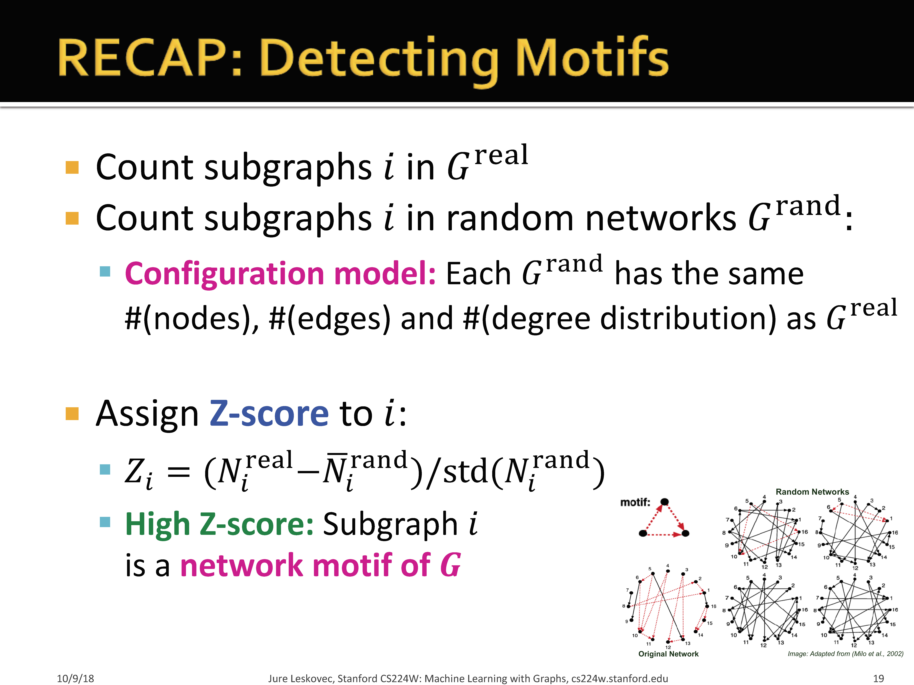
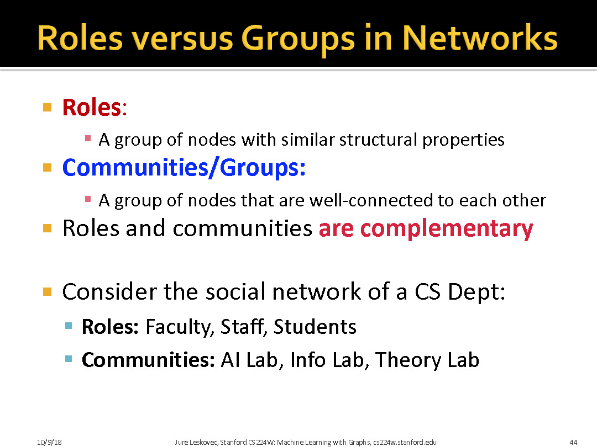
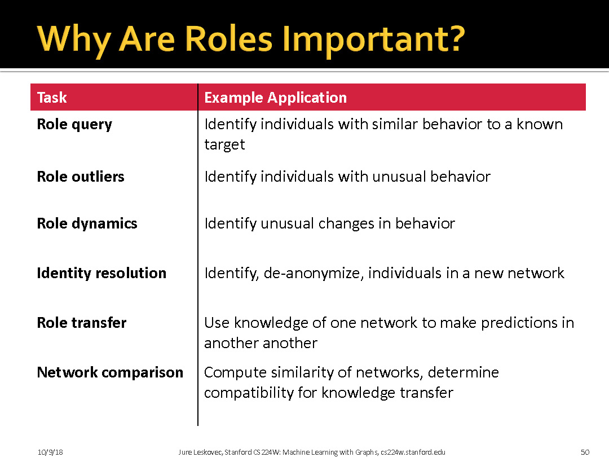

# 1 Subgraphs

> 一些定义:
> + 子图: 子图$G^{'}$中所有的顶点和边均包含于原图$G$。即$E^{'} \in E$，并且$V^{'} \in V$。
> + 生成子图(Spanning Subgraph)：生成子图$G^{'}$中顶点个数$V^{'}$必须和原图$G$中$V$的数量相同，而$E^{'}\in E$即可。
> + 导出子图(Induced Subgraph):导出子图$G^{'}$，$V^{'}\in V$，但对于$V^{'}$中任一顶点，只要在原图$G$中有对应边，那么就要出现在$E^{'}$中。
>

# 1.1 Motif

Motifs是从全局的角度描述这个网络，把网络拆解为子图与子图的组合来看待，如果可以把原来基于节点的网络换一个角度思考，看作基于motifs的网络，那么很多模型的理解方式也都改变了，或许可以挖掘出新的信息；

> 这里左边不是motif是因为左侧不是导出子图(Induced subgraphs). 没有包括所有的边

> 这里是说motif是可以覆盖的

> 真实世界中motif 的出现的频率远远大于随机网络

> std表示归一化

> 这张PPT我们可以这么理解. 使用空模型生成图. 目的是为了生成节点数目,边数目,和度分布都一样的图. 
> 下面的ACBD的度分别对应第二部分中的点数,随机地连接边,满足条件就生成了图.

> 这里表示了第二种生成图的方法. 直接交换边的终点. 但需要避免自环和多重边的产生. 

> 有较高的Z值对应的子图为网络的motif
> 通常来讲, 十万级的网络大概有10个左右的motif?

## 1.2 Graphlets

Graphlets是对motif的扩展，motif是从全局的角度来描述图的，全局的图有哪些motif，而Graphlet是从局部(节点)的角度出发来描述，关注这个节点和它邻居的情况，利用局部信息来对每个节点表示。

>这里关键是要理解同构的概念. 如图$G_0$, 两个节点完全等效. 如图$G_1$,两端节点明显和中间不一致. 如图$G_2$, 三个节点明显等效.

>因为两个d之间并未相连. 因此c不能匹配.因此为0 

# 1.3 Finding  Motifs and Graphlets

目标：找到大小为k的motifs/graphlets

挑战：

+ 枚举所有大小为k的连通子图
+ 计数，每类的子图的个数
+ 子图同构是一个NP问题
+ 随着子图大小的增加，复杂度指数增长，通常motif较小（3-8）

> + 目的是寻找大小为$k$的motifs或者graphlets. 
> + 两个集合:
>   + $V_{subgraph}$: 当前motif/graphlet
>   + $V_{extension}$: 要添加到motif中的候选子集
> + 想法:从节点$v$开始, 添加满足条件的节点$u$到$V_{extension}$, 满足的条件为:
>   + 节点$u$的id大于节点v
>   + $u$是新加入点$w$的邻居,而不是已经在子图中节点的数据
> ESU是一个递归算法,生成一个深度为$k$的ESU-tree

> 这里是ESU的示例.
> 目的是找到作图中大小为3的子图，树中前两层中，第一个元素为 $V_{subgraph}$ ,第二个元素为 $V_{extension}$，树中第一层是在做第一个算法的遍历，初始时，选取了节点1加入了 $V_{subgraph}$ ,它的邻居节点3在 $V_{extension}$ 中，然后执行 $EnumerateSubgraphs({1},{3},1)$ 函数，递归，第一轮，在 $V_{extension}$ 中移除了3，加入了245，再递归执行 $ExtendSubgraphs({1},{3},1)$ ，如此迭代，返回了三个子图，{1,3,2}, {1,3,4}, {1,3,5}，然后再遍历节点$v$=2，最终可以生成大小为3的6个子图，而这六个子图中，前五个是同构的，最终生成了两个motif/graphlet，计数分别为5和1。

# 2 Structure Role in Networks

# 3 Discovering Roles in Networks

> 这里是Role的重要性

> 这里是算法优势

> 这里是算法流程

> 所谓的ego network，它的节点是由唯一的一个中心节点(ego)，以及这个节点的邻居(alters)组成的，它的边只包括了ego和alter之间，以及alter与alter之间的边，

