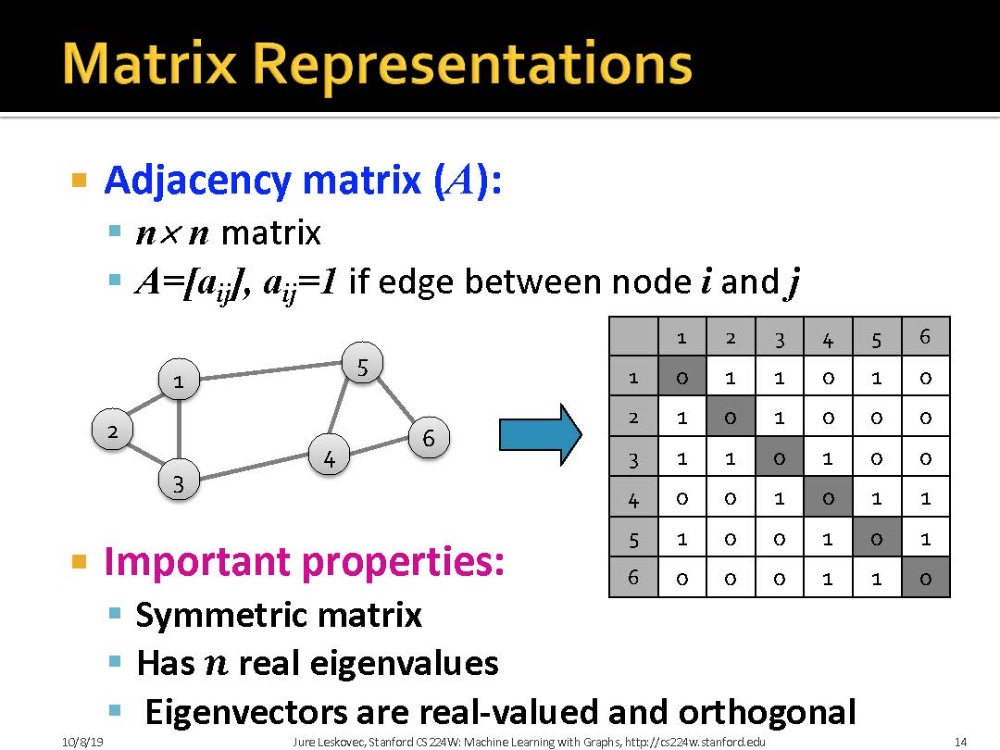
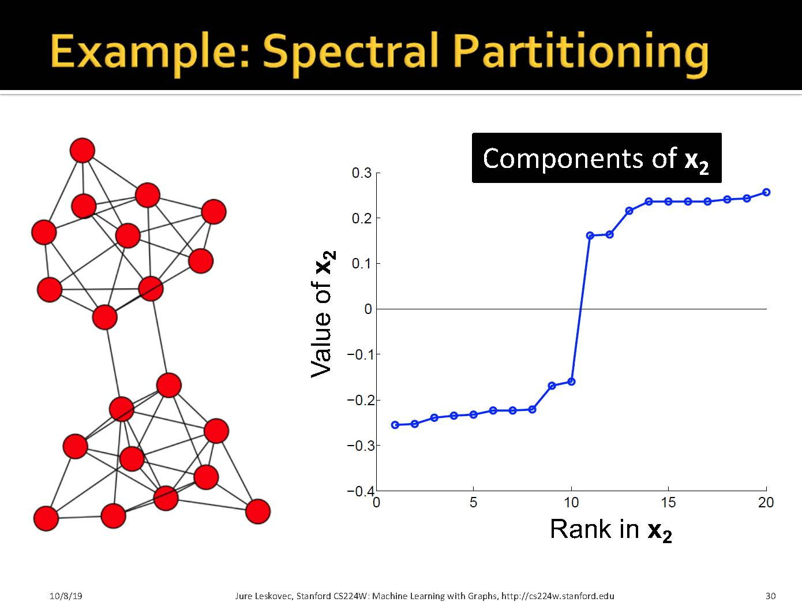
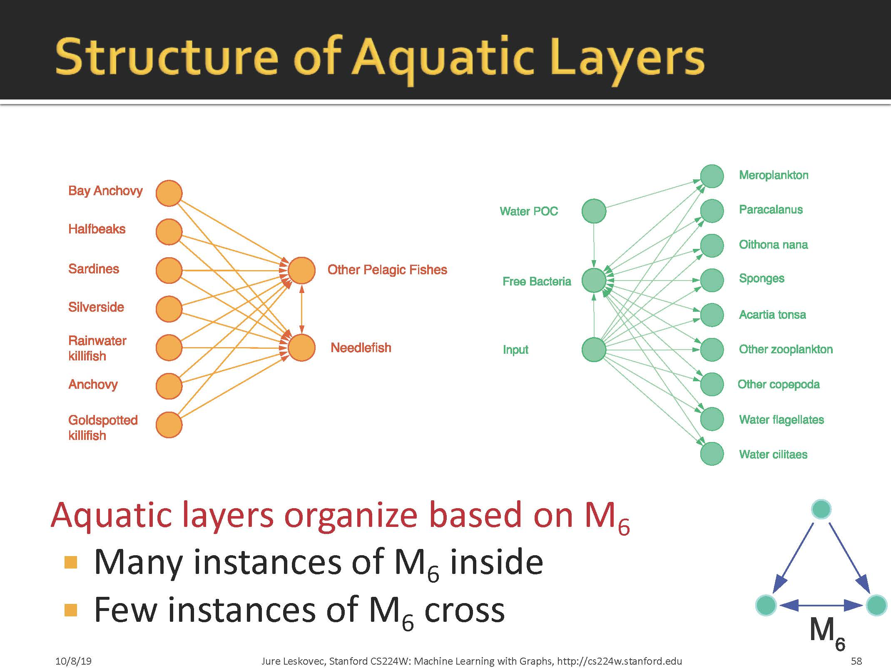

# 1 Introduction

## 1.1 问题定义

> 对一个图Bi-partition 是指将一个图分为A和B两组, 组内尽可能相似, 组间尽可能差异大. 

## 1.2 评价准则

> 如何衡量划分效果, 可以定义graph cut. 即两个集合之间连边的个数. 那么最优划分可以认为是最小化cut. 但是这样可能会带来一个问题, 例如下一页, 最优的分割应该是蓝色, 而不应该是绿色. 算法为了追求最小化cut, 

> 因此提出新的评判准则: Conductance. 这样分母为集合中度的最小值, 相当于起了归一化的作用.

## 1.3 图的矩阵表示

> + 我们可以认为$\boldsymbol{x}$是节点标签vector. 那么$\boldsymbol{A} \cdot \boldsymbol{x}=\boldsymbol{y}$ 我们可以认为$y_i$是节点$i$的标签为$x_j$的邻居的和
> 或者简单地理解为节点$i$更新自己的标签为它所有邻居标签为$x_j$和

> 我们可以认为, 所谓的用Spectural表示图, 就是用表示图的矩阵的特征值来表示图. 

> 如果图G中所有节点的度数都是d, 那么它特征值的最大值就是d. 
> $\boldsymbol{A}$是$G$的邻接矩阵, 我们可以认为每一行和每一列之和都是$d$. 那么$$\boldsymbol{\bar{x}}={1,1,1,\ldots,1}$$必定是$\boldsymbol{A}$的特征向量. 假设最大的特征值为$\lambda_n$, 它对应的特征值为$\boldsymbol{\hat{x}}$, $x_k$为绝对值最大的元素
> $$|\lambda_n|x_k=|\sum_{j=1}^{n} A_{kj}x_j|\le\sum_{j=1}^{n} A_{kj}|x_j|\le\sum_{j=1}^{n} A_{kj} x_k = d\cdot x_k$$
> 因此特征值最大为$d$

### 1.3.1 邻接矩阵

### 1.3.2 度矩阵

### 1.3.3 拉普拉斯矩阵

#### 1.3.1 拉普拉斯矩阵的性质
定理2的证明
$$
\begin{aligned}
   \boldsymbol{x}^T\boldsymbol{L}\boldsymbol{x} &= \boldsymbol{x}^T\boldsymbol{D}\boldsymbol{x}-\boldsymbol{x}^T\boldsymbol{W}\boldsymbol{x} \\
   &= \sum_{i,j=1}^{n}(D_{ij}-A_{ij})x_i x_j \\
   &= \sum_i D_{ii}x_i^2-\sum_{(i,j)\in E}2x_i x_j \\
   &= \sum_{(i,j)\in E}(x_i^2+x_j^2-2x_i x_j) \ge 0
\end{aligned}
$$

#### 1.3.2 第二特征值的意义

> $\lambda_2$是指第二小特征值结论的证明:
> 不妨限制特征向量$w_1, w_2, \ldots, w_p$均为单位向量. 记$W=(w_1, w_2, \ldots, w_p)$, $\Lambda=diag(\lambda_1, \ldots, \lambda_p)$, 则$W$为正交矩阵, 而且$M=W\Lambda W^T$. 
> 令$y=\frac{W^T x}{\sqrt{x^T x}}$, 则$y^T y=\frac{x^T W W^T x}{x^T x}=1$, 即$\sum_{i=1}^p y_i^2=1$
> 则有:
> $$\frac{x^T M x}{x^T x}=\frac{x^T W \Lambda W^T x}{\sqrt{x^T x}\sqrt{x^T x}}=y^t \Lambda y=\sum_{i=1}^p \lambda_i y_i^2$$
> 由于当$x^T w_1=0$时, $y_1=0$, 则
> $$min_{x:x^T w_1=0}\frac{x^T M x}{x^T x}=min_{\sum_{k=2}^p y_k^2=1}\sum_{k=2}^p \lambda_k y_k^2 = \lambda_2$$

#### 1.3.3 特征值&谱聚类

根据上述结论:
$$x^T L x=\sum_{(i,j)\in E}(x_i - x_j)^2$$

$$\lambda_2=min_{x:x^T w_1=0}\frac{x^T L x}{x^T x}$$

为满足上面两式, 需要限制两个条件:
+ $x$是单位向量: $\sum_i x_i^2=1$
+ $x^T w_1=0$, 由于在拉普拉斯矩阵中, 最小特征值为0, 对应的特征向量为$(1, \ldots, 1)$, 则有$\sum_i x_i=0$ 

现在回到谱聚类当中, 由于$\sum_i x_i=0$, 则$x_i$的值必然有正有负, 例如下图, 坐标轴两侧有一些点, 在谱聚类中, 我们希望最大化组内链接, 最小化组间链接, 也就是说希望尽可能少的跨越0点. 即我们希望 $min\sum_{i,)\in E}(x_i - x_j)^2$(这里可以这样理解, 如果没有跨越0点, 则平方和比较小, 如果跨越多, 则就大了). 联合上式, 我们有
$$min_{\sum_i x_i=0}\frac{\sum_{(i,j)\in E}(x_i -x_j)^2}{\sum_i x_i^2}=min_{\sum_i x_i = 0} \frac{x^T L x}{x^T x}=\lambda_2$$

为什么不利用$\lambda_1$?因为$\lambda_1$恒为0,图一定是不连通的, 最小化没有意义, 所以要给一个限制条件后利用第二小特征值. 综上所述, 就可以利用拉普拉斯矩阵第二小特征值对应的特征向量来划分.

#### 补充内容

# 2 谱聚类算法

#### 如何划分k类呢

# 基于motif的谱聚类

