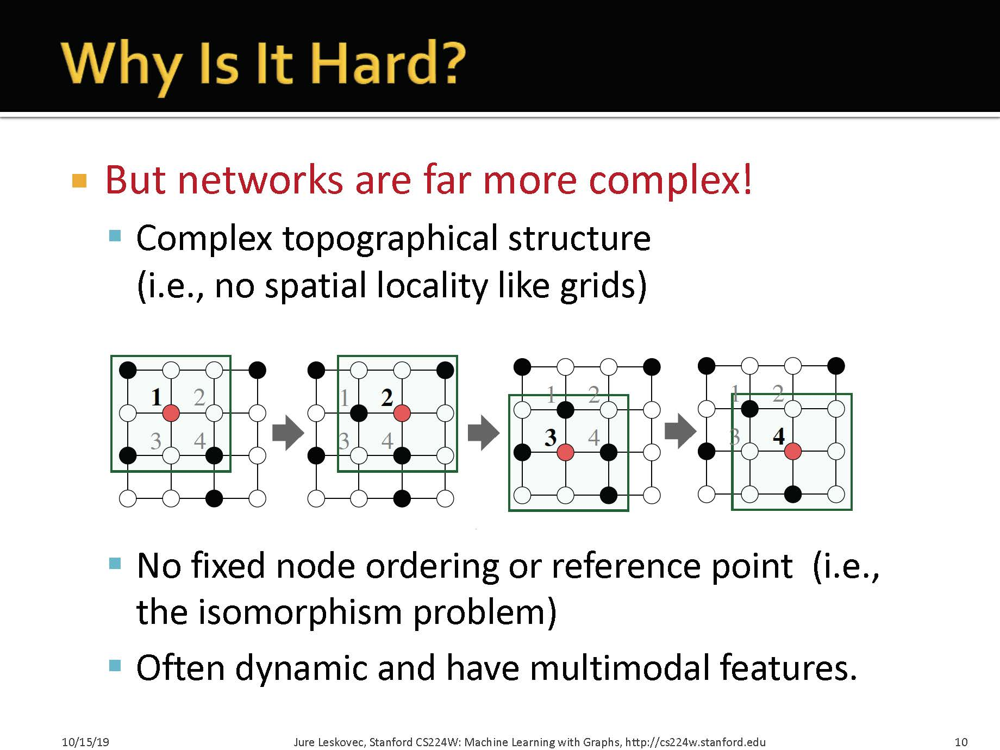
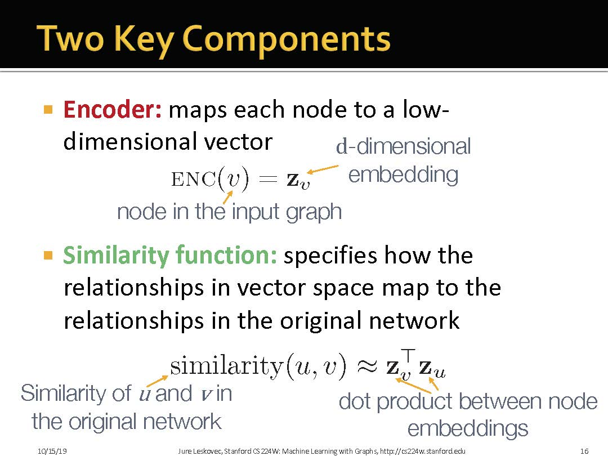
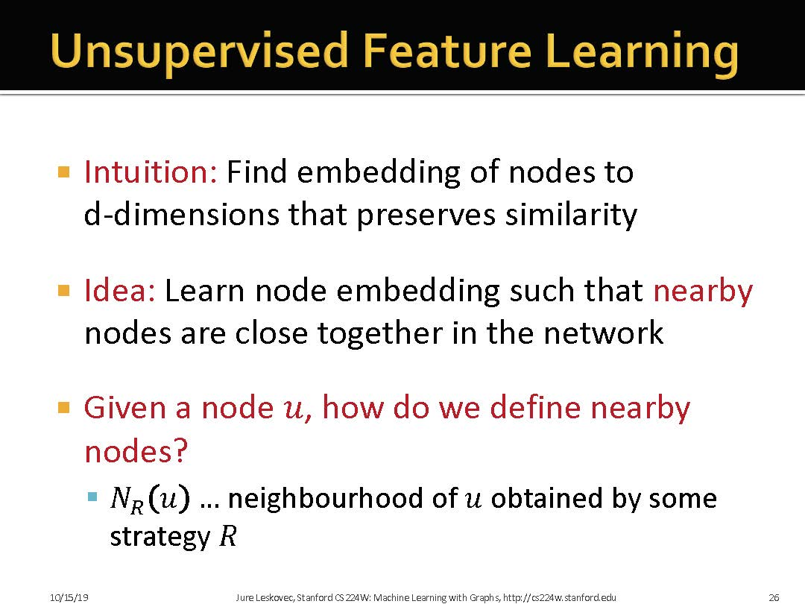
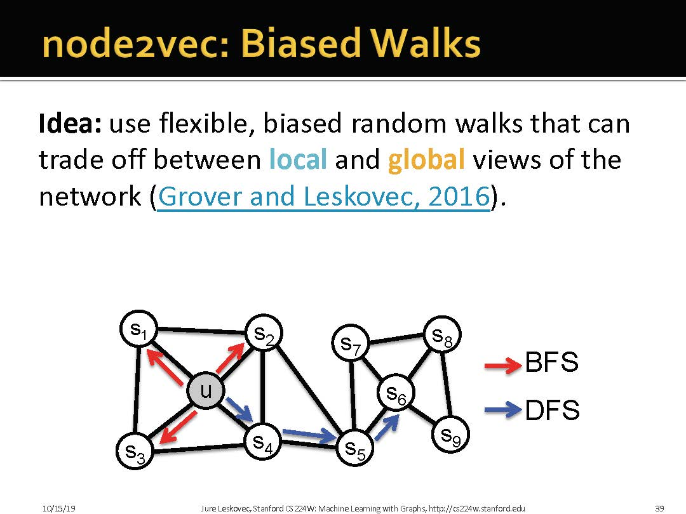
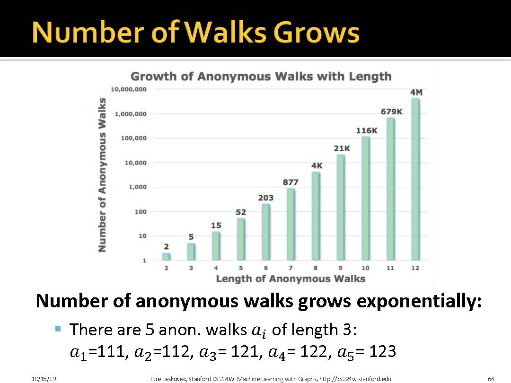
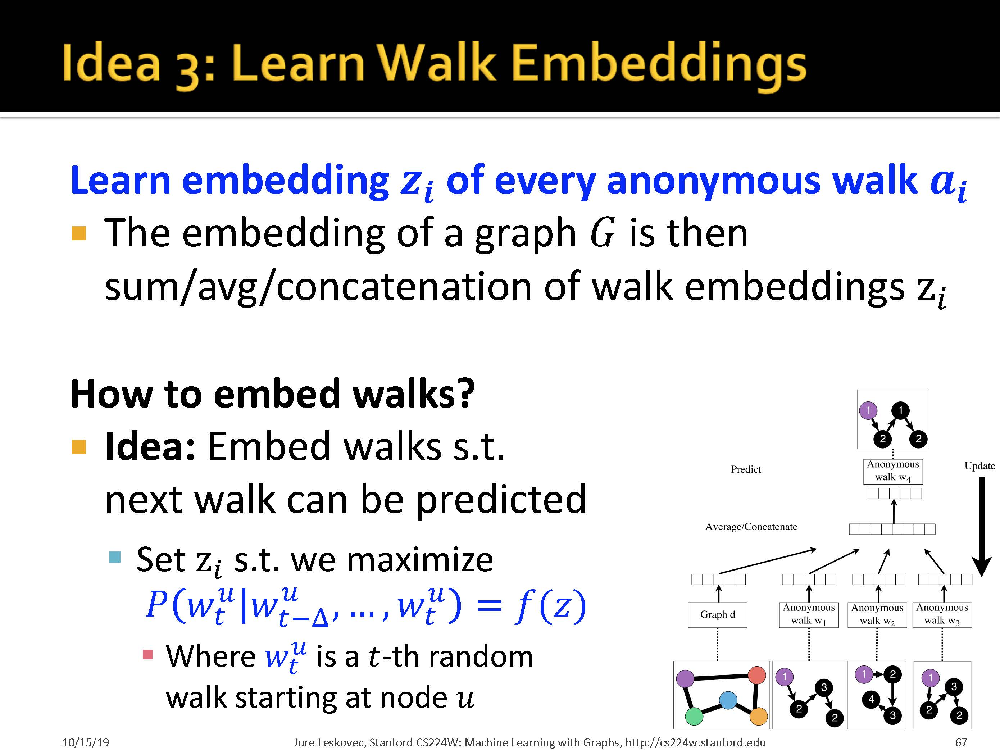

    # 1 图表示学习的思想

> 在机器学习中, 表示学习的思想就是希望能够自动地学习特征

> 在图表示学习中, 我们希望能够获得task-independent的特征

> 我们可以看到,图的邻接矩阵通常是很稀疏的, 因此我们希望用更紧密的矩阵来表示一个图. 

> 这个例子可以看到, 相邻的点在映射空间中距离更近

## 1.1 图表示学习的难点

+ Modern deep learning toolbox is designed for simple sequences or grids, but network are far more complex! 

1. 图数据是非欧空间数据, 不满足平移不变性, 而且每个节点都有独特的局部结构. 
2. 图数据具有多样的特性. 具体来讲, 每个节点, 每条边, 都可以有丰富的语义信息. 
3. 图数据的规模很大

# 1.2 Embedding Nodes

### 1.2.1 Node Embedding 步骤

> 最简单的节点嵌入是将Encoder作为一张查找表

# 2 Random-Walk Approaches to Node Embedding

# 3 Node2Vec

>Node2Vec核心思想, 结合BFS和DFS

# 4 Translating Embeddings for Modeling Multi-relational Data

# 5 Embedding Entire Graphs

