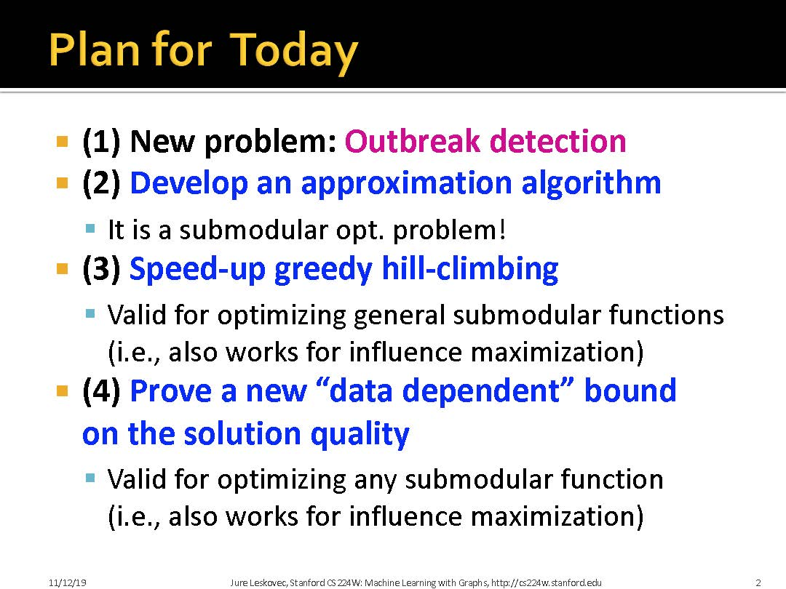
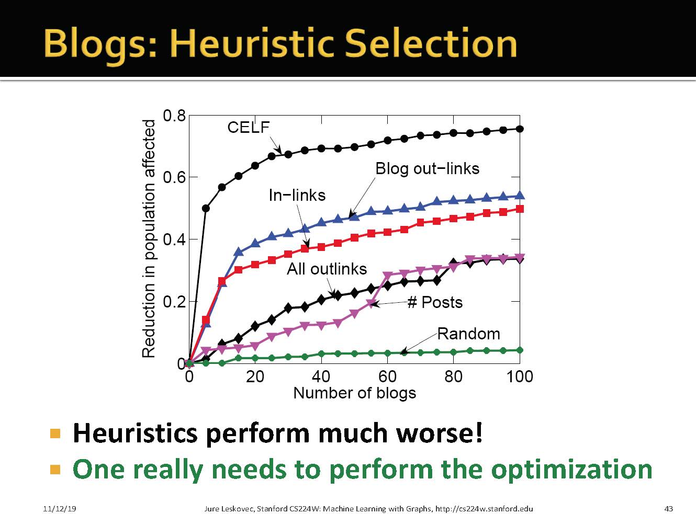

# 1 New problem: Outbreak detection

这个可以看做是传播最大化的逆向问题

## 1.1 General Problem

# 2 CELF: Algorithm for optimizing submodular functions under cost constraints

而CELF算法：根据IC模型条件下，节点的Δinfs符合子模性，于是在A加入Seeds后，在下一轮计算各个节点的边际影响力Δinfs时，如果计算出B的Δinfs大于或等于上一轮中比它小且最接近它的那个节点（这里是C）在上一轮中的Δinfs，那么这一轮就可以直接把B加入到Seeds当中，而不用计算后面C,D,E...等节点的Δinfs了，因为他们在这一轮的Δinfs必定比上一轮自己的Δinfs小，所以B就是这一轮最大的，所以选B没错，因此节省了很多计算步骤。

