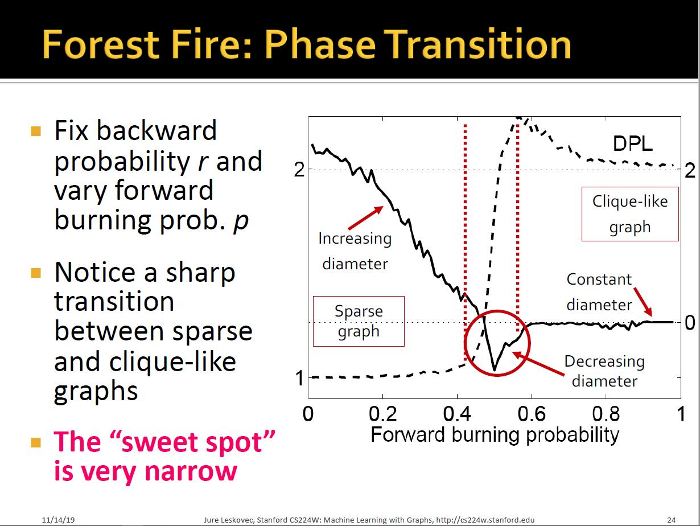
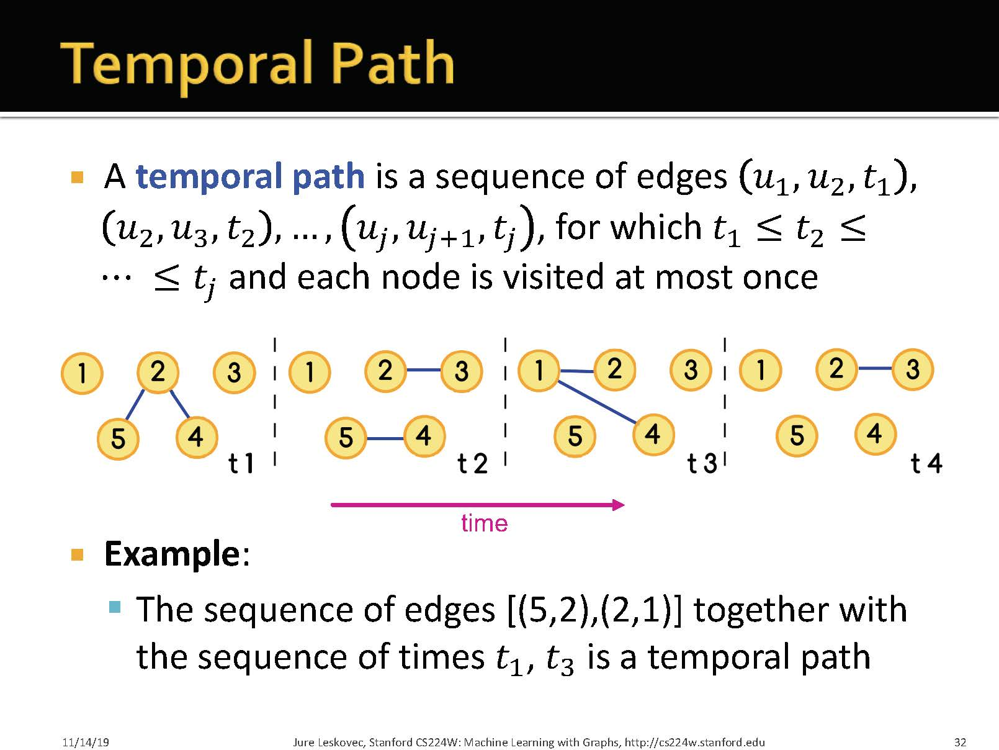

# 1 Macroscopic Network Evolution

## 1.1 Forest Fier Model

每一轮都有一个新节点v加入, 随机选择一个节点w作为大使节点. w产生两个随机数x和y分别作为出节点数和入节点数. 随后递归的点燃火势. 最后节点v与这些点燃的节点相连. 

# 2 Microscopic Network Evolution

> 这里的意思是说$t_2$和$t_1$的差距越大, 用户u选择x通信的概率越低. 
> $\beta$值越小, 越容易停在度数大的节点, 但收敛越慢. 

# 3 Mesoscopic Network Evolution

