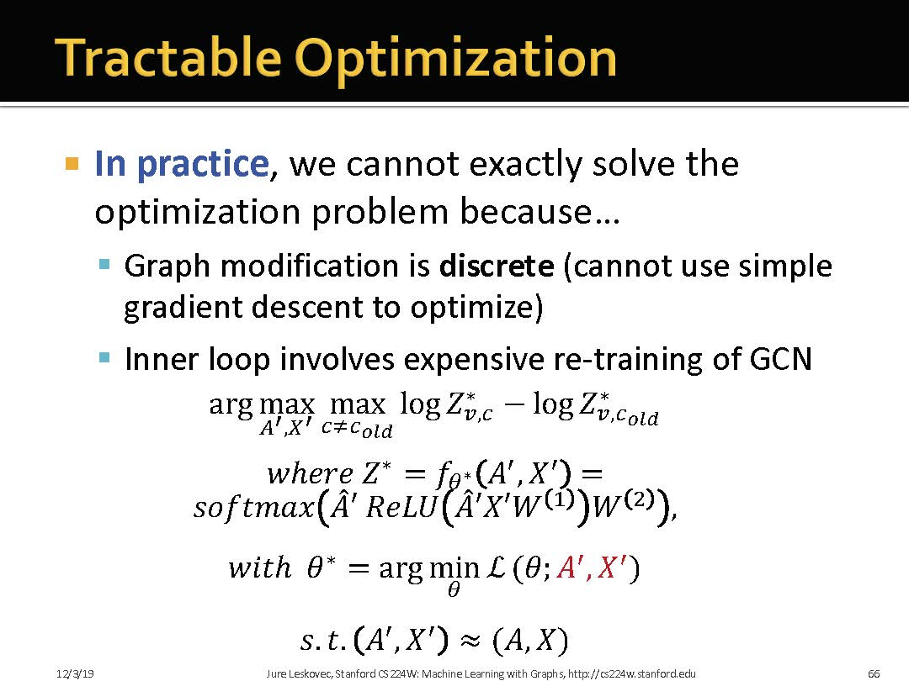

# Summary of Limitations of Conventional GNNs

GNN的核心思想是: generate node embeddings based on local network neighborhoods. 
+ Nodes aggregate information from their neighbors using neural networks. 
+ Obtain graph representation by pooling node representation (Sum, average, max, etc.)

**Limitations:**

+ 一些简单的图无法用常规的GNN区分.
+ 难以对抗噪声攻击

# 1 Limitations od conventional GNNs in capturing graph structure

## 1.1 Graph Isomorphism
现实情况下, 不存在多项式时间内检验图同构的算法. GNN可能会有效. 需要进一步考虑GNN的机制. 

GNN希望构建Injective(单射)函数, 这样就可以对于不同的图映射为不同的表示, 进而进行区分.

Entire neighbor aggregation is injective if every step of neighbor aggregation is injective. 

## 1.2 neighbor Aggregation

Neighbot aggregation is essentially a function over multi-set(set with repeating elements). 

**Discriminative power of GNNs can be characterized by that of multi-set functions**

### Case1 GCN
**Use Mean pooling+Linear ReLU**
GCN will fail to distinguish proportionally equivalent multi-sets.  
**Not injective**

### Case2 GraphSAGE
**MLP+Max Pooling**
GraphSAGE will even fail to distinguish multi-set with the same distinct elements
**Not injective**

**上面这两个例子都是因为mean和max都会导致多个结构映射到同一个结果**

## 1.3 Injective multi-set function

GIN的 aggregation是单射的

### 1.3.1 How powerful is GIN?

GIN is closely related to Weisfeiler-Lehman Graph Isomorphism Test

因为WL-test需要从根节点逐步展开(采样)邻居. 而GIN则可以看做是逐步将节点聚合. 

**WL-Test**
+ Map different rooted subtrees to different colors
+ WL then counts different colors
+ WL compares the count

> 这图颜色好像有问题

# 2 Vulnerability of GNNs to noise in graph data

深度神经网络中也存在这个问题, 容易被攻击. 

## 2.1 攻击的情况

## 2.2 Nettack: High Level Idea
在有限的攻击下,能够最大化的误导模型预测.

### 2.2.1 形式化定义

**简单理解:** 对图的结构做简单修改(噪声),  最大化改变节点标签的可能. 图上的攻击主要有两种
+ 攻击结构, 就是修改邻居矩阵A
+ 攻击属性,就是改变节点属性X
同时,攻击还不能太明显.

**难点:**
+ 修改A和X的操作都是离散的, 没法用SGD优化
+ 定义中的GCN是基于修改后的$A^{'}$和$X^{'}$训练的,也就是说每修改/攻击一次,就要重新训练GCN.这谁顶得住啊...

**一些解决方法:**
+ 贪婪搜索
+ 简化GCN的训练过程

# 3 Open questions & Future directions