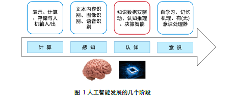

# 1 概述篇

## 1.1 认知图谱的概念

总体来说, 人工智能的发展经历了表示, 计算到感知两个阶段, 下一阶段的核心是认知. 

*唐杰:认知图谱=知识图谱+认知推理+逻辑表达. 并希望利用知识表示, 推理和决策, 包括人的认知来解决复杂问题.* 
基于认知科学中的双通道理论, 认为人脑认知系统包含System1和System2, 出自"人工智能下一个十年"

## 1.3 认知图谱机遇与挑战

**感知智能技术的缺陷:**
+ 鲁棒性差. 
  + 准确度越高的模型鲁棒性普遍越差, 且分类错误率的对数和模型鲁棒性存在线性关系. 
  + 相比于模型大小, 模型结构对于鲁棒性的影响更大
+ 模型可解释性差, 难以胜任可靠性要求高的任务. 大部分阅读理解方法都只能看作黑盒, 无法看到他们的推理过程
+ 缺乏积累知识的能力

# 2 技术篇

## 2.1 知识图谱

### 2.1.3 知识图谱关键技术

#### (1) 知识图谱表示
知识图谱表示又称知识图谱嵌入, 关键思想是将知识图谱中实体和关系映射到连续的向量空间中, 以便**简化操作, 同时保留知识图谱的固有结构**. 嵌入技术主要包含两类: 平移距离模型(Translational Distance Models)和语义匹配模型(Semantic Matching Models). 

+ **平移距离模型:** 基于距离评分函数, 通过两个实体之间的距离来度量事实的合理性. 代表模型: 
  + TransE及其变体: TransE, TransH, TransR, TransD
  + 高斯嵌入模型: KG2E, TransG. 核心思想是*知识图谱中的实体和关系的语义本身存在不确定性,因此用高斯分布来建模实体对应的语义*. TransG的核心思想是*关系$r$在不同场景下有不同的语义, 因此对不同语义形成多个高斯分布*
+ **语义匹配模型:** 基于相似性评分函数, 通过匹配实体的潜在语义和向量空间表示中包含的关系来度量事实的可信性. 
  + RESCAL及其变体:
    + RESCAL: 将实体表示为向量, 并将关系表示为矩阵. 并将评分函数定义为双线性函数. 可以更好地建模实体和关系之间的潜在关系
    + DistMult: 将关系矩阵限制为对角矩阵来简化RESCAL, 但这样**无法处理不对称关系**
    + HOIE:对RESCAL简化. 通过先对实体进行循环关联操作, 再和关系矩阵结合运算. 由于向量交换不满足交换律, 因此**可以建模不对称关系**
  + 基于神经网络的匹配模型:
    + SME:语义匹配能量模型. 针对事实三元组$(h,r,t)$, 将关系和实体均建模为嵌入向量. 然后将关系$r$和头实体$h$组合得到$g_u(h,r)$, 关系$r$和尾实体$t$组合得到隐藏层中的$g_v(t,r)$, 事实三元组的分数可以由点积得到 $$f_r(h,t)=g_u(h,t)^T g_v(t,r)$$
    + NTN: 神经张量网络模型首先将事实三元组$(h,r,t)$中的实体投影到输入层中的嵌入向量, 然后将这两个实体$h,t \in R^d$由特有的张量$M_r \in R^{d \times d \times k}$组合, 映射到非线性隐藏层. 最后一个针对关系的线性输出层给出评分. $$f_r(h,t) = r^T tanh(h^T M_r t + M_r^1 h + M_r^2 t + b_r)$$. 其中, $M_r^1, M_r^2 \in R^{k \times d}$和 $b_r \in R^k$ 分别是关系的权重矩阵和偏差向量.  
    + MLP: 多层感知机. 将每个关系以及实体表示为向量. 对于给定事实, 将$h,r,t$连接在输入层, 并映射到非线性隐藏层, 然后由线性输出层生成分数. 
    + NAM (Neural Association Model): 神经关联模型. 对于给定的事实三元组, 首先将头实体的嵌入向量和关系链接起来, 输入到L层神经网络中. 最后再和尾向量点乘得到分数. 

#### (2) 知识图谱构建

**数据层:** 包含大量事实信息, 即(实体, 关系, 实体)和(实体, 属性, 属性值)

**模式层:** 在数据层智商, 是提炼后的知识. 通常采用本体库来管理模式层. 即用本体库对公理, 规则, 和约束条件的支持能力来规范事实三元组之间的联系. 

#### (3) 知识图谱存储
