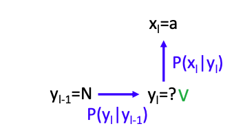
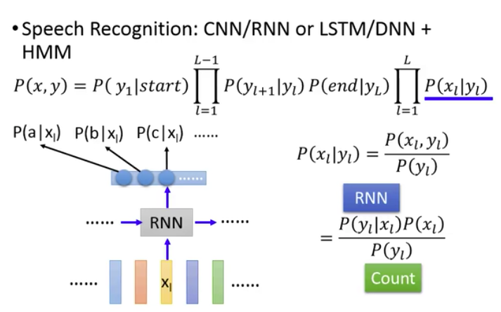

本文主要介绍了几种传统的序列标注方法，包括HMM（隐马尔可夫模型），CRF（条件随机场），Structed perception/SVM。

#### Introduction

##### Sequence Labeling

首先叙述sequence labeling的基本概念，machine的任务就是学习出一个函数f，可以实现sequence X到Y的转换。

现在我们假设X和Y的长度是一样的，输入$x_1,...,x_L$，输出为$y_1,..,y_L$，这个任务其使用RNN就可以完成，本文将叙述另外一种方法来进行sequence labeling。

##### Application

##### Example Task

本文会使用POS tagging来当作讲解的例子，我们要对一个句子中的每个word进行标注，词性的类别有很多，有名词、动词、副词等

如果现在有一段话“John saw the saw.”，需要进行词性标注，那么“John”的词性就是是proper none，第一个“saw”是verb，第二个“saw”就是Noun；

pos tagging是sequence labeling中比较basic、也比较重要的一个task，是很多文字处理程序的基石，比如必须先进行pos tagging，才可以再进一步做文本分析。

那么pos tagging任务是不是用一本词典就可以完成了呢？

答案是不能，pos tagging任务还需要考虑word在句子中的顺序，才可以得出正确的词性，比如“John saw the saw.”这句话中，第一个“saw”是verb，第二个“saw”就是Noun；因此我们只考查词典是不能完成任务的，还需要完全理解整个句子的语义才可以得出正确的结果。

#### Hidden Markov Model (HMM)

##### Introduction

如果使用HMM的思想来生成一个sequence，首先会生成一个POS sequence，再根据这个pos sequence来生成对应的词汇，从而生成最后需要的那个句子。

Step1: 在pos sequence中的第一个词汇，有0.5的几率是det，0.4的几率是propnoun，0.1的几率是verb；现在我们就可以进行random的sample，假设sample到了propnoun；下一个词有0.8的几率是verb，假设就sample到了verb；下一个词很可能就结束了

Step 2: 现在我们知道了pos sequence，就可以来进行填词，把每个词性对应的词汇找出来，

HMM就是在描述，使用这个pos sequence来生成这个句子的几率，怎么说出这句话来。我们用$P(x,y)$表示这个word sequence x和pos sequence y一起出现的几率，$P(y)$表示这个pos sequence出现的几率，$P(x|y)$表示在y这个条件下，生成这个word sequence的概率。

对于下图中的例子，$P(y)$表示PN放在句首的位置，PN后面接V的几率，V接D的几率，D接N的几率；$P(x|y)$就表示PN产生John的几率，V产生saw的几率，D产生the的几率，N产生saw的几率。

这里是HMM的进一步叙述，step 1和2分别计算transition 和emission probability

##### Estimating the probabilities

那么我们要怎么来计算这些概率呢，即PN后面接V，V产生saw的几率？

这些概率都是通过training data得到的。首先要收集一大堆的training data（sentence），这些sentence中的每个词我们都找专家标好了对应的词性，有了这些标记好的training data，我们就可以来计算这些概率了。

现在如果要计算这个tag是s，s的下一个tag是$s'$的概率，我们可以先计算出training data中s后面是s'的次数，再计算s出现的次数，即
$$
P(y_{l+1}=s'|y_l=s)=\frac{count(s\rightarrow s')}{count(x)}
$$
对于给出的tag是s，我们从s的词袋中找出对应的word是t的概率，我们可以计算出training data中tag s后面是word t的次数，再计算s出现的次数，即
$$
P(x_{l}=t|y_l=s)=\frac{count(s\rightarrow t)}{count(x)}
$$
$P(y_1|start)$表示$y_1$在句首出现的次数，$P(end|y_L)$表示$y_L$在句末出现的次数，我们就可以根据下图中的公式计算pos sequence y和word sequence x一起出现的几率$P(x,y)$，

##### How to do POS Tagging?

我们现在可以看到word sequence x，但并不知道pos sequence y，y是隐藏的，需要我们通过某种算法来求解。

我们要找到的y，其实就是使在给定word x的条件下，pos tag是y的概率最大的那个y，即
$$
y=arg\mathop{\rm max}_{y\in Y}P(y|x)=arg\mathop{\rm max}_{y\in Y}\frac{P(x,y)}{P(x)}
$$

##### Viterbi Algorithm

由于x是给定的，我们可以只考虑分子部分，那么现在的问题就变成了
$$
\tilde y=arg\mathop{\rm max}_{y\in Y}P(x,y)
$$
那么现在我们可以对所有可能的y进行穷举，假设pos tag一共有$|S|$个，pos sequence y的长度是$L$，那么一共有$|S|^L$种可能，这个计算量是非常庞大的；

但现在有Viterbi Algorithm，我们可以对这个过程进行简化，可以把复杂度降低到$O(L|S|^2)$。这个算法可以看成是一个function，输入word x，输入可能性最大的那个tag y。

##### Summary

HMM是一种structed learning的方法，需要回答三个问题，

Problem 1: 找到evaluation function，这里我们找的就是x和y的联合概率分布 $P(x,y)$ ；

Problem 2: 进行inference，找到对应的x，来使evaluation function $P(x,y)$的概率最大；

Problem 3: training，$P(y),P(x|y)$都可以从training data中的统计数据算出。

##### Drawbacks

对于HMM算法，要找出使得evaluation function值最大的$\tilde y$。现在假设$\hat y$是正确的tag sequence，我们就必须要要求$P(x,\hat y)>P(x,y)$，才能保证$\hat y$是正确的sequence；但HMM并不能做到这件事，并不能保证错误的y带进去的概率$P(x,y)$，一定小于正确的$\hat y$带进去的概率。

现在举一个例子来说明这件事，有transition probability：P(V|N)=9/10，P(D|N)=1/10，分别表示tag N后面是V、N后面是D的概率；还有emission probability： P(a|V)=1/2，P(a|D)=1 ......，分别表示tag V对应的word是a、D对应的word是a的概率；

那么现在有一个需要解决的问题，现在我们知道在l这个时间点对应的word是a，$y_l$这时最有可能对应的tag是什么呢？

现在我们已经知道了$P(x_l|y_l),P(y_l|y_{l-1})$，把$y_l=V$带进去，我们可以得到tag N之后是V的概率为0.9，V对应的word是a的概率是0.5，$0.9\times 0.5=0.45$；如果我们把$y_l=D$带进去，概率就是$0.1\times 1=0.1$；明显是V对应的概率是最大的，因此我们可以认为这里的$y_l=V$

如果现在有这样的training data，N后面接V，有9个这样的数据，P后面接V，也有9个这样的数据，而N到D只有1个；那么N可以到V，也可以到D，到V的概率就是0.9，到D的概率是0.1；V只能退出a或者c，概率都是0.5；

按照HMM算法，计算概率的大小，$N\rightarrow V\rightarrow a$概率是0.45，而$N\rightarrow D\rightarrow a$概率是0.1，明显中间节点是V的概率更大；

但按照我们自己的分析，training data中明明就直接有一项$N\rightarrow D\rightarrow a$，但HMM却没有选择D，明显不符合常理。

这里我们对HMM进行总结：

+ 缺点：如果有一个pair (x,y)从来没有在training data中出现过，hmm还是很可能给这个pair一个很高的几率；
+ 优点：hmm在training data很少时比其他的方法performance要好。

之所以HMM会出现这个问题，是因为hmm的transition和emission probability是**分开计算**的；我们可以用一个更复杂的模型，CRF来解决这个问题。

#### Conditional Random Field (CRF)

我们可以把$P(x,y)$是正比于$exp(w\cdot \phi (x,y))$的，设一个比例系数R，可以看作是，
$$
P(x,y)=\frac{exp(w\cdot \phi (x,y))}{R}
$$
在CRF中，我们选择$P(y|x)$作为evaluation function

##### P(x,y) for CRF

把hmm的evaluation function进行log，可得到多个式子相加的形式

其中$N_{s,t}(x,y)$表示在$(x,y)$这个pair中，tag s和word t出现的次数。$(x,y)$表示专家标记之后的一个sentence。

下面讲一个具体的例子。

$logP(the|D)$出现了两次，即$N_{D,the}(x,y)=2$,

$logP(x,y)$中的其他项也进行类似的处理,

把这些展开的式子再代入原式子，就可以看作是两个vector进行dot product

对于w这个矩阵，其中每个维度的元素和原来的hmm都有着某种联系。比如$w_{s,t}=logP(x_i=t|y_i=s)$，表示在tag为s的条件下，取word为t的概率大小；如果对这个式子再取exp，那么就可以得到$P(x_i=t|y_i=s)=e^{w_{s,t}}$；

但直接写$P(x,y)=exp(w\cdot \phi (x,y))$会有一些小问题，w矩阵里面的元素是可正可负的，如果是负的，exp之后就小于1，可以解释为概率值；如果是正的，exp之后就大于1，由于概率值都是小于1的，就不能解释为概率值；因此，这里$P(x,y),exp(w\cdot \phi (x,y))$是一个成正比的关系。

##### Feature Vector

 $\phi (x,y)$就是feature vector，由两部分组成，

**Part 1**: tag和word之间的关系，比如在(x,y)这个pair中，“the”被标记为D两次，因此value对应2；“dog”被标记为N一次，value的值就对应为1；没出现过的value就是0；

如果有$|S|$个可能的tags，$|L|$个可能的words，Part 1就有$|S|\times |L|$个dimensions。

**Part 2**: tag之间的关系，比如在(x,y)这个pair中，tag D后面接N的次数为2，即$N_{D,N}(x,y)=2$，但tag D后面接D的次数是0，因此$N_{D,D}(x,y)=0$。

如果有$|S|$个可能的tags，$|L|$个可能的words，Part 2就有$|S|\times |S|+2|S|$个dimensions，S个tag和其他的S个tag都有关系，start和end和S个tag也有关系

##### Training Criterion

$P(y|x)$表示在已知的word x上，生成pos sequence y的概率。

##### Gradient Ascent

##### Training

首先求对应的梯度

在求出来的梯度中，$N_{s,t}(x^n,\hat y^n)$表示word t和tag s在$(x^n,\hat y^n)$中出现的次数；后面一项表示对于任意的y‘，都需要计算给出的word $x^n$的tag是y'的概率 $P(y'|x^n)$，还需要计算word t和tag s在$(x^n,y')$中出现的次数 $N_{s,t}(x^n,y')$ ；

我们再来叙述下梯度中两个式子所表示的物理含义，

+ 第一项，如果s，t在$(x^n,\hat y^n)$出现的次数越多，就增加w；
+ 第二项，如果s，t在$(x^n,y')$出现的次数越多，并不是在正确答案中出现的次数多，那么就减小w。

+ 如果s，t在正确答案中出现次数多，就减小w，任意一个y'出现的次数也多的话，就增加w，这两项可以实现一个**tradeoff**。

但这里要计算所有可能的y‘，硬算的话计算量会很大，可以用Viterbi algorithm算法来减小计算量。

下图为vector的表示，

##### Inference

求出w后，就可以开始进行inference，

##### CRF v.s. HMM

CRF不仅增加$P(x,\hat y)$，还会减小$P(x,y')$，但HMM并没有减小这个操作；

我们想要得到的结果是$P(x,\hat y)>P(x,y)$，HMM并不能实现，而CRF却能够实现；这是由于CRF会在学习过程不断调整参数，比如把原来的$P(a|V)=1/2$调整为0.1，使出现正确答案的概率最大。

##### Summary

#### Structured Perceptron/SVM

##### Structured Perceptron

##### Structured Perceptron v.s. CRF

Structured Perceptron只减掉某一个y（几率最大的那个），CRF则是减去所有的y‘

##### Structured SVM

还额外考虑error

##### Error Function

error function表示$\hat y^n$和y之间的差距，problem 2.1除了考虑dot product的值最大，还需要考虑error function的值，也需要越大越好

上图中还有一个计算error function的example，在$\hat y,y$之间有三个tag不一样，sequence的长度为10，因此error function的值为3/10

#### **Concluding Remarks**

这里是几种算法performance的比较，最好的是structed svm

##### How about RNN？

##### Integrated together

我们可以把RNN、LSTM和HMM、crf的思想结合起来，

 比如语音识别领域，我们可以用RNN的结果来表示$P(x_l|y_l)$ 

在semantic tagging，把input vector输入这个双向的RNN，得到新的feature，再抽取出新的$(x,y)$，

 