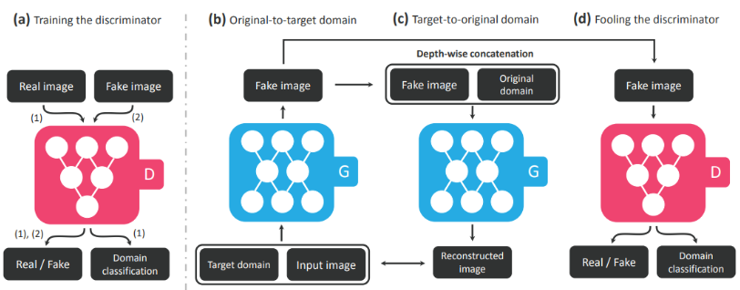
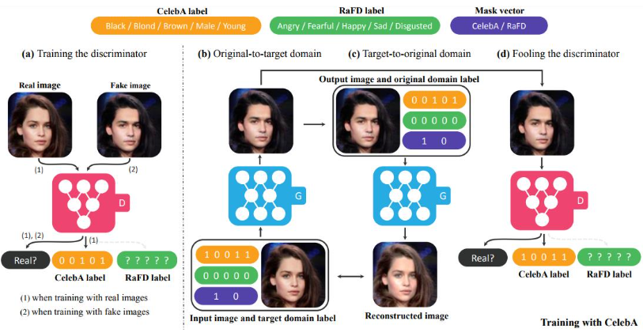

在以前的文章中，我们提到过[CGAN](https://scarleatt.github.io/2020/07/05/CGAN/)，训练数据包括图像和其对应的文字描述，是一种监督学习的方法。本文将叙述一种使用CGAN进行无监督学习的方法，主要包括两大类的方法：Direct Transformation和Projection to Common Space。

#### Unsupervised Conditional Generation

如果现在有一张真实的风景照X，还有一张图像是梵谷的画作Y，那么我们就可以训练一个generator，使其输出像梵谷画作的图像。现在我们要完成的任务是对图像进行风格转换，我们可以收集很多真实的风景照，也可以收集很多梵谷的画作，但我们很难收集到这两者之间的联系，相当于训练数据是没有label的，因此就需要进行无监督的学习。

这种技术不仅可以用到图像领域，也可以用到其他领域，比如语音处理领域。

根据收集到的论文，Unsupervised CGAN可以分为两大类的方法：

1. Direct Transformation：学习一个generator，直接将Domain X的图像转化为Domain Y的图像；这种处理方式不会对input进行太大的改变，如果是影像的话，通常只会修改一下颜色、质地之类的；
2. Projection to Common Space：input和output差距很大，不仅仅是只有颜色和纹理的变化；这时就需要先使用encoder，得出input的特征，比如这是个男生、还戴着眼镜，再用decoder生成对应的动漫角色

#### Direct Transformation

##### Introduction

现在是无监督的学习，generator如何得知自己是不是产生了类似Domain Y的图像呢？这时我们就需要训练一个Domain Y的discriminator，这个discriminator看过很多属于domain Y的图像；对于给定的图像，就可以判断出到底属于哪个domain的图像。

对于generator，这时的训练目标就是生成能骗过discriminator的图像。如果generator能生成骗过discriminator的图像，那么我们就可以认为generator生成了和domain Y类似的图像。

generator可以产生很像梵谷画作的图像，但这个图像可以是和input毫无关系的，这并不是我们想要的结果。因此我们并不能只要求generator生成的图像能骗过discriminator就好。

实际上，在generator不加额外限制的条件下，generator的input和output通常差别不会特别大（比如input是风景图，output是梵谷的自画像），generator通常只希望改一小部分内容能骗过discriminator就好，并不希望进行太大的改变。因此如果不加额外的constrain，这个GAN也是可以work的。

有学者在论文中提出了其他的解决方法。

(1) 如果generator比较shallow，不那么deep，不用加额外的constrain，就可以使input和output差距不大；如果generator很深，就可以使input和output差距很大，这时就需要一些额外的constrain。

(2) 还可以使用另外一种方法。现在有一个pre-trained的network（VGG等），把generator的input和output输入这个network，会输出一个embedding（[word embedding](https://scarleatt.github.io/2020/06/11/Word-Embedding/)）。那么generator的目标就有两个：输出和梵谷画作类似的图像；其input和output之间的差距也不能太大。

##### Cycle GAN

(3) **Cycle GAN**，现在有一个generator $G_{X\rightarrow Y}$可以生成domain X到Y的图像，还有另外一个generator $G_{Y\rightarrow X}$可以生成domain Y到X的图像output，生成的图像应与原来的input越接近越好。现在的generator有了两个目标：产生能骗过discriminator的图像；使对应的input和output越接近越好。

那么现在就不可能在中间产生一个像梵谷自画像的图像，因为这时第二个generator就不可能从这个自画像返回原来的自画像，不满足两个限制条件。

Cycle GAN也可以是双向的。原来的网络是使domain $X\rightarrow Y,Y\rightarrow X$，现在我们加入了另外一个GAN网络，使输入domain Y的图input转化为X的图，再使domain X的图转化为Y的图output，input和output之间的差距也应该越小越好。这时还对应了两个discriminator。现在我们就可以同时train这两个网络。

##### Issue of Cycle Consistency

CycleGAN会把input的一些信息藏起来，output的时候会把这些信息又呈现出来。

下图中的网络是使输入的真实图像转化为类似卫星图的图像。第一个generator把input转化为卫星图，第二个generator再转化为原来的真实图像output。我们可以在input的红色方框内有一些黑点，中间卫星图的部分却没有黑点，再output的红色方框内又出现了这些黑点。

Q：那么为什么generator可以从第二张图像中生成output呢？

A：答案是第一个generator把这些关键信息隐藏了，只是我们人眼并不能看到这些藏起来的信息。

下图中还有一些其他GAN网络（Dual GAN，Disco GAN），但核心思想都是和Cycle GAN差不多的，只是论文提交到了不同期刊上。

##### StarGAN

如果我们现在不是在两个Domain之间互转，而是在4个Domain之间，在理论上就需要12个GAN网络才可以实现。但StarGAN只学习了1个generator，就可以实现在多个Domain之间互转。

下面简要叙述StarGAN的算法：

(a) 首先训练了一个discriminator，需要来鉴别输入的图像是real/fake，还需要得出图像到底是属于哪一个domain；

(b) 还需要学习一个generator，输入是一张图像和目标domain，即你想让input转化成哪一个domain，生成一个Fake Image；

(c) 把生成的图像再输入同一个generator，目标domain也作为输入，生成一张新的图像（reconstructed image），我们希望reconstructed image和input image之间越接近越好；

(d) 把Fake Image再输入discriminator，看到底是不是符合要求的图像。

下图是一个更加realistic的展示。domain可以有多个，所以用一串编码表示，比如现在输入图像的domain是Brown、Young，对应的编码为00101，记作CelevA label。

(a) 现在把一张图像输入discriminator，来判断到底是不是真实的图像，且输出domain对应的代号；(b) 把input image和target domain label（10011，Black、Male、Young）输入generator；(c) 把上一部生成的图像再输入同一个generator，让其生成00101（brown、young）的图像output，我们希望input和output越接近越好；(d) 把第一次generator生成的图像输入discriminator，看是不是realistic的图像，且输出对应的domain代号。

#### Projection to Common Space

##### Target

现在Domain X是真实人物图像，Domain Y是动漫人物，X和Y之间差距很大，就不能用之前的direct transformation。

这里我们可以先使用encoder $EN_X$提取出X的特征，用另一个encoder $EN_Y$提取Y的特征，即图像输入encoder会输出一个vector；把vector输入decoder，如果输入domain X的decoder，就产生真实人物的图像，如果输入domain Y的decoder，就产生动漫人物的图像。

再回顾一下我们的问题，我们希望输入真实人物的图像，网络输出动漫人物的图像。这里vector，表示人脸的特征，其每一个维度对应人脸的某个属性，比如戴不戴眼镜。即我们希望decoder能够根据这些attribute生成对应的动漫人物。

如果我们知道X和Y之间的关系，这个问题用supervise学习可以很简单地解决，但现在这是一个unsupervised问题，我们可以收集domain X的很多数据，也可以收集domain Y的很多数据，但这两者之间的联系我们却很难收集。

那么我们怎么来训练这个encoder和decoder呢？

#####  Training

我们可以先把属于domain X的encoder和decoder结合起来，组成一个auto-encoder，输入一张domain X的图，经过encode-decode的过程，使其reconstruct成原来输入的图，使这两者之间的reconstruction error最小化。属于domain Y的encoder和decoder也使用类似的操作。

这样做会造成一个新的问题，这两个encoder和decoder之间是没有关联的。

我们可以再多加discriminator进来，让输入domain X的decoder的输出更像X。如果我们只是来学习这个auto-encoder，使reconstruction error最小化，会使decoder的output非常模糊。

现在这个属于domain X的encoder和decoder，以及discriminator和起来，就相当于一个VAE GAN；属于domain Y的encoder和decoder，discriminator相当于另外一个VAE GAN。

由于这两个auto-encoder是分开学习的，如果现在输入一张真实的人脸，属于domain Y的decoder很可能输出一张截然不同的人脸。两个encoder是分开训练的，很可能encoder $EN_X$输出的vector的第一维代表性别、第二维代表戴不戴眼镜，encoder  $EN_Y$输出的vector的第二维代表性别、第三维代表戴不戴眼镜。

<u>Solution 1:</u> 为了解决这个问题，有学者提出了新的解法。对于不同domain的encoder和decoder，我们可以让其tie到一起。具体做法是：属于domain X和Y的网络结构都有多个hidden layer，我们可以让这两者的后面某几层hidden layer的参数是共用的；对应的decoder，可以前面几个hidden layer是共用的，后面几个不是共用的。

如果我们共用encoder的后面几个hidden layer，属于domain X和Y的encoder所输出的vector，都是属于同一个latent space的，用同样的dimensions来表示人脸的同一个特征，即第一维都表示男性，第二维都表示戴眼镜。

<u>Solution 2:</u> 加一个domain discriminator，可以对domain X和Y的encoder所输出的vector进行判断，看到底是属于哪一个domain的图像。如果这个domain discriminator不能进行判断，那么我们就可以认为这两个encoder所生成的vector其distribution都是一样的，从而这两个distribution中相同的维度表示相同的意思。

假设domain X和Y中男女比例、戴不戴眼镜的比例都是一样的，现在domain discriminator可以强迫让这个embedding的latent feature是一样的，因此就会用同样的dimension来表示这个vector（The domain discriminator forces the output of 𝐸𝑁x and 𝐸𝑁y have the same distribution. ）。

<u>Solution 3</u>: 还可以用cycle consistency。真实人物的图像input输入domain X的encoder，生成对应的code再输入domain Y的decoder，重建输入的图像；再输入domain Y的encoder，对应的code输入domain X的decoder，得到output，目标是使input和output之间的error越小越好。

#### Voice Conversion

把一个人的声音转化成另一个人的声音。

