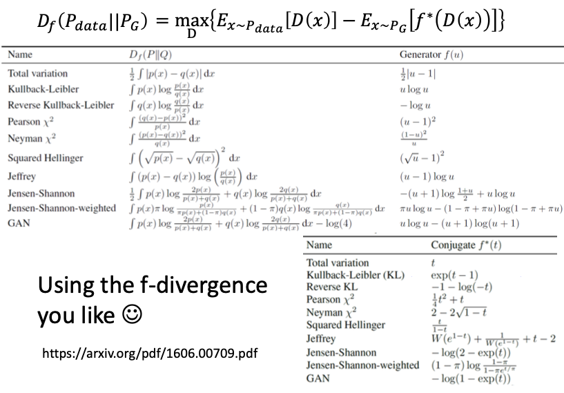

#### f-divergence

$p(x),q(x)$分别表示x从分布P，Q中sample出来的概率。f可以是不同的函数，必须是凸函数，且$f(1)=0$。f-divergence的式子如下，可以表示P和Q之间的差异，
$$
D_f(P||Q)=\int_x q(x)f\left(\frac{p(x)}{q(x)}\right)dx
$$
那么为什么这个式子可以表示P和Q之间的差异呢？

如果现在$q(x)=p(x)$，那么$D_f(P||Q)=0$，表示q和p之间的距离为0.

如果q和p有一些很小的差距，算出来的divergence就大于0.
$$
\int_x q(x)f\left(\frac{p(x)}{q(x)}\right)dx=0\geq  f\left(\int_x q(x)\frac{p(x)}{q(x)}dx\right)=f(1)=0
$$

如果$f(x)=xlogx$，那么$D_f(P||Q)$就是KL divergence；

如果$f(x)=-logx$，那么$D_f(P||Q)$就是Reverse divergence；

如果$f(x)=(x-1)^2$，那么$D_f(P||Q)$就是Chi Square；

#### Fenchel Conjugate

每个凸函数都有一个Conjugate function $f^*$，是由x和$f(x)$导出来的。对于值的计算，我们可以通过穷举所有t的值代入，看到底哪个t可以使$xt-f(x)$的值最大。即
$$
f^*(t)=\mathop{\rm max}_{x\in dom(f)}\{xt-f(x\}
$$
对于值的计算来举一个例子，当$t=t_1$时，
$$
f^*(t)=\mathop{\rm max}_{x\in dom(f)}\{xt_1-f(x\}
$$
这时$x$的取值范围为$x=\{x_1,x_2,x_3\}$，代入x的值，计算$x_1t_1-f(x_1),x_2t_1-f(x_2),x_3t_1-f(x_3)$的值，$f^*(t)$即为三者最大；

代入$t_2$的值来计算$f^(t_2)$的值；

……

这样每个t值都带进去算很麻烦，因此出现了第二种方案，把$xt-f(x)$用图形描述出来。找出这些直线的upper bound，可以发现$f^*(t)$是凸函数。

现在假设$f(x)=xlogx$，代入$xt-f(x)$计算，画出$x=\{0.1,1,10,...\}$时的函数图像，并找出这些直线的upper bound，如下图所示，如果进行了很多次运算，这些直线的upper bound和$f^*(t)=exp(t-1)$的图像很接近。

下图是这个过程具体的证明，

#### **Connection with GAN**

$f(x)$与$f^*(x)$互为Conjugate function。把$x=\frac{p(x)}{q(x)}$代入，得
$$
D_f(P||Q)=\int_x q(x)f\left\{\mathop{\rm max}_{x\in dom(f)}\{\frac{p(x)}{q(x)}t-f^*(t)\}\right\}dx
$$
我们现在可以用一个discriminator D，来帮助我们求解这个max的问题，输入为x，输出就是满足条件的t，就不用穷举所有的t才能找到我们的最优解。如果用$D(x)$来替代x，就可以表示$D_f(P||Q)$的lower bound，即
$$
\begin{aligned}
D_f(P||Q)&\geq\int_x q(x)f\left(\frac{p(x)}{q(x)}D(x)-f^*(D(x))\right)dx\\
&=\int_xp(x)D(x)dx-\int_xq(x)f^*(D(x))dx
\end{aligned}
$$
如果随便找一个D，最后得出来的值肯定比divergence的值小；但如果是找一个最优（max）的D，预测出来的t就是最准的，就可以使结果逼近divergence，即
$$
D_f(P||Q)\approx \mathop{\rm max}_D\int_xp(x)D(x)dx-\int_xq(x)f^*(D(x))dx
$$

$V(G,D)$可以有不同的形式，不同的divergence就有不同的$V(G,D)$。

下图中列出了不同的divergence和generator。

可以用不同的divergence又有什么优点呢？

#### Mode Collapse

当我们在训练GAN的时候，可能会遇到mode collapse，real data的distribution是非常宽泛的，但generated data的distribution可能会非常小。比如我们在生成二次元人物的时候，可能会出现下图中的结果，某张特定的人脸开始蔓延，变得到处都是，同一张人脸会不断反复地出现。

#### Mode Dropping

mode dropping的情况比mode collapse要稍微简单一点，现在real data有两种不同的distribution，而generator只会产生一种distribution的数据。

Generator第一次会先产生一些白皮肤的人，再进行一次generator，会产生一些黄皮肤的人，再进行一次generator，会产生一些黑皮肤的人。每次只产生一种分布的数据。

会出现这个问题，一个很可能的原因就是divergence选得不好。

