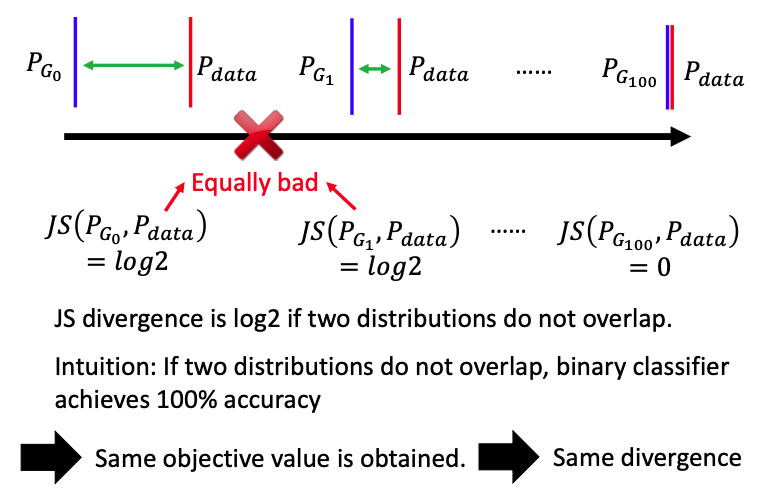

本文主要介绍了WGAN的核心思想。由于JS divergence自身有一些额外的限制，我们先改进了classifier的输出分数的分布，从sigmoid改成了linear，即LSGAN；还有另外一种改进方式，使用Wasserstein distance来衡量两个分布之间的差异，即WGAN。

#### JS divergence is not suitable

在之前的文章中，我们使用了JS divergence来衡量$P_G,P_{data}$之间的差距。在大多数的情况中，我们学习出来的分布$P_G$和真实数据的分布$P_{data}$之间其实并没有任何重叠，原因如下：

1. the nature of data，$P_G,P_{data}$都是高维空间的图像数据在低维空间的manifold，这两个分布在低维的manifold上是有一部分重叠的，但在高维空间中，这两个分布不一定有重叠，因此在manifold上的重叠是可以被忽略的。
2. 由于我们是从$P_G,P_{data}$中sample出部分数据来进行divergence，如果sample的数据不够多，虽然这两个分布是有重叠的，但我们sample出来的数据并不一定有重叠。

Q：什么是manifold？

A：manifold其实是一个空间。可以看作是一个d维的空间，而这个空间是被m维的空间扭曲之后的结果（m>d）。在下图中，就表示了一个二维的manifold被折起来，变成了三维空间的数据，其实我们用二维空间就可以表示这个三维空间的数据。

**What is the problem of JS divergence?**

当两个分布完全没有任何重叠的话，JS divergence的值就是$log2$，在下图中只有第三种情况两种分布$P_{G_{100},P_{data}}$有重叠，JS divergence的值为0，其他情况下都是$log2$。

那么这样会造成什么弊端呢？

对于下图中的前两种情况，$P_{G_0},P_{data}$之间的差距和$P_{G_1},P_{data}$是完全不一样的，很明显$P_{G_0},P_{data}$之间的差距要大很多，但JS divergence计算这两者之间的差距输出都是$log2$，是equally bad。因此$P_{G_0}$不会update到$P_{G_1}$，更不会update到$P_{G_{100}}$，训练到此就被卡住了。

#### Least Square GAN (LSGAN)

在下图中，我们用蓝色和红色圆点表示数据不同的类别，横向坐标轴表示原始的数据分布。现在我们来训练一个binary classifier，这个classifier会给蓝色的点0分，给绿色的点1分，输出接近与sigmoid函数，输出在接近0的位置特别平。本来我们的目标是训练一个classifier，generator会根据discriminator给出的gradient去移动，希望generator生成的点会往右边不断移动，来接近真实数据的分布。

但实际上，如果我们训练一个classifier使其输出接近sigmoid函数，generator生成的数据所的分数几乎都是0，gradient非常小几乎为0，没办法继续训练下去。

我们可以让这个classifier训练出来没那么好，那么到底什么叫不要train得太好呢？

后面就有学者提出了**Least Square GAN**，把sigmoid换成linear，这样就不会出现在某些地方特别平坦的问题，也就变成了一个regression问题。

#### Wasserstein GAN (WGAN)

##### Earth Mover’s Distance

现在有一台挖土机，我们把分布P看作是一堆土，分布Q就使挖土机要把土挖过去的地方，挖土机从P到Q移动的距离就叫做**Earth Mover's Distance**，也称作Wasserstein distance。

如果现在把分布P和Q分别看作是在一维空间上的两个点，这两个点之间的距离就可以看作是Wasserstein distance，即$W(P,Q)=d$

如果我们要衡量下图中两个分布的Wasserstein distance，挖土机有很多种铲土的方案，有可以直接到达的，也有舍近求远的，那么Wasserstein distance到底是smaller distance还是larger distance呢？

现在我们可以穷举所有的moving plan，把推土机走的平均距离都分别算出来，看哪一个距离最小，最小的那个距离就是Wasserstein distance。

下图中展示了最小的distance，同样颜色的方块代表同样的土，

现在来讲一个更加真实的例子。要把P的土挪到Q所在的地方，首先要确定一个moving plan，这个moving plan可以看作是一个矩阵。$x_p,x_q$分别表示P和Q中土的对应位置，这两者的交界处就表示P要挪多少土给Q，颜色越亮挪的土越多。矩阵一行内所有的土和起来，就表示分布P在对应位置bar的高度。

那么现在有了这个moving plan的矩阵，我们就可以来计算要挪土的距离了。$\gamma(x_p,x_q)$表示要从$x_p$挪多少土到$x_q$去，$||x_p-x_q||$则表示这两者之间的距离。
$$
B(\gamma)=\sum_{x_p,x_q}\gamma(x_p,x_q)||x_p-x_q||
$$
对于我们要找的Wasserstein distance，我们则需要穷举所有可能的$\gamma$矩阵，找到对应的moving plan，使distance算出来最小，即
$$
W(P,Q)=\mathop{\rm min}_{\gamma\in\pi}B(\gamma)
$$

##### **Why Earth Mover’s Distance?**

可以看出计算最优的moving plan，算出Wasserstein distance是非常麻烦的，那么我们为什么还要使用这个Wasserstein distance呢？

回顾下我们之前使用的JS divergence，$P_{G_0},P_{data}$与$P_{G_{50}},P_{data}$这两者之间的divergence都是log2，$P_{G_{0}},P_{G_{50}}$的表现是一样的，没办法进行改进，也没办法改进到$P_{G_{100}}$。

但Wasserstein distance并不会出现这种问题，我们可以用Wasserstein distance来衡量两个不同分布之间的差异，在下图中，$d_0$明显比$d_{50}$大，那么模型就可以不断地进行优化，来找到最后的$P_{G_{100}}$，使得对应的Wasserstein distance为0，即$W(P_{G_{100}},P_{data})=0$。

##### Evaluate wasserstein distance

那么我们现在怎么来修改discriminator，使其可以评估Wasserstein distance呢？

推导过程过于复杂，在此直接得出结论
$$
V(G,D)=\mathop{\rm max}_{D\in1-Lipschitz}\{E_{x\sim P_{data}}[D(x)]-E_{x\sim P_{G}}[D(x)]\}
$$
如果x是从$P_{data}$中sample出来的，应该越大越好，如果是从$P_G$中sample出来的，应该越小越好。除此之外，还需要有一个额外的限制，discriminator是一个1-Lipschitz函数，要足够smooth才行。

如果现在没有这个constrain，紫色圆点是从$P_{G}$中sample出来的，绿色圆点是从$P_{data}$中sample出来的。现在只考虑让$E_{x\sim P_{data}}[D(x)]$分数越大越好，让$E_{x\sim P_{G}}[D(x)]$越小越好，这两个分布很有可能没有重叠的地方，那么$E_{x\sim P_{data}}[D(x)]$的分数会变得无限大，$E_{x\sim P_{G}}[D(x)]$会变得无限小，训练永远不会停止，模型也永远不会收敛。

因此必须要有额外的限制，训练出来的discriminator得出的分数必须足够平滑，这样就不会出现$E_{x\sim P_{data}}[D(x)]$的分数会变得无限大、$E_{x\sim P_{G}}[D(x)]$会变得无限小这种情况，模型也最终会收敛。

那么**Lipschitz Function**到底是什么呢？

我们用$||x_1-x_2||$来表示input change，$||f(x_1)-f(x_2)||$来表示output change，input change乘上倍数K，必须要大于等于output change，即output不能变化太大，要在满足这个限制的条件下进行变化。output的变化永远比input的变化要小，即
$$
||f(x_1)-f(x_2)||\leq K||x_1-x_2||
$$
如果K=1，那么就是1-Lipschitz函数。

在下图中，有两个函数的曲线，蓝色曲线的变化太多剧烈，output的变化超过了input的变化，并不是1-Lipschitz；但绿色曲线的变化就相对平缓很多，是一个1-Lipschitz函数。

那么我们要给discriminator加一个constrain呢？

如果是没有constrain的discriminator，直接使用gradient ascent就好；但现在是加入了constrain的discriminator，有学者就提出了**weight clipping**这种方法；

weight clipping的具体做法如下，模型还是照常训练，照常更新参数，但现在我们给weight多了一个额外的限制，如果$w>c,w=c; w<-c,w=-c$；不会出现weight突然很大的情况，因此output的变化也不会很剧烈。

Q：那么weight clipping处理过后就可以变成1-Lipschitz函数吗？

A：并不能，这只是一个非常原始的解法。

#### **Improved WGAN (WGAN-GP)**

如果不能直接找出直接限制discriminator的解法，我们可以找出等价的解法。我们要求discriminator是属于1-Lipschitz函数的，这个做法就等价于，将discriminator对x求梯度之后的norm，这个norm的值必须小于等于1，即等价于
$$
||\Delta_xD(x)||\leq1 \rm\ for\ all\ x
$$
那么我们怎么把这个限制条件加进去呢？

我们可以在原来的式子后面加入额外的一项，即
$$
V(G,D)\approx\mathop{\rm max}_{D}\{E_{x\sim P_{data}}[D(x)]-E_{x\sim P_{G}}[D(x)]
\\\quad\quad\quad-\lambda \int_x[max(0,||\Delta_xD(x)||-1)]dx\}
$$
相当于加入一个正则项，如果$||\Delta_xD(x)||$的值大于1，就相当于有penalty；也就是希望$||\Delta_xD(x)||$这一项的值小于等于1，如果满足这个条件，就不会有penalty。

但在实际的做法中，这种做法很不可取。加入正则项这个办法有一个额外的条件，就是必须要对所有的x求积分，所有的x都需要满足这个条件，但实际上我们只sample出部分数据，并不能保证sample出全部的数据。

现在我们要进行进一步的改进，我们事先有一个确定好的分布$P_{penalty}$，这个分布中的x满足$||\Delta_xD(x)||\leq1$即可，
$$
V(G,D)\approx\mathop{\rm max}_{D}\{E_{x\sim P_{data}}[D(x)]-E_{x\sim P_{G}}[D(x)]
\\\quad\quad\quad\quad\quad\quad\quad\quad-\lambda E_{x\sim P_{penalty}}[max(0,||\Delta_xD(x)||-1)]{\rm d}x\}
$$

那这个$P_{penalty}$到底是什么样的呢？

我们先在$P_{data},P_G$中分别取一个点，把这两个点的直线连接起来，从这两个直线中间的某个点随机sample一个点，我们就把这个点x当作是从分布$P_{penalty}$中sample出来的。

为什么这样取出来的点x就可以当作是从分布$P_{penalty}$中sample出来的呢？

在原始的论文中是这样解释的，如果要对所有的x都满足这个限制条件是不可能的，像图中这种画直线的方式得到了很好的performance；我们也可以从直觉上这样理解，我们的目标是让generator生成的数据分布$P_G$，沿着discrimiantor给出的梯度方向，慢慢挪到真实数据分布$P_{data}$那边去，而$P_{penalty}$正是这中间的过渡形态，只要使从$P_{penalty}$中sample出来的x满足条件$||\Delta_xD(x)||\leq1$即可。

$max(0,||\Delta_xD(x)||-1)]$对小于1的值也不算在内，但其实$||\Delta_xD(x)||$小于1对结果也是会有影响的，我们并不能直接忽略这个值，gradient大于1有惩罚，小于1也会有惩罚，因此，进一步改进得到了，
$$
V(G,D)\approx\mathop{\rm max}_{D}\{E_{x\sim P_{data}}[D(x)]-E_{x\sim P_{G}}[D(x)]
\\\quad\quad\quad\quad\quad\quad\quad\quad-\lambda E_{x\sim P_{penalty}}(||\Delta_xD(x)||-1)^2\}
$$

#### Spectrum Norm

spectrum这个方法可以对discriminator进行限制，使所有的x对应的梯度都小于1.

#### Algorithm of original GAN

那么怎么把原始的GAN改成WGAN呢？如下图所示

#### Energy-based GAN (EBGAN)

本来discriminator是一个binary classifier的架构，现在我们把它改成autoencoder，generator还是维持原来的架构。现在把generator生成的图像经过encoder和decoder，来计算reconstruction error，再乘上一个负号，就变成了现在discriminator的output。

这样做就有一个好处。这个autoencoder可以是pre-training，提前训练好的，我们可以提前用很多真实的例子来训练这个autoencoder，并不需要使用到generator，就可以训练好discriminator。因此EBGAN的generator就可以跟快生成很清晰的图像。

在训练EBGAN的时候，我们要让real data的discriminator得分越高越好，也就是reconstruction error要越小越好；让generated data得分越小越好，reconstruction error要越大越好。由于Hard to reconstruct，easy to destroy，那么对于generated data，如果generator直接生成noise，这时的error是最大的，得分也是最低的，但这并不是我们想要的结果。

我们加入了一个额外的限制，对于generator生成的数据所对应的reconstruction error，设置一个margin，让这个error小于某个threshold就好，不用更小，这个margin是需要自己去调整的参数。

