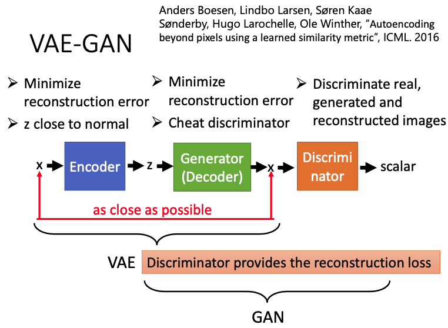
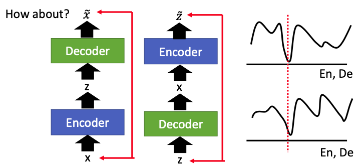
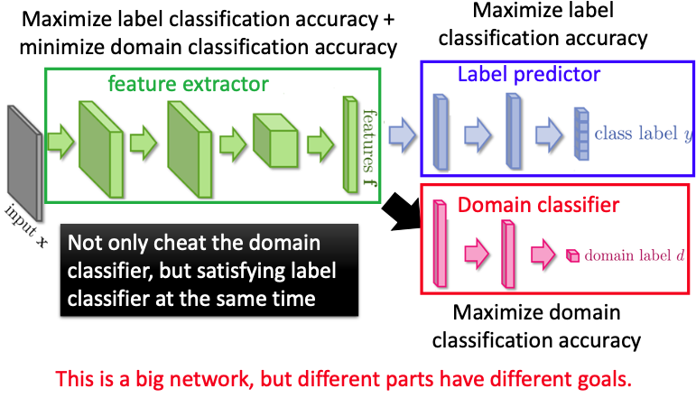

本文主要叙述GAN进行feature extraction的应用，包括InfoGAN，BiGAN，VAE-GAN，Triple GAN，Domain-adversarial training。

#### InfoGAN

GAN会input一个random的vector，然后output一个object。input的每个dimension都代表着某个特征，如果我们对input的某个dimension进行变化，output也会有相对应的变化，但实际上我们并不能那么直接观察到input和output之间的关系。

在下图中，展示了一个GAN手写数字生成的例子，横轴表示input的某个维度，纵轴表示变化后的output，但我们并不能观察出改变某个维度后，output会进行怎样的变化。

我们希望像下左图中蓝色的区块一样，在那一块区域的vector都具有相同的特征，如果用同一个区块的vector来作为generator的input，那么output就会有蓝色的特征，即我们假设这些特征是有一定规律性的。但实际上，这些特征的分布是非常不均匀的。

#### What is InfoGAN?

infoGAN把输入的z分成两部分，一半是c，一半是z'，还加入了一个额外的classifier，来对generator的输出x进行classify，classifier要能从x中反推出原来的c。我们就可以把这里的generator看作是encoder，把classifier看作是decoder，这两者和起来就可以看作是一个“autoencoder”。这里的“autoencoder”和传统的autoencoder是相反的，“autoencoder”先把code变成image，再从image变成code。

那么这里的discriminator是不是一定要存在呢？

答案是一定的，discriminator的存在非常有必要。generator要产生能使classifier进行分类的图像，如果没有discriminator，generator可以生成一张把c写在中间的图像，这样classifier读中间的数字，就知道c是什么。但这并不是我们想要的结果，generator生成的图像还必须接受discriminator的检验，保证生成的是一张真实的图像。

discriminator和classifier的参数可以是共享的，由于它们的输入都是一样的图像x，只有最后一层的输出不太一样，classifier输出code，discriminator输出scalar。

那么infoGAN怎么解决input的feature，对output的影响不明确这件事呢？

如果generator可以学习到c的每个维度都对output x有一个明确的影响，那么classifier就可以很容易地根据x来反推出输入的c是什么；如果现在generator没有学习到某个dimensions对output的影响，就像本文刚开始说的手写数字生成的那个例子那样，改变输入的某个dimensions，对输出的影响是很奇怪的，那么classifier就不能从x反推出原来的c。

为什么这里的z要这样划分呢，例如前面一半是c，后面一半是z'？

这里的c并不是因为它代表了某些特征而被归类为c，而是因为被归类为c，所以代表某些特征。

在下图中，(a) 改变了c的第一维，对于infoGAN，刚好这个第一维就表示digit，生成的图像就变成了数字0-9；(b) 对应了一般的GAN，也改变了c的第一维，但生成的图像就比较奇怪；(c) 表示改变了c中的rotation，可以发现infoGAN生成的图像有不同程度的旋转 ；(d) 表示改变了c中的width，笔画慢慢从细到粗。

#### VAE-GAN

在原来的encoder和decoder（generator）的基础上，加入了discriminator。如果把encoder和decoder和起来，就是一个VAE，如果把generator和discriminator和起来，就相当于是一个GAN。generator生成的图像与原图像的reconstruction error应该越小越好，同时还要越接近真实图像越好。

**对于VAE来说**，如果只是让VAE的input和output越接近越好，不见得output的图像会realistic，生成的图像会很模糊。因此加入了一个discriminator，可以让generator生成的图像更加realistic。

**对于GAN来说**，generator的input是随机的，它并不知道真实的图像长什么样，要花很大的代价才能让generator产生真实的图像。那么现在加入了encoder，generator根据encoder的输出，就知道真实的图像长什么样子了。

那么现在对于VAE-GAN来讲，encoder和decoder的目标除了最小化reconstruction error，

+ encoder还需要将输出的编码接近normal distribution，
+ decoder（generator）生成的图像还需要骗过discriminator；
+ 对于discriminator来讲，还需要能辨别real，generated 和 reconstructed image。

下面我们将简要叙述VAE-GAN的算法流程，首先初始化encoder，decoder，discriminator的参数，

+ sample出M个真实的数据$x^i$出来；
+ 把真实数据输入encoder，得到$\tilde z^i=En(x^i)$；
+ 把$\tilde z^i$输入decoder，得到$\tilde x^i=De(\tilde z^i)$；
+ 从正态分布$P(z)$中sample出M个code $z^i$，再输入decoder得到对应的图像$\hat x^i=De(z^i)$；
+ 更新encoder来减小reconstruction error$||\tilde x^i-x^i||$，还需要让encoder生成的code和正态分布越接近越好；
+ 更新decoder来减小reconstruction error$||\tilde x^i-x^i||$，还希望生成的图像能骗过discriminator；
+ discriminator给真实的image高分，给reconstructed和generated的图像低分。

之前我们都是让discriminator进行二分类，这里我们可以让他进行三分类，real，gen，recon。

#### BiGAN

BiGAN也是修改了Autoencoder，但不是像VAE-GAN那样，encoder和decoder是连在一起的，BiGAN的encoder和decoder不是连在一起的。encoder首先输入一张真实的图像，输出code z，decoder的输入则是从normal distribution中sample出来的，再输出一张图像。

那么要怎么学习这个encoder和decoder呢？

BiGAN的做法是再加入一个discriminator，鉴别真实的图像和根据code z生成的图像。

算法流程，

如果输入图像数据的分布是$P(x,z)$，我们希望decoder的输出数据的分布$Q(x,z)$和原来的P是接近的，那么discriminator就是在衡量P和Q之间的差异。经过discriminator的引导，P和Q分布会越来越接近。在理想情况下，P和Q会变成一摸一样的。

虽然encoder和decoder没有连在一起，但在discriminator的引导下，在理想的情况下会达成以下特性，

那么如果我们分别训练一个正向和反向的autoencoder，可不可以也达到同样的效果呢？

BiGAN和这种方式的optimal solution是一样的，但这两者的error surface是不一样的，如果这两者都训练到optimal的case，这两者的结果是一样的。但实际上并不可能训练到optimal case，autoencoder不可能真的学习到input和output一摸一样，BiGAN也不可能学习到P和Q的分布一摸一样。因此如果这两者学习不到optimal case，那么这两者学习出来的情况也是不一样的。

#### Triple GAN

Triple GAN的主要结构有三种，discriminator，generator，classifier。如果现在不考虑classifier，就相当于是一个conditional GAN，其中的Y就相当于是一个condition。

Triple GAN其实是一种semi-supervised learning，如果有少量的label data，大量的unlabeled data。我们可以把labeled data来训练classifier，input x，就输出对应的Y；同时我们也可以训练generator，使其可以输入Y，输出一个X，就组成了一个pair(X,Y)，可以把这个pair再当成classifier的训练资料，增加训练数据。

classifier可以输入X，再输出对应的Y，组成一个pair，discriminator可以来辨别这个pair是不是真实的pair。

#### Domain-adversarial training

##### Introduction

很可能我们的training data和testing data差别很大，比如training data都是黑白色的，但testing data却是彩色的。

那么现在我们可以通过generator提取出这两者的feature，虽然原始数据的domain不一样，但提取出来的feature却有着相同的分布。

那么现在有个generator可以进行feature extractor，还有一个discriminator进行domain classifier，来判断这个feature到底来自哪一个domain；现在还有一个额外的classifier，来进行label predict，判断feature属于哪一个类别。

这三者可以同时训练，也可以分开训练，就像GAN一样，要训练D，我们会先固定G的参数。

##### **Feature Disentangle**

对于原始的seq2seq autoencoder，input segment输入encoder之后，会生成一个code，这个code包含多种信息，phonetic information, speaker information, etc.

我们需要进行**Feature Disentangle**，可以先进行两个encoder，即Phonetic Encoder和Speaker Encoder，再进行decoder，还原出原来的语音信号。

我们可以先加入一些constrain，对于同一个人的声音信号进行encode，虽然这两个输入的声音信号有些差别，但我们希望生成的embedding是接近的；如果是不同的人说的，这个output的embedding也必须有有一些差别。

我们还必须要训练另外一个speaker classifier，来判断两个vector到底是不是同一个人说的。如果输入的是两个不同的人说的语音信号，经过phonetic encoder的学习后，可以被提取出相同的feature，我们就说这个encoder可以过滤掉一些无关的杂讯，只关注一些有用的资讯。

结果展示，

