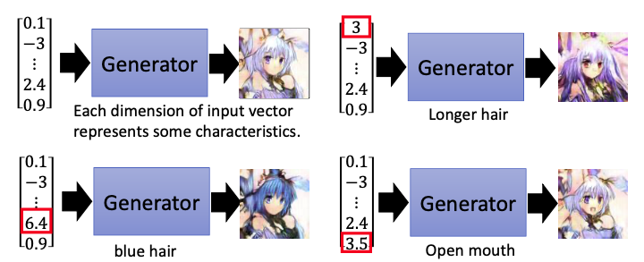
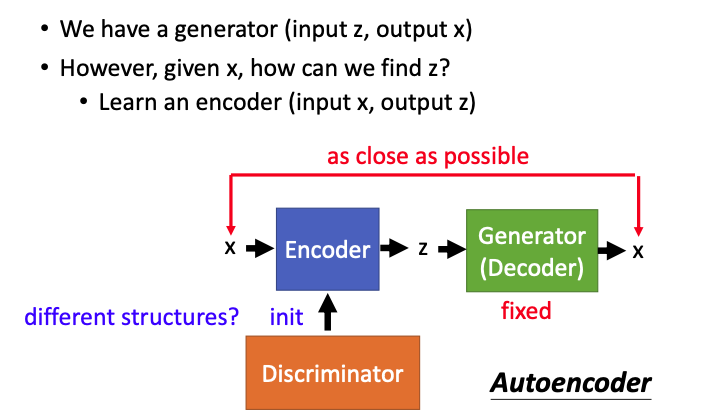
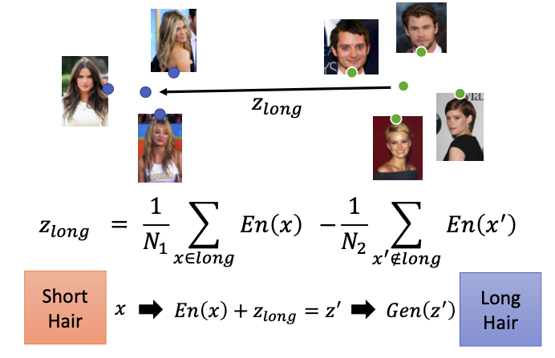
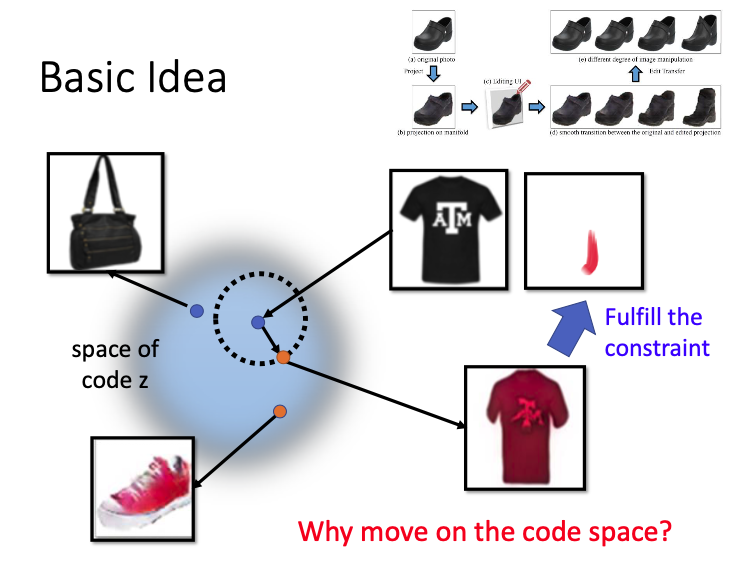
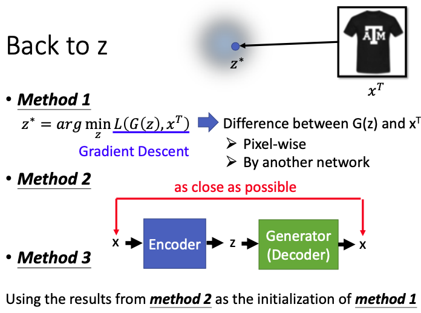
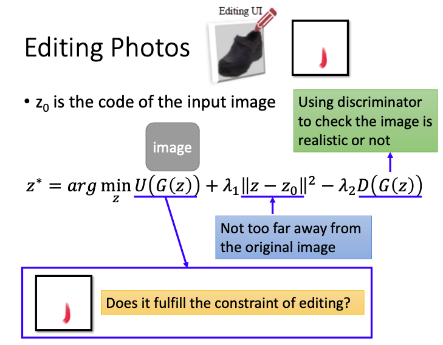
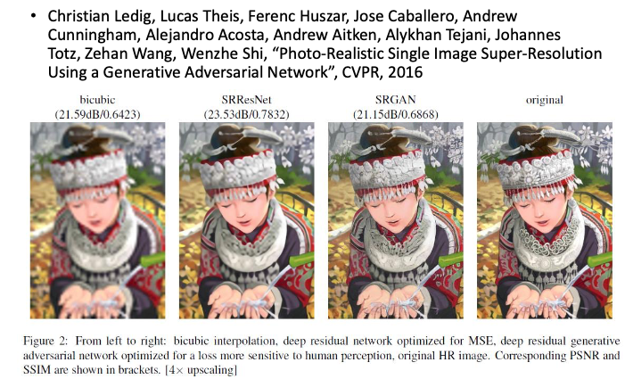
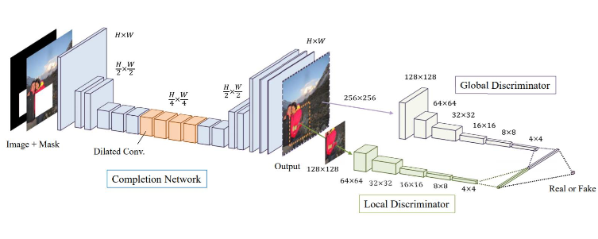

本文主要介绍了使用GAN来进行智能图像编辑，包括编辑原图像，Image super resolution和Image Completion等。

#### Modifying Input Code

generator的输入是一个vector，输出一张人脸。input的vector的每个维度都表示某种特征，我们现在要做的就是根据生成的图像，来反推出输入vector的每个dimension表示什么特征。

#### GAN+Autoencoder

我们可以收集一堆有label的数据，这个label可以表示这个图像具有的特征是金发、年轻、男性、女性等。

但现在有一个问题，根据给出的image，我们并不知道其输入的随机vector是什么。我们可以学习另外一个encoder，这个encoder和generator就组成了一个autoencoder。

为了学习出输入的vector，我们需要固定generator的参数，可以用discriminator的参数来初始化encoder的参数，再来学习encoder。

#### Attribute Representation

encoder训练完成后，我们就可以知道图像x对应的vector z是什么，什么样的vector可以生成这张图像。

在下图中，我们算出每个短发图像的vector之后，再做一个平均，就可以知道短发图像的vector；把长发图像的vector做一个平均，就可以得到长发图像的vector。把这两个vector相减得到$z_{long}$，就可以知道要做什么样的变化，使短发的脸变成长发的脸。

现在我们有一张短发的图像x，把它输入encoder得到code，把这个code和$z_{long}$相加，就可以得到长发脸的vector $z'$，把这个vector再输入generator，就可以得到长发脸的图像$Gen(z')$。

那么现在对于随机输入的一张图像，我们把其code再加上我们想要的特征向量(比如$z_{long}$)，就可以得到我们想要的特征图的输出。

智能的ps演示，https://www.youtube.com/watch?v=9c4z6YsBGQ0

那么这种智能的ps是怎么作用的呢？

#### **Photo Editing**

##### Basic Idea

首先需要训练一个generator，在不同的latent space上sample出不同的点，generator就可以生成对应的商品。

那么刚才那个智能的ps中，对原图进行小小的修改就可以变成一件新的商品，这个是怎么完成的呢？

首先需要对输入的商品图像进行反推，反推出在这个code space上的位置，在这个基础上，再进行变化。在满足使用者给出的constrain后，就可以产生一张新的图。

##### Back to z

我们首先需要完成的事，根据输入的图像反推出对应的code。有以下三种方式。

**Method 1**  当成一个optimization problem，找到对应的$z^*$，使其对应的generator的输出和原图之间的差值最小化，loss function可以有很多种，可以是计算像素级的差值，也可以使用其他的classifier网络，让这两者的embedding越接近越好。
$$
z^*=arg\mathop{\rm min}_zL(G(z),x^T)
$$
**Method 2** 使用一个autoencoder ，使input和output越接近越好。

**Method 3** 结合了前两个方法，第一个方法要用到gradient descent，可能会遇到local minimal这个问题，给z不同的初始化值，最后得到的结果很可能是不一样的。因此我们可以用autoencoder得到的z来作为方法1的初始值，再来进行优化调整。

##### Editing Photos

从图像反推出z之后，我们还需要求解另外一个optimization problem。

把z输入generator之后，产生image的还需要满足一个额外的constrain $U(G(z))$；新的图像和原来的图像应该越接近越好，原来是黑色的鞋子，现在我们希望新图像还是鞋子，不能差太多；discriminator还需要检测生成的新图像是不是realistic；
$$
z^*=arg\mathop{\rm min}_z U(G(z))+\lambda_1||z-z_0||^2-\lambda_2D(G(z))
$$
求解这个optimization problem，找到满足这些constrain的$z^*$。

#### Image super resolution

GAN也可以进行Image super resolution，输入一张模糊的图，输出一张清晰的图。可以发现使用GAN的结果，更加清晰了。

#### Image Completion

我们可以把图像的某部分挖空，机器要来恢复这部分被挖空的图像。

