本文首先会叙述GAN如何来改善Sequence Generation的问题，由于text generation在generator的输出是不连续的，会导致模型不能求微分，本文也提供了三种解决方案：Gumbel-softmax、Continuous Input for Discriminator、Reinforcement Learning，重点讲解了其中第二种方法；再来讲述Unsupervised Conditional Sequence Generation，使用CGAN来进行摘要提取、文字翻译、语音识别等。

### Conditional Sequence Generation

只要是sequence generation，我们都可以看作是conditional sequence generation，是有条件的。比如语音辨识系统，需要输入一段语音再进行识别；翻译任务也需要输入原文再进行翻译；聊天机器人也需要上文，才能知道下一句要说什么。

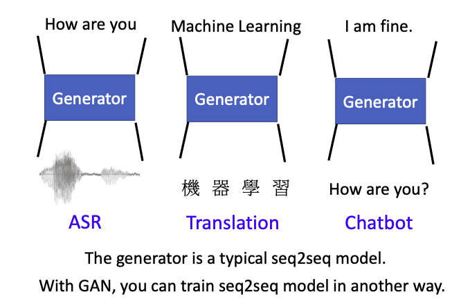

#### Review: Sequence-to-sequence

再回顾下聊天机器人的大概流程，首先会输入一段文字“How are you？”，输入encoder之后，再把code输入generator（decoder），我们希望输出序列是“I'm good”的概率最大。

现在有两个chatbot，一个输出“Not bad”，另一个输出“I'm John”。如果从人的观点来看，“Not bad”是一个更好的回答；但对于机器而言，“I'm John”则是一个更好的回答。因为机器的期望输出是“I'm good”，后者和正确答案至少有“I'm“是相同的。

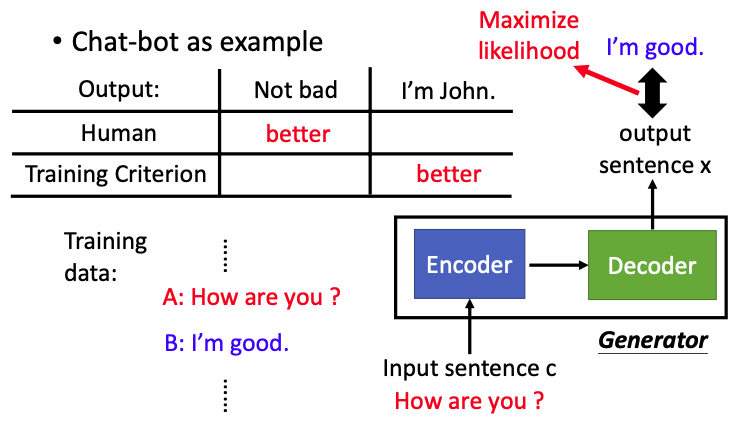

首先我们会讲怎么用reinforce learning来Improving Supervised Seq-to-seq Model，再讲GAN。

#### RL (human feedback)

##### Introduction

如果现在我们想做chatbot，用reinforce learning的思想怎么来做呢？

chatbot在和人互动的过程中，会获得reward。如果人问“How are you？”，chatbot回答“ByeBye”，就给一个很低的分数（-10）；如果人说“Hello”，chatbot回复”Hi“，就给reward（+3）.

那么chatbot就希望自己可以得到最高的奖励，来maximize the expected reward。

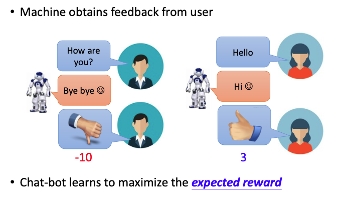

##### Maximizing Expected Reward

对于input sequence c，chatbot会输出一个对应的response sentence x，Human再来比较这个c和x，给予一个评价$R(c,x)$。

这个结构和conditional generation很像，主要差别在于Human这个结构，和原来的discriminator有些不一样，现在的Human要把generator的input和output都考虑进来，才能得出评价分数。

现在chatbot就希望Human给出的评价分数越高越好，即maximize expected reward，可以用policy gradient来完成这件事。

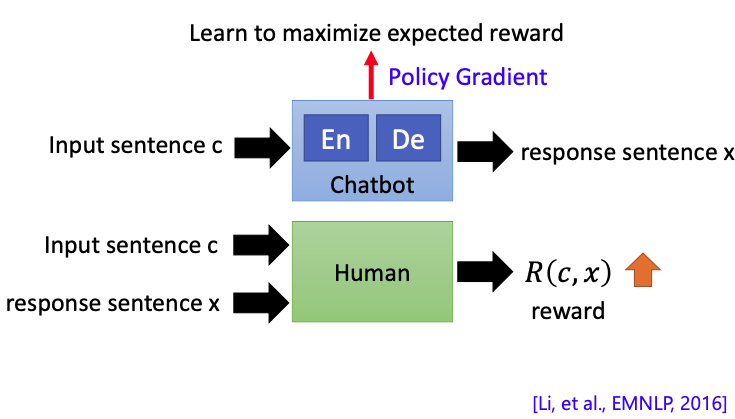

下图中的encoder和decoder合起来就是sequence to sequence模型，我们希望不断更新这个model的参数，来使Human给出的reward越高越好。这个公式表示在现有的参数下，Human给出的reward有多大，
$$
\overline R_\theta=\sum_hP(h)\sum_xR(h,x)P_\theta (x|h)
$$
其中$P(h)$表示输入的每个sequence所可能出现的概率，比如人输入"How are you"给chatbot很多次，那么对应的概率就要大；$P_\theta (x|h)$表示对于给定的h，chatbot给出的每个回复的概率；$R(h,x)$表示所有的回复。

我们的目标就是找到$\theta^*$，来使reward越大越好，即
$$
\theta^*=arg\mathop{\rm max}_\theta \overline R_\theta
$$
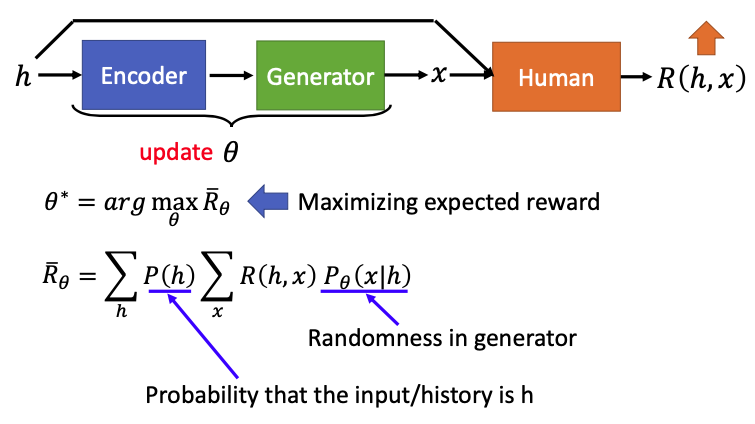

我们可以对期望的reward式子进行变化，
$$
\begin{aligned}
\overline R_\theta &=\sum_hP(h)\sum_xR(h,x)P_\theta (x|h)\\
&=E_{h\sim P(h)}[E_{x\sim P_\theta(x|h)}[R(h,x)]]\\
&=E_{h\sim P(h),x\sim P_\theta(x|h)}[R(h,x)]\\
\end{aligned}
$$
要计算这个期望值，就必须要计算所有c和x，但实际上，我们无法穷举出所有的input和output；

因此，我们只sample部分数据，从分布$P(h)$中sample出N个h，从$P_\theta(x|h)$中sample出N个x，即sample：$(h^1,x^1),(h^2,x^2),...,(h^N,x^N)$，这时我们的reward公式也发生了变化，即
$$
\overline R_\theta \approx \frac{1}{N}\sum_{i=1}^NR(h^i,x^i)
$$
现在$\theta$从reward的公式里面消失了，那么我们要怎么算出gradient来更新参数呢？

##### Policy Gradient

我们可以先对有$\theta$的项求gradient，再使用最后的式子来做approximate，
$$
\begin{aligned}
\Delta\overline R_\theta &=\sum_hP(h)\sum_xR(h,x)\Delta P_\theta (x|h)\\
&\approx\frac{1}{N}\sum_{i=1}^NR(h^i,x^i)\Delta logP_\theta(x|h)
\end{aligned}
$$
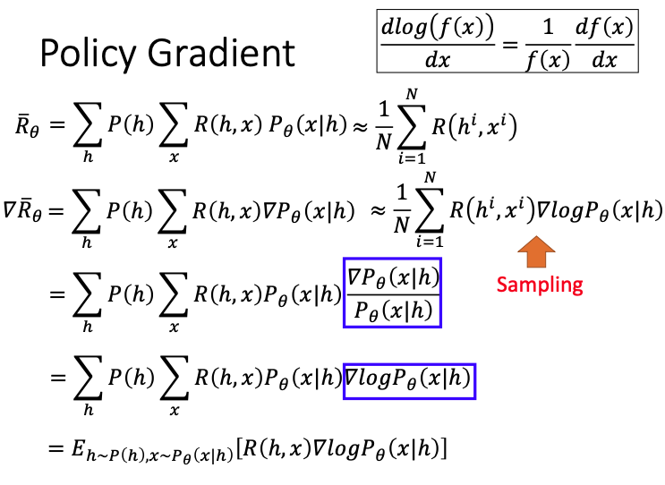

计算出对应的gradient之后，就可以使用gradient ascent来更新参数，

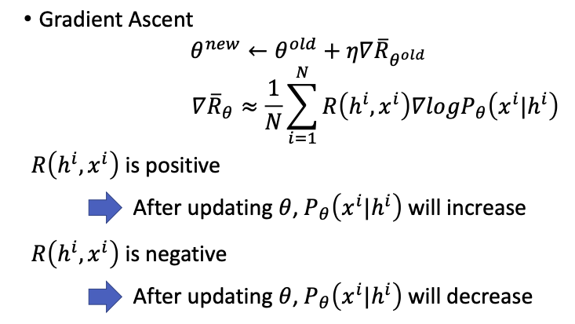

那么gradient $\Delta \overline R_\theta$的具体含义是什么呢？

+ 如果$R(h^i,x^i)>0$，就更新$\theta$来增加$P_\theta(x^i|h^i)$，即增加在给定的输入$h^i$的情况下，输出$x^i$的几率；
+ 如果$R(h^i,x^i)<0$，就更新$\theta$来减小$P_\theta(x^i|h^i)$。

##### Policy Gradient - Implemenation

那么我们如何使用policy gradient技术，让chatbot可以在reinforce learning的情景中，来学习如何与人进行对话呢？

在下图中，chatbot的参数是$\theta^t$，让chatbot与人进行对话，做一个sampling的process，如果人说的话是$c^i$，chatbot的回答是$x^i$，会得到对应的一个reward $R(c^i,x^i)$，一共有N个reward。

再计算出对应的gradient，更新参数$\theta$；每更新一次参数，都要重新收集charbot和人的对话。这点要和常规的gradient ascent进行区别，常规的gradient ascent算法可以很快进行下一次的参数更新，并不需要重新收集训练资料。

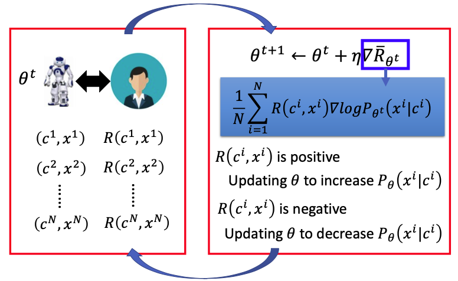

##### Comparison

下面我们对maximum likelihood和reinforcement learning进行比较。

首先是training data的区别，maximum likelihood的$\hat x^i$是人为标注的，是正确答案；但RL是人输入$c^i$，然后chatbot输出$x^i$，这里的$x^i$却不是人为标注的，并不一定是正确答案，有可能是正确答案，也有可能不是。

我们再对比下两者要最大化的objective function，RL多了一项$R(c^i,x^i)$，相当于为training data中的每个pair都加上了不同的weight $R(c^i,x^i)$；而Maximum Likelihood的training data中每个pair对应的weight都是1.

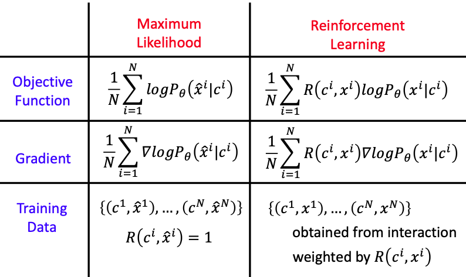

##### Alpha GO style training !

但reinforce learning训练起来是很麻烦的，人并没有那么多精力来和机器一直互动。因此，有人就提出了训练两个chatbot，让这两个chatbot互相问问题，有时候会出现一些正常的对话（右），但有时候很可能进入一个死循序（左）。

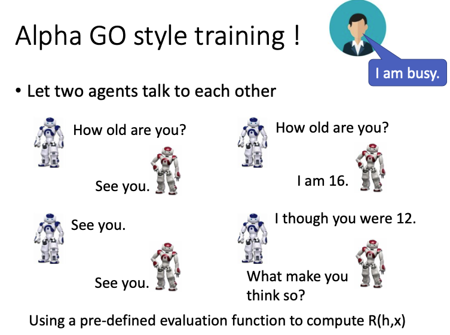

我们可以使用一个evaluate function来计算这个模型的训练结果，来观察这个对话到底好不好，如果是左边的两个chatbot，就给低分，如果是右边的两个chatbot，就给高分。

但这个evaluation function是人定的，复杂度是有限的。为了解决这个问题，我们可以引入GAN的概念。

#### GAN (discriminator feedback)

##### Conditional GAN

现在有一个chatbot，输入和响应的sentence分别是c、x，我们可以用discriminator来替代人的角色，来评估c和x的匹配程度，来评价这是不是一个正常的人类对话。

为了能辨别到底是不是正常的人类对话，discriminator还需要输入大量的人类对话进行学习。chatbot的目标就是生成能骗过discriminator的对话。

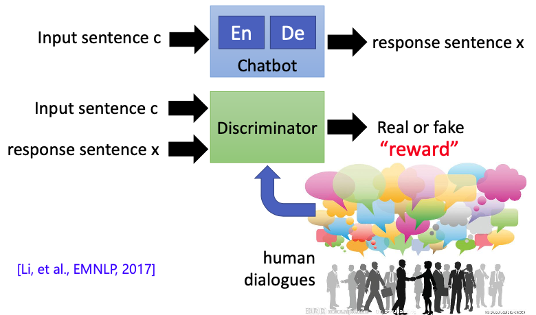

这个过程就相当于是conditional GAN，input sequence c就相当于是一个condition，generator要生成既满足condition，还要能骗过discriminator的sequence。

下面我们将简要介绍一下chatbot和GAN结合的算法流程。首先需要初始化G和D的参数，再进入循环，

+ 先从training data中sample出input c和对应的response x；
+ 再从input中sample出$c'$，输入generator，产生对应的response $\tilde x=G(c')$；
+ 同时将generator的input和output都输入D，更新D的参数，使其看到正确的$c,x$，就给高分；看到错误的$c',\tilde x$，就给低分；训练这个discriminator既可以用传统的JS divergence，也可以用WGAN的思想；
+ 还需要更新generator的参数，使其生成的sequence可以骗过discriminator，使D输出的分数越大越好。

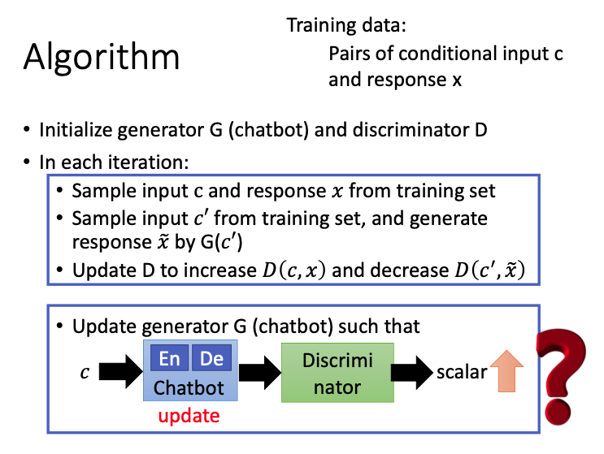

chatbot现在是一个[sequence to sequence](https://scarleatt.github.io/2020/06/28/seq2seq/)的model（RNN），首先要给一个condition作为输入，network输出词汇的distribution（这里我们假设只有两个词A，B），根据distribution再去做sample，就得出此次生成的词汇是B；把这个word和之前的condition再当作下一个时间点的输入，得出对应的distribution，……

这里的condition相当于是输入sequence的特征集合，必须在每次生成一个新词的时候都输入network，不然network可能会忘记输入sequence的一些关键信息。

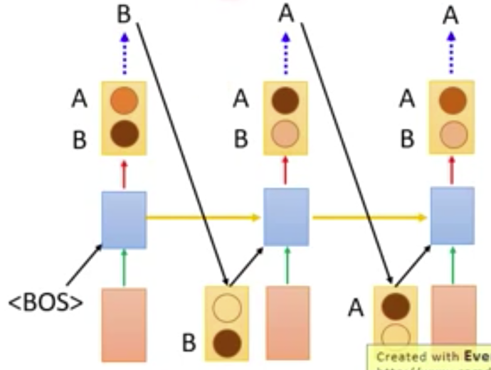

discriminator现在的输入就包括两部分，chatbot的input和output，输出一个评价分数scalar。现在我们要做的事是更新generator的参数，使其生成的sequence可以骗过discriminator，使discriminator的输出评价分数越大越好。

但现在会出现一个新的问题，这个network没有办法计算微分。如果这里是图像的生成，generator生成的图像全部直接丢给discriminator，没有sampling这个过程；但现在是文字生成问题，generator最后的结果会有一个sampling的过程，选择可能性最大的那个词作为输出，就不能计算微分；

**Q**：为什么做了sampling过程就不能计算微分了？

**A**：我们可以从微分的本质来回答这个问题，我们可以观察其输入的一点小小的变化，对输出会造成什么影响，这两者的变化值相除，就是对应的微分。现在回到我们chatbot的generator，如果我们对输入进行了小小的变化，由于进行了sampling，这个输出的变化是不确定的；很可能你现在sample了输入x出来，对x进行变化，本来y会产生相应的变化，但由于y没有被sample到，这个变化就没有表现出来。

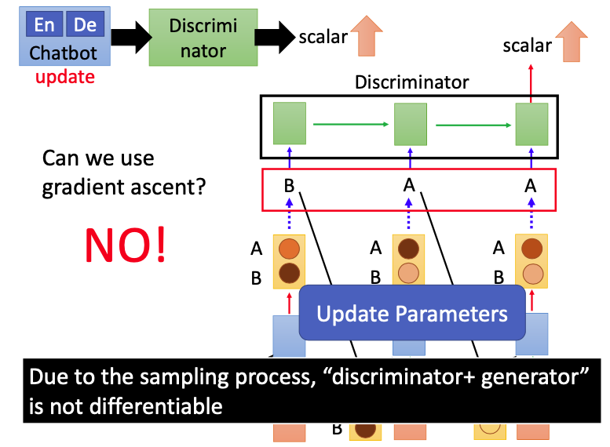

##### Three Categories of Solutions

有三个方法可以解决这个问题

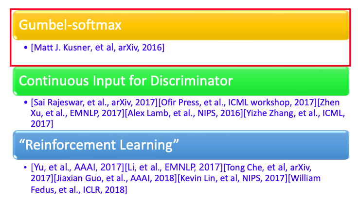

##### Solution 1: Gumbel-softmax

首先我们介绍一下Gumbel-softmax，是如何来解决不能求微分这个问题的。其核心思想就是把原来不能微分的变成了可以微分的东西。

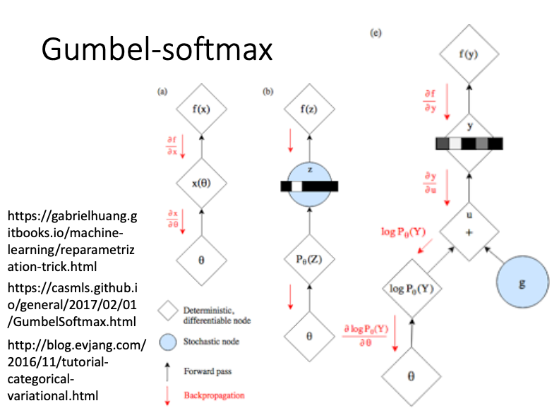

##### Solution 2: Continuous Input for Discriminator

现在我们介绍另外一个方法，把连续的输入给discriminator。

原来由于sampling这个过程，使得我们不能求微分，现在我们可以避开这个过程，直接把distribution给discriminator，就可以求微分了。

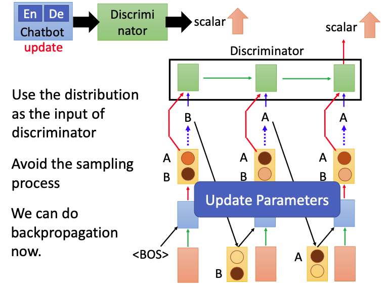

但这种做法会出现一个新的问题。对于real sentence，是one hot编码；而对于generated data，generator输出的是一个distribution，并不是one hot编码，discriminator现在可以根据是不是one hot编码，不考虑句子本身的语义，就可以轻易分辨出哪一个是真实的数据。

generator只要尽快生成one-hot编码，就可以轻易骗过discriminator。但这时generator生成的sequence是没有任何意义的。

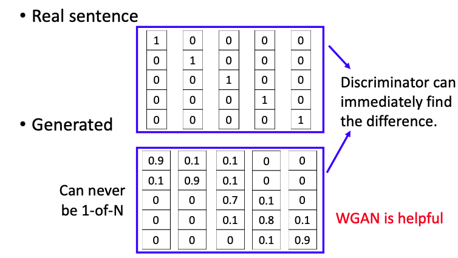

在condition generation中，如果是要进行sequence generation，要用的方法是把连续的输入给discriminator，我们可以使用[WGAN](https://scarleatt.github.io/2020/07/14/WGAN/)来完成这个训练。在使用WGAN时，要有一个额外的限制，discriminator是一个1-Lipschitz函数，要足够smooth才行。discriminator被限制后，就没那么容易分辨出到底哪一个是real sentence。

##### Solution 3: Reinforcement Learning?

现在我们使用reinforce learning的思想，来解决sampling之后不能求微分这个问题。

在之前的章节RL (human feedback)中，我们提到可以把discriminator当作人，人就知道怎么来调整chatbot的参数，使评价分数scalar越高越好，这里的评价分数也就相当于是reward。把人换成机器的discriminator，更新generator的参数，来提高discriminator的分数，也就等价于使reward最大化。我们可以用discriminator的输出$D(c,x)$，来替代这个reward $R(c,x)$。

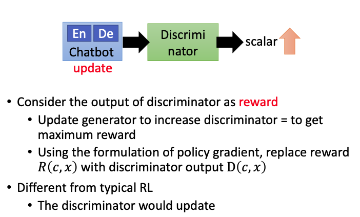

**g-step**：首先要训练generator，和typical RL相比，这里我们把Human换成了机器（discriminator），把所有的$R(c,x)$ 用$D(c,x)$来代替。之前的人来做discriminator，就非常花时间；但现在变成了机器来做discriminator，耗时就相对较小；

**d-step**：再来训练discriminator。我们需要把真实的人类对话输入给D，还需要把generator生成的对话也给D，discriminator就可以学习来分辨这两种对话。

训练好discriminator之后，对应的$D(c^i,x^i)$也发生了变化，因此要重新训练generator，……，再重新训练discriminator，……

这个过程会不断反复地进行。

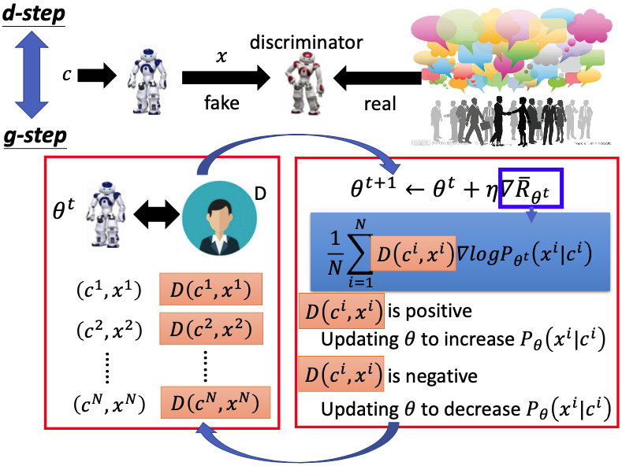

现在对于输入的sequence为$c^i=$“What is your name？”，chatbot给出的输出$x^i=$“I don't know”，是不太好的对话，discriminator给出的分数$D(c^i,x^i)$是负的，我们就需要更新参数$\theta$来减小$P_\theta(x^i|c^i)$。

我们把输出$x^i=$“I don't know”分成三个部分，用$x^i_1,x^i_2,x^i_3$分别表示“I”，“don't”，“know”；那么我们现在要减小的目标就是，
$$
logP_\theta(x^i|c^i)=logP(x_1^i|c^i)+logP(x_2^i|c^i,x_1^i)+logP(x_3^i|c^i,x_{1:2}^i)
$$
要来减小$logP_\theta(x^i|c^i)$也就等价于，把$P(x_1^i|c^i),P(x_2^i|c^i,x_1^i),P(x_3^i|c^i,x_{1:2}^i)$减小；

如果现在$P(x_1^i|c^i)=P(''I''|c^i)$，含义在给定的$c^i=$“What is your name？”条件下，输出"I"的几率。如果“I”当作正确答案的开头，是非常可行的，正确答案可以是“I am xx”等。但现在在训练过程中，chatbot看到“I”的可能性却是下降的，这是不合理的；如果产生了“dont”，“know”，这是合理的。

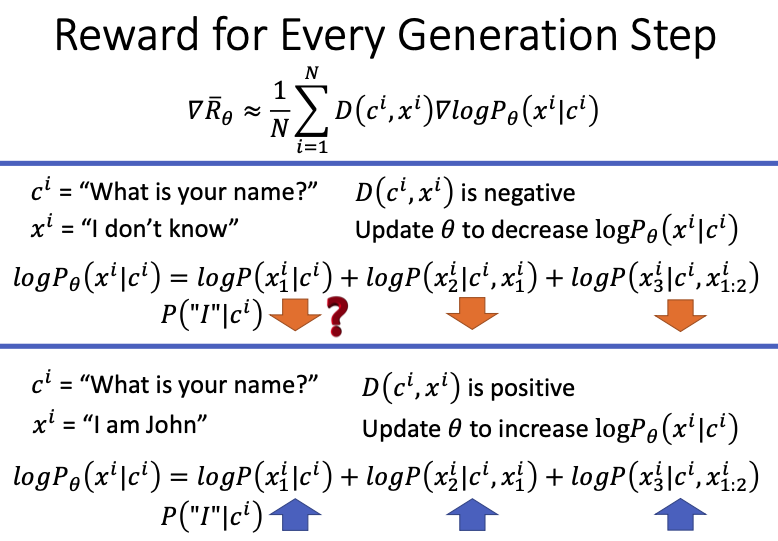

如果现在chatbot的回答$x^i$是“I am John”，这是一个好的对话，discriminator就会给一个正的分数，再更新参数$\theta$来增加$P_\theta(x^i|c^i)$。

我们把输出$x^i=$“I am John”分成三个部分，用$x^i_1,x^i_2,x^i_3$分别表示“I”，“am“，“John”；那么我们现在要增加的目标就是，
$$
logP_\theta(x^i|c^i)=logP(x_1^i|c^i)+logP(x_2^i|c^i,x_1^i)+logP(x_3^i|c^i,x_{1:2}^i)
$$
要来增加$logP_\theta(x^i|c^i)$也就等价于，把$P(x_1^i|c^i),P(x_2^i|c^i,x_1^i),P(x_3^i|c^i,x_{1:2}^i)$增加；现在$P(x_1^i|c^i)=P(''I''|c^i)$，这个几率是在上升的。

现在出现了一个新问题。对于同一个词”I“的概率，一个增加一个减小，如果sampleing的次数够多，是恰恰可以相互抵消的；但实际上，我们往往并不能sample到这么多的次数。

##### Reward for Every Generation Step

输入为$c^i=$“What is your name？”，输出$x^i=$“I don't know”，是不好的对话。但造成这个不好的原因并不是因为在开头sample除了“I”，而是后面的“dont”，“know”。因此，我们希望机器可以学习到对话为什么不好，需要对原来的式子进行改写，
$$
\Delta\overline R_\theta\approx\frac{1}{N}\sum_{i=1}^N\sum_{t=1}^T (Q(c^i,x_{1:t}^i)-b)\Delta logP_\theta(x^i_t|c^i,x_{1:t-1}^i)
$$
其中$P_\theta(x^i_t|c^i,x_{1:t-1}^i)$表示在输入的sequence $c^i$，以及产生了t-1个word的情况下，产生$x^i_t$的概率；计算reward的方式也发生了变化，变成了$Q(c^i,x_{1:t}^i)-b)$，会对每一个时间点新生成的word进行evaluation，而不是对整个输出的句子做evaluation。

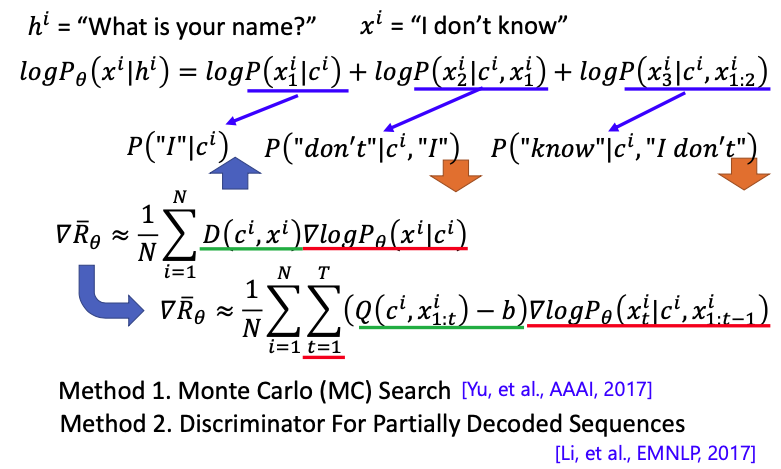

##### **Experimental Results**

下面是实验结果的展示。

对于MLE（Maximum Likelihood Evaluation）的生成结果，会频繁出现“I'm sorry”，“I dont know”。如果对应到图像的问题，这些频繁出现的句子就很像我们之前用VAE生成的模糊影像，由于有很多种火车，因此VAE选择了平均值，就会变的很模糊；再回到这里的文本生成问题，chatbot会生成很多个不同的答案 ，如果要同时maximum这些不同答案的likelihood，就会出现一些很奇怪的句子。

对于GAN训练出来的chatbot，就会产生一些很长、有内容的句子。

##### More Applications

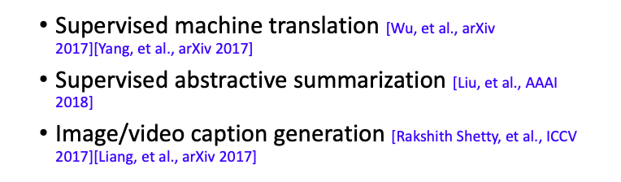

如果在训练seq2seq的模型，我们可以考虑用GAN来改善模型生成的结果。

### Unsupervised Conditional Sequence Generation

#### Text Style Transfer

[在前面的文章中，我们已经提到过如何用GAN来进行image style transformation，](https://scarleatt.github.io/2020/07/06/CycleGAN/)比如把风景照转成梵谷的画，把male audio转成female audio等。那么我们现在也可以对文字进行style transformation，把正面的句子看作是一种style，把负面的句子看作是另外一种style。

如果我们要进行text style transfer，只需要一堆正面的句子，一堆负面的句子，分别当作是两个domain的数据，应用CycleGAN，就可以训练这个network。

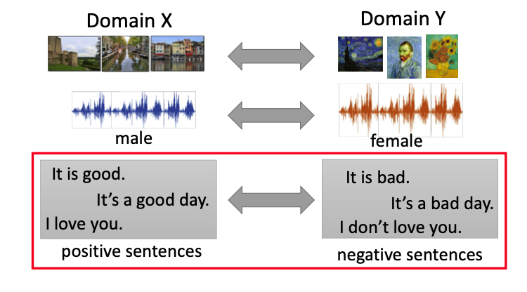

##### Direct Transformation

这是图像进行风格转换的结构图，

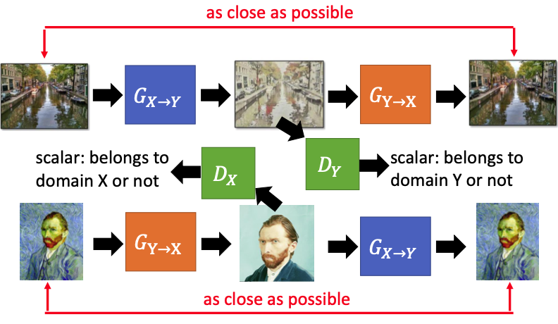

如果我们要对文本进行风格转换，把上图中的图像换成文字，即把positive sentence算成一个domain，把negative sentence算成是另外一个domain，用cycleGAN算法来进行训练即可。

这样做就会产生一个问题，generator的输出是discrete的，是进行sampling的结果，当generator $G_{X\rightarrow Y}$和discriminator $D_Y$连起来的时候，就不能进行微分，也就不能训练。

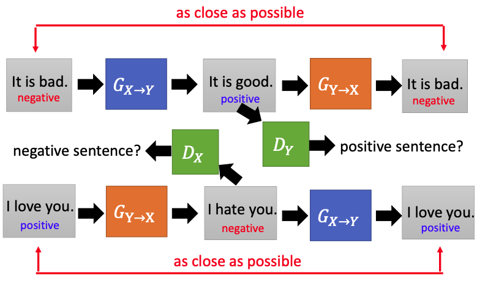

上文已经针对这种问题提出了三种解法，这里我们选择Solution 2: Continuous Input for Discriminator，把每个word都进行word embedding，都用一个vector来进行替代，整个句子就相当于是vector的sequence，是连续的；而且word embedding的结果并不是one-hot编码，并不会对结果造成其他的影响。

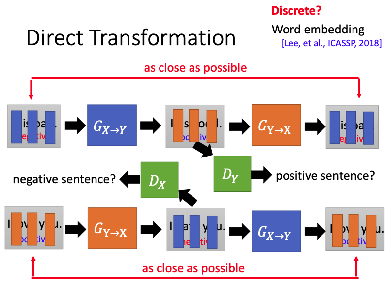

这里是实验结果的展示，

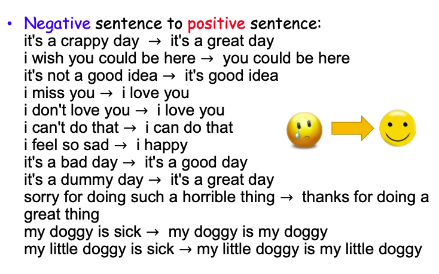

##### **Projection to Common Space**

现在讲另外一种transform的方式，输入真实人物的图像，网络输出动漫人物的图像。

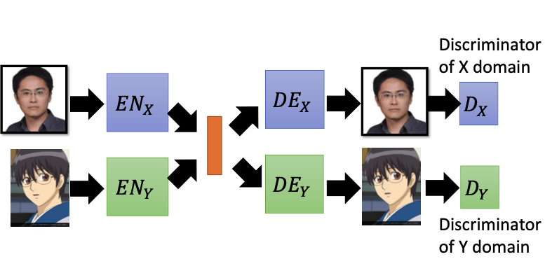

我们也可以进行这种风格的文本转换，同样会出现结果是discrete的问题，我们也可以选择三种方式的其中一种来进行改进。这里我们简要叙述两种解决办法：

1. 由于decoder的结果是discrete的，但decoder的hidden layer的结果却不是discrete的，是Continuous的；
2. 通过两个encoder把两个不同domain的sentence，都映射到同一个space，还需要加一个domain discriminator，可以对domain X和Y的encoder所输出的vector进行判断，看到底是属于哪一个domain的图像。如果这个domain discriminator不能进行判断，那么我们就可以认为这两个encoder所生成的vector其distribution都是一样的，从而这两个distribution中相同的维度表示相同的意思。

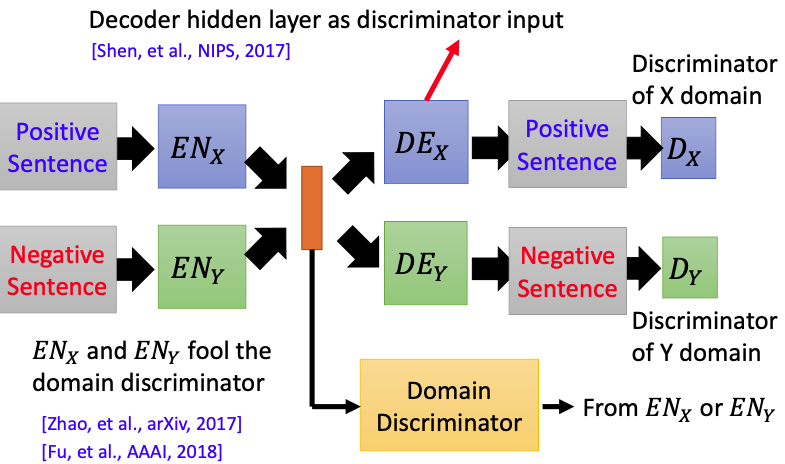

#### Unsupervised Abstractive Summarization

##### Abstractive Summarization

我们可以训练一个提取摘要的模型，输入一篇文章，输出为对应的摘要。以前的技术是这样来操作的，先给机器一篇文章，机器来判断每个句子重不重要，重要的句子就会被extract出来，然后被拼接成全文的摘要。

但这样生成的摘要不太好，我们应该在理解文章之后，用自己的话把摘要写出来。我们可以训练一个sequence to sequence的模型，先给machine一堆文章及其对应的标注摘要，模型训练完成后，就可以总结出一篇新文章的摘要。

但这个模型的训练需要大量的资料，差不多要收集100万个example，机器才能训练出来这个模型。

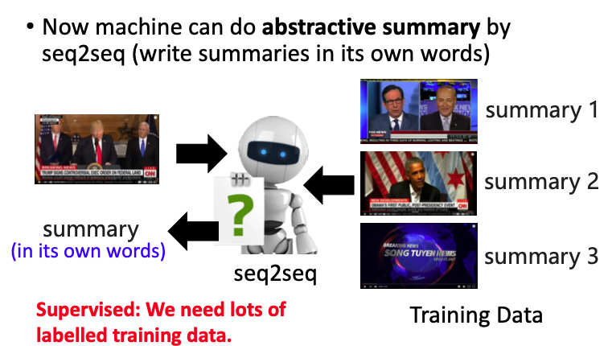

##### Review: Unsupervised Conditional Generation

我们可以把文章看成一种domain，把摘要看成是另外一种domain，使用GAN的技术，就可以用unsupervised的方法，不需要收集两个domain之间的pair <文章，摘要>。使用GAN的方法后，我们只需要收集domain X的一堆数据（文章），domain Y的一堆数据（摘要），训练完成后，机器就可以自动实现domain X和Y之间的互转。

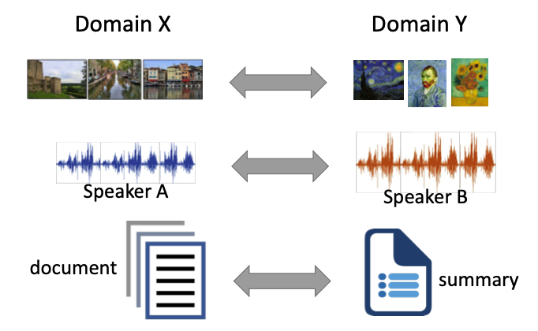

##### **Unsupervised Abstractive Summarization**

这个技术和cycleGAN很像。

首先训练一个seq2seq的model，输入一篇文章，输出一段sequence；我们还需要一个discriminator，看过很多其他人写的摘要，可以对输出的sequence进行检测，看这个sequence到底是不是人写的摘要。

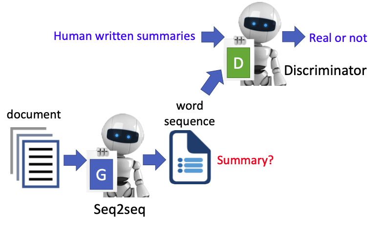

现在会出现一个新问题，这个输出的sequence可以很像人写的摘要，但这个摘要和输入的document没有关系。

我们可以再加一个seq2seq模型，可以将第一个seq2seq模型生成的摘要在进行reconstruct，看新生成的document是不是和最开始的input接近，即最小化reconstruction error。那么现在第一个seq2seq模型的目标就有两个：产生能骗过discriminator的摘要；产生的摘要必须是和原文接近的内容。

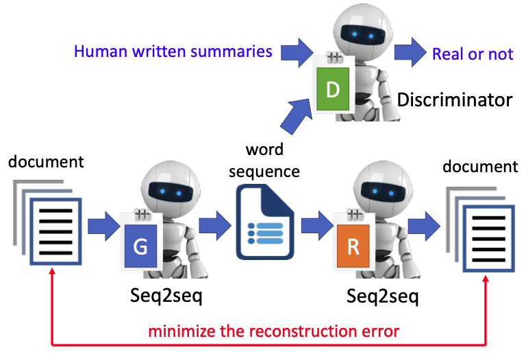

我们也可以从另外一个角度来理解这个模型，

先输入一个document，生成摘要后，再reconstruct回原来的document，这可以看作是一个**seq2seq2seq auto-encoder**，中间的摘要就可以看作是encoder之后的code；

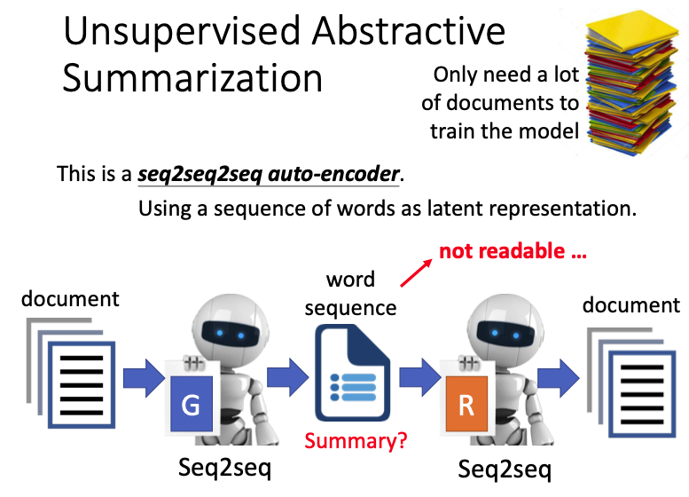

但这个code并不一定是可读的。为了让model产生人类可以阅读的摘要，我们需要一个discriminator，这个discriminator学习了大量人类写的摘要，可以来判断生成的摘要是不是readable。

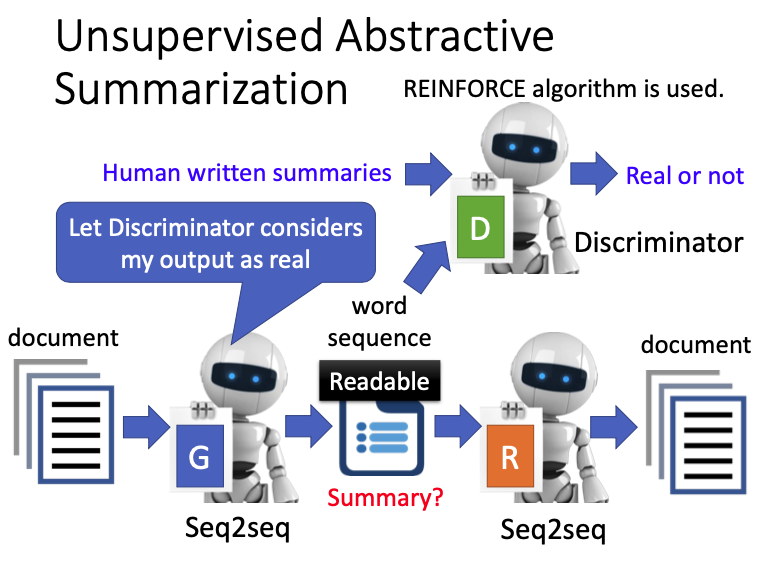

这里展示了部分实验结果，unsupervised表示Unsupervised Abstractive Summarization，可以发现生成的摘要比较保守，由于generator会很想生成能骗过discriminator的摘要，通常generator会去原文中提取一段话。

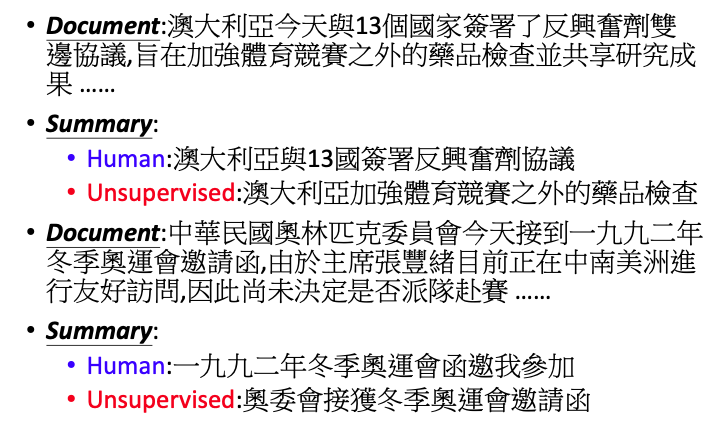

也有一些失败的例子，

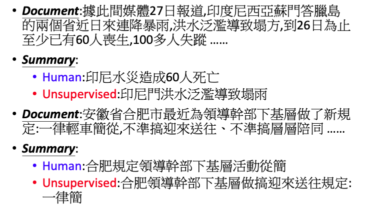

这里是几种对比实验的展示，分别是WGAN，RL，Supervised。纵轴表示生成摘要的评价指标，越高越好，横轴表示训练资料的数量。黑色表示使用了380万个pair作为训练资料的结果。

如果我们先用unsupervised的方法来训练我们的模型，把模型训练得很强，再用少量的label data来进行fine-tune，进步就会很快。在下图中，我们只使用了50万个有label的数据，就可以达到和supervise的方法一样好的效果。

#### Unsupervised Translation

##### Unsupervised Machine Translation

我们也可以用unsupervised的方法来进行机器翻译，比如把法语当作是一种domain X，把中文当作是另外一种domain Y；我们就可以使用这种cycleGAN的思想，来进行domain之间的转换。

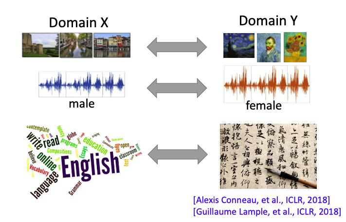

facebook新发的论文也证明这种思想是非常可行的。纵轴表示摘要的好坏，横轴表示训练资料的数量。

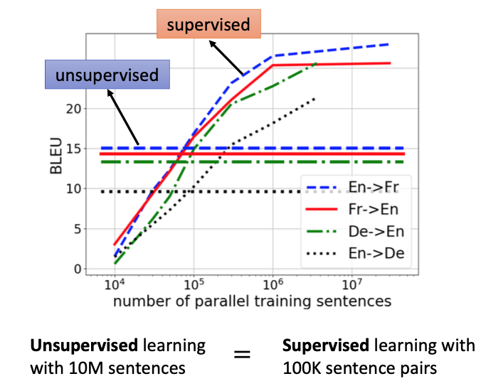

##### Unsupervised Speech Recognition

既然语音信号之间可以互相转换，语言之间也可以互相转换，那么语音信号和语音之间能进行转换吗？

其实这也是可以办到的。

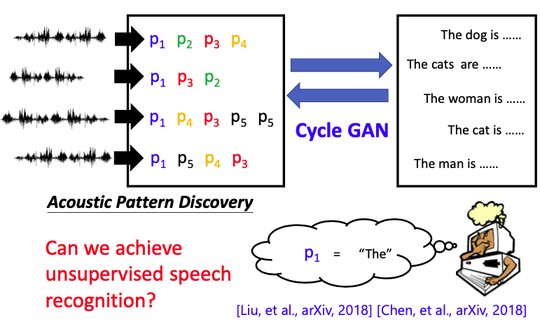

这里是具体的实验结果，红色和蓝色直线表示使用unsupervised的方法，发现只有30%的准确率；而对于supervised的方法，训练资料越多，模型的准确率越高。

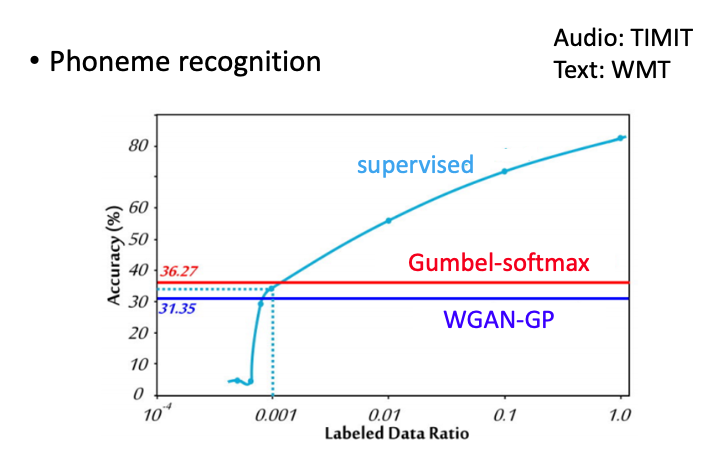