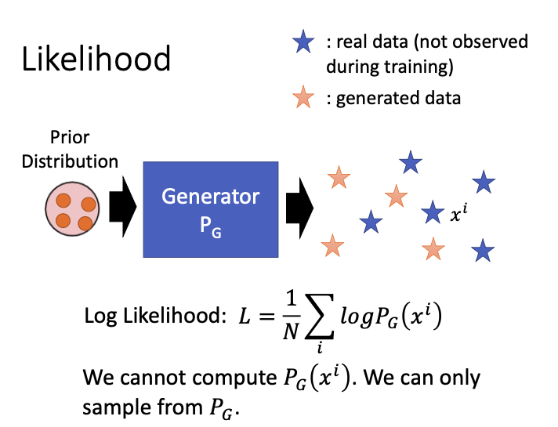
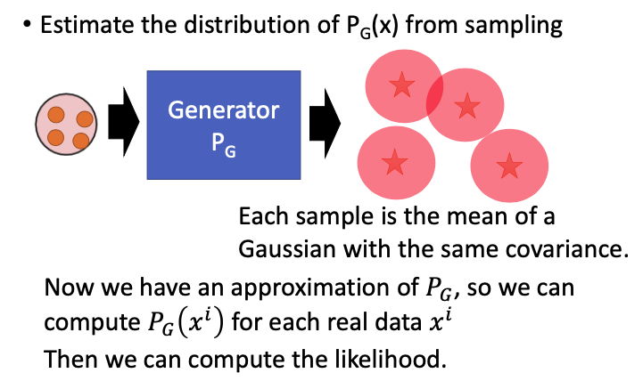
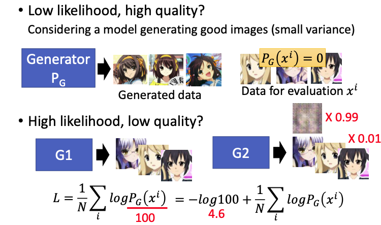
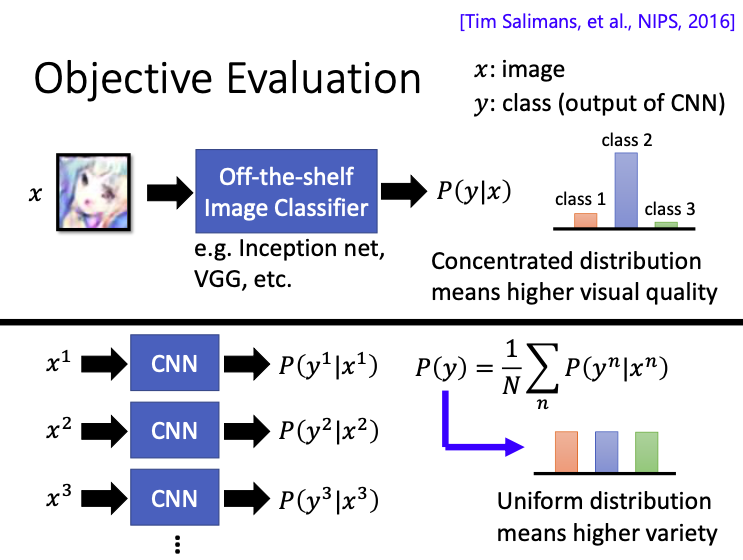
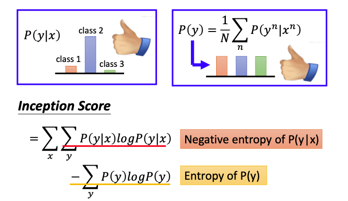
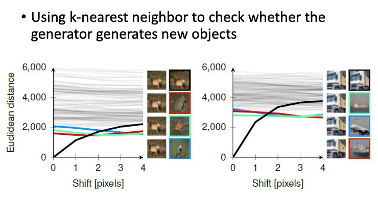
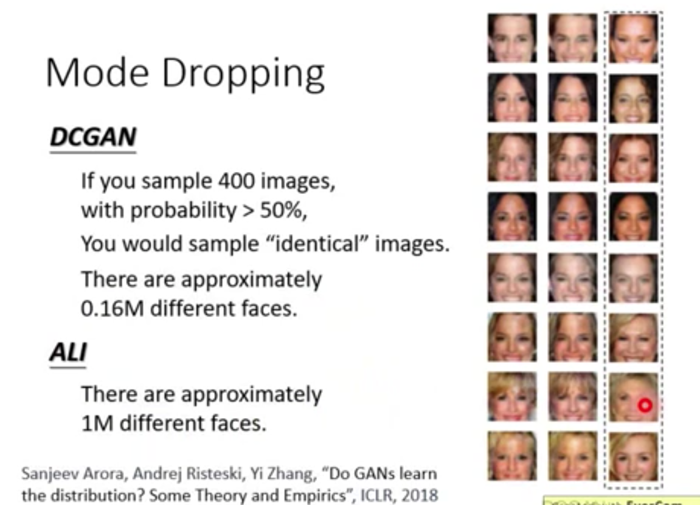

本文主要叙述如何来评价GAN生成结果的好坏。首先叙述了使用传统的likelihood，由于传统的likelihood方法有一些局限性，本文接着使用了Inception Score的思想，来对GAN进行评价。

#### Likelihood

对于传统的评价generator生成结果的方法，是计算每个结果产生的likelihood。

+ 先从真实数据的distribution中sample出$\{x^1,x^2,...x^m\}$；
+ 把$x^i$代入现在的已知的distribution $P_G(x^i;\theta)$，表示$x^i$是从现在这个distribution中sample出来的概率；
+ 把这些概率相乘，得到似然函数L；最后找到对应的参数$\theta$，使似然函数取得最大值。

$$
L=\frac{1}{N}\sum_{i}logP_G(x^i;\theta)
$$

这个likelihood就可以用来评价generator的好坏，如果likelihood很高，表示这个generator有很高的几率可以产生真实数据，就是一个好的generator。

现在会遇到一个新问题。我们没有办法计算$P_G(x^i)$，训练好的generator就可以看作是一个network，这个network可以实现输入一个vector，然后输出一张图像，但没有办法算出generator产生某个特定图像的几率。generator虽然可以产生图像，但没有办法产生特定的图像。

如果generator是一个gaussian mixture model，我们就可以算出这个likelihood；但现在是复杂的模型，并不能计算likelihood；

##### Likelihood \- Kernel Density Estimation

我们可以尝试 Kernel Density Estimation来计算likelihood。

首先让generator产生很多data，然后我们再使用多个gaussian distribution来逼近这些data。如果现在是图像问题，先让generator生成很多图像（高维的vector），把这些vector当作gaussian model的mean，每个mean都有一个固定的variance；把这些gaussian model都融合起来，就得到了一个gaussian mixture model;

[**Gaussian Mixture Model**：](https://scarleatt.github.io/2020/06/29/generative-models/)如果现在有m个gaussian model，其中$P(m)$表示选择该对应model的可能性，$P(x|m)$表示在选定了第k个model后，该mode产生x的概率，即
$$
P(x)=\sum_mP(m)P(x|m)
$$
那么现在我们就有了分布$P_G$的近似分布$P(x)$，那么我们就可以计算$P_G$产生真实数据$x^i$的概率$P_G(x^i)$了，我们也可以继续计算likelihood。

##### Likelihood v.s. Quality

就算我们真的算出了这个likelihood，这个likelihood也并不一定就代表了generator的quality，很可能会出现以下两种情况：

+ low likelihood，很可能产生high quality的图像。在下图中，很可能generator生成了很接近真实图像的动漫头像，但这时我们要来计算likelihood，生成图像和真实图像很可能差别很大，那么generator生成数据库中的真实图像的可能性就很小，即$P_G(x^i)=0$；

+ high likelihood，很可能产生low quality的图像。下图中有两个generator，算出来的likelihood值分别为$L_1,L_2$。generator 1生成的图像质量很高，且和数据库中真实的图像也很接近，我们可以先算出这个likelihood，

$$
L_1=\frac{1}{N}\sum_{i}logP_G(x^i)
$$

对于generator 2生成的图像，有0.99的概率生成模糊的图像，有0.01的概率生成真实的清晰图像。相对于generator 1而言，$P_G(x^i)$减小了100倍，
$$
L_2=\frac{1}{N}\sum_{i}log\frac{P_G(x^i)}{100}=-log100+\frac{1}{N}\sum_{i}logP_G(x^i)
$$
其中$log100$的值接近4.6，但likelihood的值算出来的值一般都是几百的，generator 1和2的likelihood算出来其实差别不大。但其实这两个generator的差别很大，generator 1比2要好一百倍，只是likelihood的值算出来差别不大而已。

因此，likelihood的值与generator的好坏其实是没有必然联系的。

#### Objective Evaluation

我们可以用一个训练好的classifier来判断生成结果的好坏，加入我们现在在做人脸生成问题，我们就可以用人脸识别程序来判断，如果能进行识别，就说明生成的结果还不错。这个classifier是训练好的，比如VGG。

在下图中，generator生成了一张图像x，我们把x输入这个classifier，会输出对应类别的distribution，即x属于class 1，2，3的概率。如果这个分布产生的概率越集中（某个类别概率很大，其他类别概率很小），就表示generator产生的图像品质很高，classifier可以很自信地进行分类；

很可能generator就只能产生那个类别的清晰图像而已，产生的其他类别图像质量都很差，这并不是我们想要的结果。因此，我们不仅仅衡量输出概率的distribution，还需要从diverse的方向来衡量；

那么什么叫从diverse的方向来衡量呢？

现在让generator生成一堆图像，这里用三张不同的图像作为例子，把这些图像输入CNN，得到三个不同的distribution，再分别求三个distribution中属于同一类别概率的平均值。如果平均值的分布比较uniform，就表示每一种class都有可能被产生，就表示是diverse的；如果平均完之后的值有的很大，是某一个class的概率特别高，model就比较倾向于产生这个类别的事物，就说明output不够diverse。

现在对于我们的模型就有两个要求，

+ **图片质量**：classifier得出的distribution要足够sharp、集中，classifier可以很自信地确定x是属于哪个类别；这可以用条件概率$P(y|x)$来表示，越大越好；
+ **图片多样性**：生成的图像还要足够diverse，标签的分布要均匀，因为我们不希望生成的图像都是属于某一个类别的；这可以用$p(y)$来表示。

有了这些限制之后，就可以定义对应的score，我们这里使用的是inception network来进行evaluation，对应的分数是inception score，
$$
{\rm Inception\ score}=\sum_x\sum_yP(y|x)logP(y|x)-\sum_yP(y)logP(y)
$$

#### We don’t want memory GAN.

在训练GAN的时候，还有另外一个问题，有时候计算generator生成的图像特别清晰，这个结果也不见得是好的。因为很可能generator只是记住了training data中的某几张图像而已，而我们希望生成的图像不是database里面的，而是有创造性的图像。

那么我们怎么知道生成的图像是不是database里面的呢？要一张一张去对比吗？

我们可以在generator每生成一张图像的时候，都自动和database里面的每张图像进行对比，可以进行pixel-level的相似度对比；

但只进行pixel-level的相似度对比是远远不够的。在下图中，有一只羊的图像，每一条曲线都代表一张图像，纵坐标表示database中的图和羊的近似程度，横坐标表示把羊图像向左移动的pixel数目。如果往左边移动一个pixel，发现这张图像还是和原来的图像最接近；如果移动两个pixel，最像的图片就变成了下图中红色方框内的图像，对应图中的红色曲线

#### Mode Dropping

在训练GAN的时候，很可能会出现mode dropping，生成的图像出现多样性不够的问题。

对于DCGAN（Deep Convolutional GAN），我们怎么检测其生成的人脸是多样性的呢？

首先DCGAN产生很多张image，看这些生成的image中有没有非常像的，是人都可以辨识出来的。对于判断是不是同一张人脸，可以使用下列论文中提到的方法，先把DCGAN生成的图像丢到一个classifier里面，如果机器认为这是同一张图像，人再来进行观察，看是不是同一张图像。

那么DCGAN到底可以产生多少张不一样的image呢？

现在我们sample出400张image出来，如果有50%的概率，可以从400张image里面找出2张相同的人脸；我们就可以根据这个数据来反推到底产生了多少不同的人脸

#### Reference

1. Lucas Theis, Aäron van den Oord, Matthias Bethge, “A note on the evaluation of generative models”, arXiv preprint, 2015

2. [【深度理解】如何评价GAN网络的好坏？IS（inception score）和FID（Fréchet Inception Distance）](https://blog.csdn.net/qq_27261889/article/details/86483505)

   

