> 本文主要针对source和target data的不同情况，介绍了几种主要的transfer learning的方式，包括Fine-tuning、Multitask learning、domain-adversarial training、zero-shot learning。

如果现在没有和我们任务直接相关的数据，比如我们要做的任务是猫狗分类，很可能手头只有elephant和tiger的数据集，是不同标签的；也有可能是动漫的cat/dog数据，和真实数据集的domain不一样。

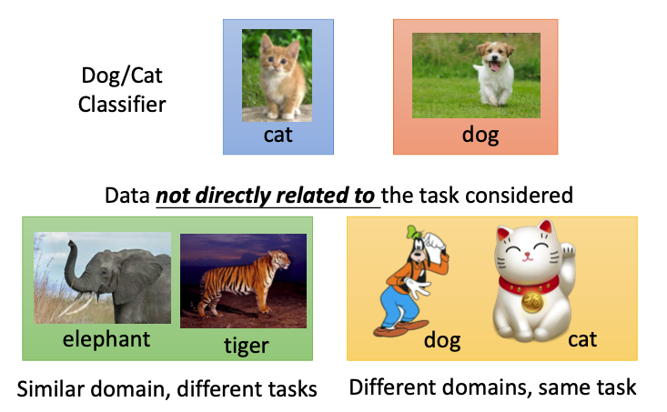

那么这些不相关的数据，会对我们的任务是有帮助的吗？

#### Overview

现在有一些data是和我们的任务有关的，是target data，有一些data是和我们的任务无关的，是source data；target data和source data可能是有label的，也可能是没有label的，我们也将分为这四种情况来进行讨论。

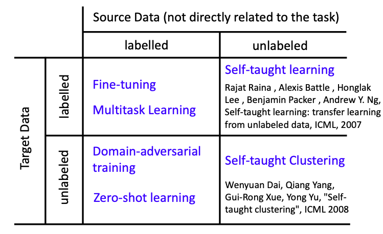

如果target data和source data都是有label的，那么我们就可以进行model fine-tuning。

#### Model Fine-tuning

现在我们只有很小一部分target data $(x^t,y^t)$，但却有很多的source data $(x^s,y^s)$；如果target data只有少量的几个example，那么我们就可以称作是**one-shot learning**。

我们可以针对这样的task举一个例子，speaker adaption，任务是辨识某一个人的声音，但只有这个人的少量audio data，但我们有很多其他人的audio data；

为了解决这个task，我们可以先使用source data来训练一个model，然后再用target data来进行fine-tuning；即把source data训练的model当成一个初始值，再用我们source data来进行训练任务。

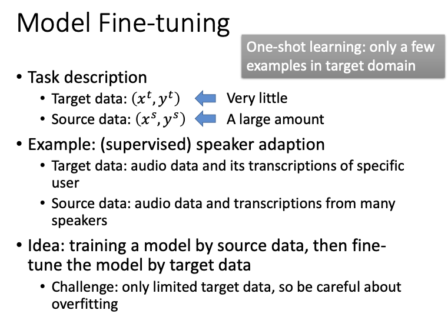

但对这个模型进行训练的时候我们必须非常小心，由于target data的数量太少了，必须要注意overfitting问题。

我们在训练过程中加入一些小技巧，conservative training、layer transfer。

##### Conservative Training

现在有大量的source data，即很多其他人的audio data，用这些data来训练一个model；把这个训练好的model来作为另外一个model的初始值，再用target data来进行训练；

为了防止overfitting，我们需要加上一些constrain。在看到同一个data的时候，我们希望这两个model的output越接近越好；或者这两个model的参数之间的差距也要越小越好，可以计算这两者之间的L2-norm。

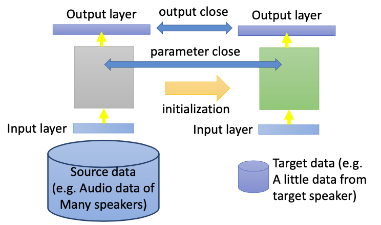

##### Layer Transfer

首先用source data训练好一个model，把这个model中的其中几个layer的参数拿出来，到新的model里面去；

再用target data来训练没有复制过去的layer（rest layer），target data只需要训练非常少的参数，因此就可以避免overfitting；

如果target data足够多，也可以直接直接对整个network进行fine-tuning。

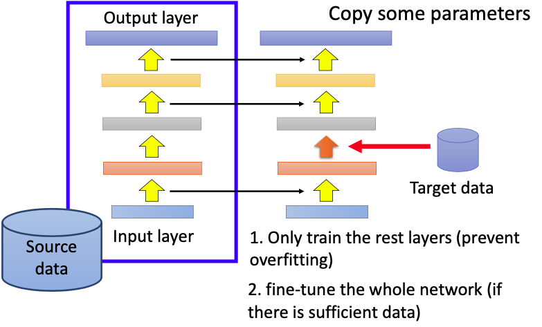

对于不同的task，需要copy的layer也是不同的。比如Image相关的任务，通常都是copy前几层的参数，因为前几层都是在做一些比较基础的工作，类似于有没有直线，有没有简单的几何图形。

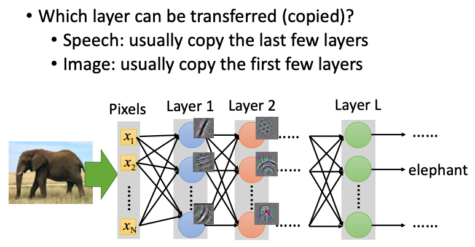

下面是Image使用Layer transfer进行的实验，source data包括500个类别，target data包括也包括500个其他的类别，数据来自imagenet；下图中横轴表示copy的层数，纵轴表示copy这几个layer，再用target data来进行训练所能达到的准确度accuracy；

红色的曲线（only train the rest layer）：首先用source data训练好model，copy其中的某几个layer之后，只用target data训练剩下没copy的layer；随着copy的层数不断增多，可以从图中看到训练的准确度是在不断下降的；只有copy前面几个layer，performance稍微有些进步；

橙色的曲线（fine-tune the whole network）：现在我们不只是用target data来训练剩下的layer，而是对整个network进行fine-tuning，可以发现随着copy的layer数量越多，模型准确度越高；

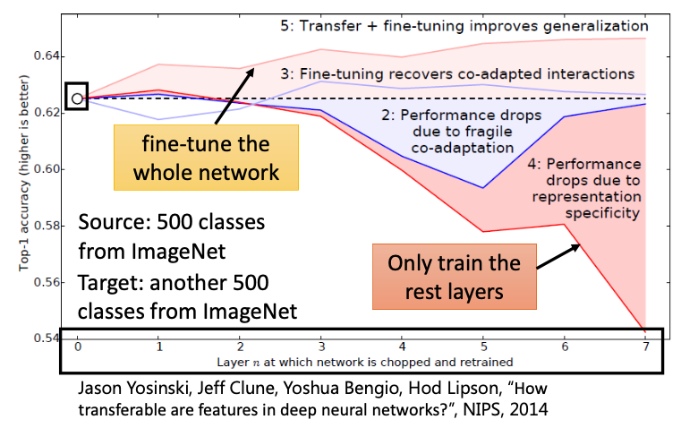

下图中红色的曲线和上图中红色曲线相对应，只训练剩下的layer，纵轴表示source和target data之间的相关程度。从图中我们可以看出，如果source和target data差别很大，在做transfer learning的时候performance会下降很多；但如果只copy 前几个layer，performance就掉得不会太多。

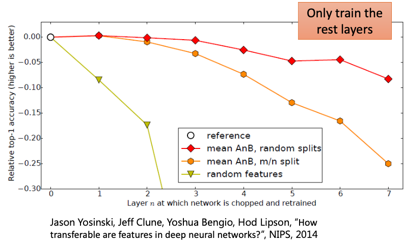

#### Multitask Learning

##### Introduction

在进行fine-tunign时，我们更多关心的是target对应的准确率，并不太关心source的准确率；而multitask learning则是两者的准确率都考虑进来了。

有两个不同的task A，B，这两个task所使用的input feature都是一样的，前几层的网络结构也是一样的；但在之后的某个层就分叉了，Task A会用到部分output，Task B会用到另外一部分的output；

这样做的其中一个好处就是，我们会用task A和B的data一起来对前几个layer进行训练，这几个layer很可能有更好的performance；

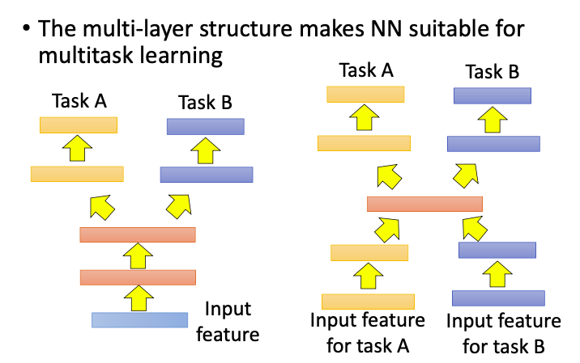

即使这两个task的前几个input层的layer都不一样，只有中间某些layer是可以共用的，我们也可以使用transfer learning的思想。

##### Multilingual Speech Recognition

Multitask Learning有一个很成功的应用，即Multilingual Speech Recognition（多语音辨识）；

现在我们有一堆多种语言的语音数据，我们要对这些audio进行语音辨识。我们可以训练一个model，来同时对这五种语言进行辨识，这个model的前面几个layer都是共用参数的，只有后面几个layer的参数不一样。因为都是人类说的语言，所以前几层可以共用参数。

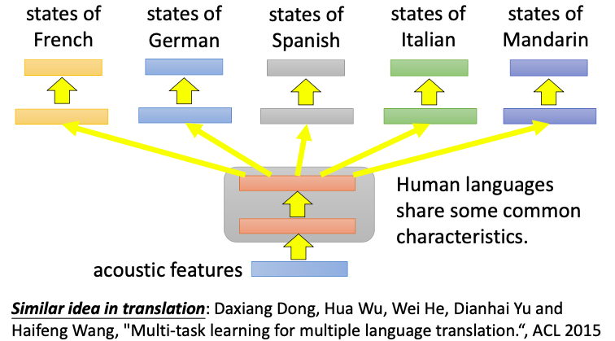

#### Domain-adversarial training

如果现在target data是unlabeled，而source data是labeled，我们可以通过Domain-adversarial training来进行transfer learning。

在下图中，source data是带label的，是来自MNIST的数据，$(x^s,y^s)$是training data；target data是没有label的，来自MNIST-M，$(x^t)$是testing data；这两者是mismatch的；

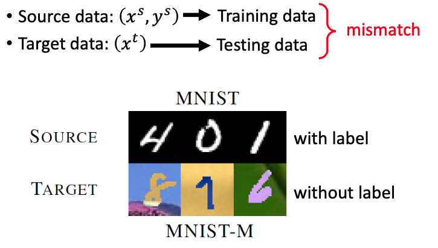

那么我们怎么让在MNIST上训练出来的model，应用到MNIST-M（背景五颜六色）上呢？

如果直接把MNIST-M中的某个图像x输入训练好的network，然后输出对应的classification，效果会非常不好；我们可以把这整个network的前几层看作是在extract feature，后面几层看作是在进行classification；

在下图中，我们把extract出来的feature做一个可视化的展示，如果把MNIST的数据输入进去，即图中蓝色的点，会发现有10个cluster，classifier可以根据这些feature进行分类；但如果把MNIST-M输入network，会变成图中红色的点，是没有规则的，classifier并不能根据这些feature进行分类。

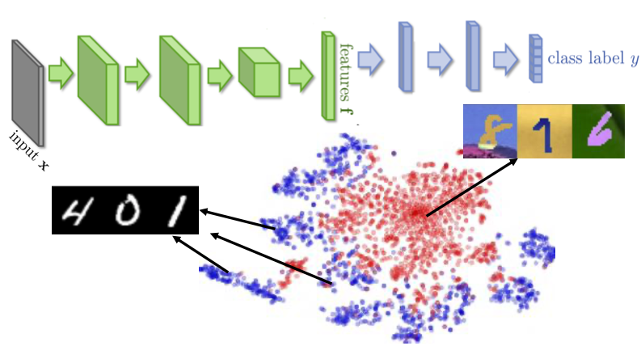

针对这个问题，我们可以对网络结构进行改进；

我们可以通过network中的feature extractor，即Domain-adversarial training，把domain的这些特性给消掉。不同的domain不应该像上图那样分成两群，而应该被混在一起；

为了训练这个feature extractor，我们可以把提取出来的feature输入一个classifier，提取出来的feature要想办法骗过classifier；如果把extractor看作是generator，那么classifier就可以看作是discriminator，和起来就可以看作是GAN；

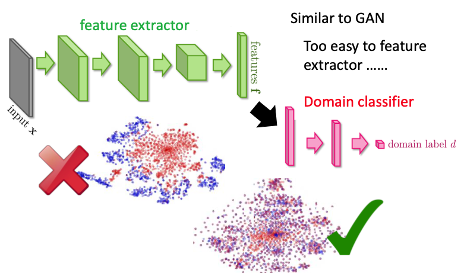

但骗过这个classifier太简单了，feature只要全都是0，就可以骗过这个classifier；

因此这个feature不仅要能骗过classifier，还需要保留原来digit的特性；如果输入label predictor，也需要做的好，要能输出对应的label（0～9）；

这个feature extractor需要满足两个条件，Maximize **label** classification accuracy + minimize **domain** classification accuracy，这也就是Domain-adversarial training中adversarial的由来。

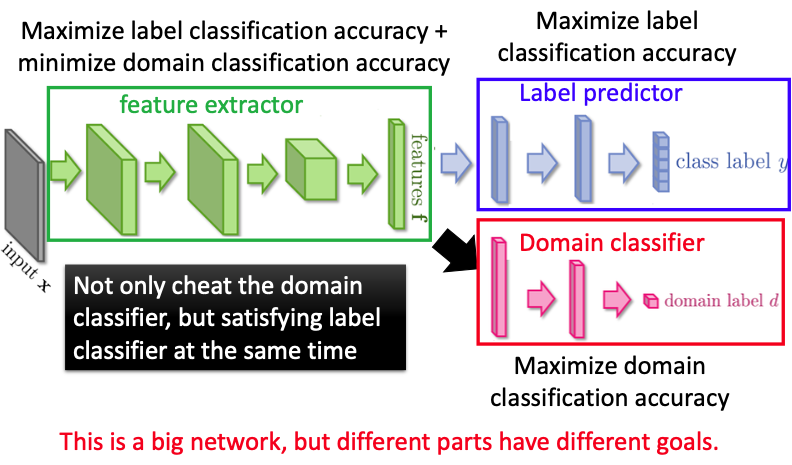

虽然Domain-adversarial training原理很简单，但训练起来还是很麻烦的

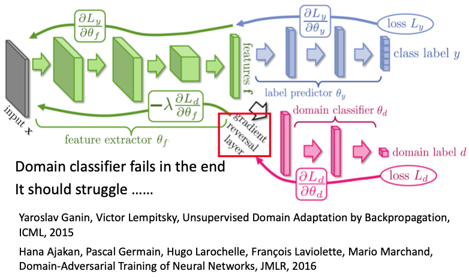

这里就是论文中的实验结果，

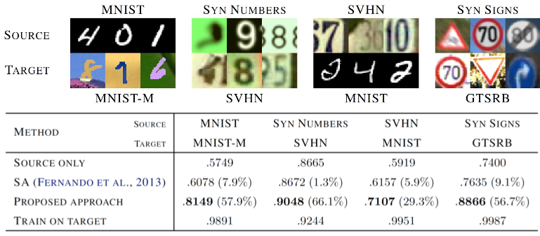

#### Zero-shot learning

在Zero-shot learning里面，training和testing data的task是不一样的；比如source data是要进来猫狗分类的数据，但testing data却只有草泥马，这是在training data中没有的类别

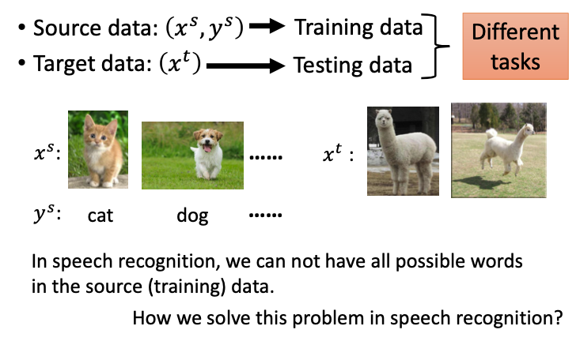

在语音辨识领域，如果我们并不知道所有可能的source data，我们如何来进行辨识呢？

我们对这个问题进行了转化，不是要辨识一段语音属于哪一个word，而是要辨识语音属于哪一个“音标”，即把辨识的单位变成“音标”。还需要建立表示“音标”和word之间转换关系的表格，当我们辨识出“音标”之后，查表就可以得到对应的word。就算有一段语音没有在training data中出现过，我们也可以先辨识出其对应的“音标”，再得到具体的word。

现在回到图像领域。

如果是在图像领域，我们可以把每个class用attribute来表示，如下图的 Database所示，比如dog有毛，是四条腿，有尾巴的，……。这个attribute的数量要足够多，每个class都有其特别的attribute组合，如果出现两个类别的class有相同的attribute组合，这个方法就失效了。

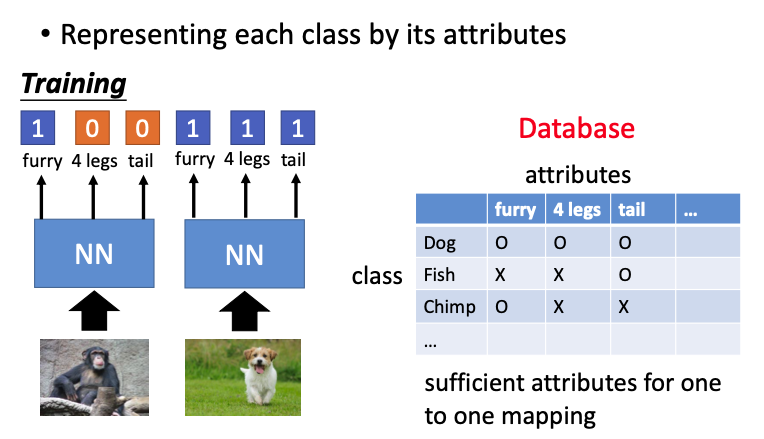

那么现在的任务就变成了，辨识每张image里面的attribute，比如看到dog的图像，就要说这是有毛、有四条腿、有尾巴的动物；

在testing的时候，即使出现一个从来没看过的动物，network只需要辨识这个动物的attribute就可以了，再去查看属性表，看哪一个class和这些attribute最接近。

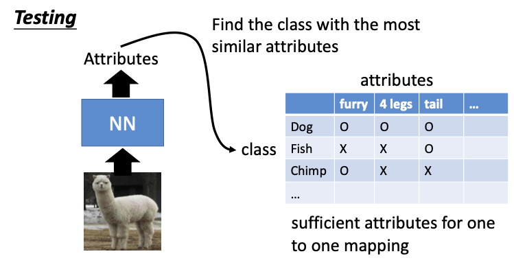

这个attribute的数量可能会非常多，这时我们就需要做attribute embedding（降维成一个vector，表示成space上的一个点）；首先我们需要把图像的attribute先投影到embedding space上，把表格里面的属性也投影到这个space，分别写作$f(x^i),g(y^i)$，f和g可以看作是一个network；

在training的时候，我们希望$f(x^i),g(y^i)$越接近越好；在testing的时候，即使我们从来没见过这个草泥马，我们也可以把这个草泥马的attribute投影到embedding space上，看哪个class的attribute和这个点最接近

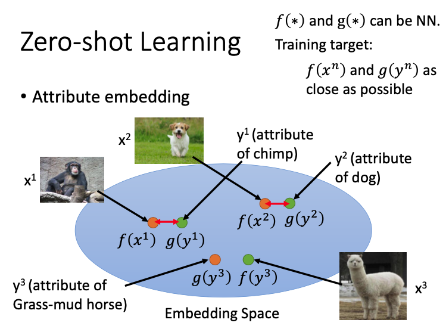

如果没有这个database（class和attribute的关系），我们可以借助word vector来完成这个任务。即用word vector来表示这个动物，这个vector的某个dimension就表示动物的某个attribute，再把attribute也用对应的word vector表示，再来做embedding

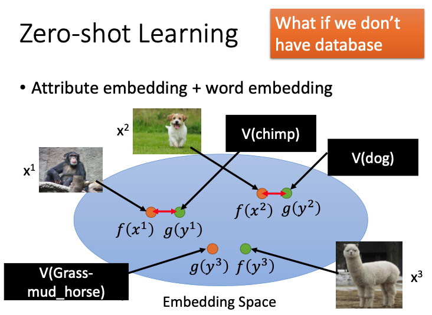

$x^1,y^1$投影到embedding space之后，他们之间的距离要越接近越好，对应着一个最小化问题；但这样做会造成一个问题，只要把所有的word都投影到一个点上，距离就是0；

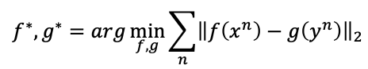

因此要对loss function进行一些变化，我们要使同一个pair之间的距离越小越好，还要使不同pair之间的距离越大越好，即

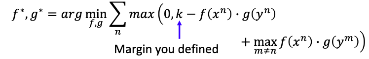

如果后面一项小于0，这个loss function的值就是0，把这一项进行化简，

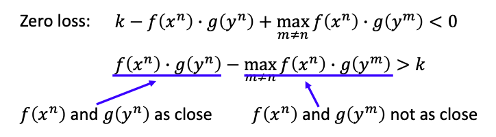

还有一个**更简单**的方法来做zero-shot learning，即**Convex Combination of Semantic Embedding**；只需要off-the-shelf NN for ImageNet和一个word vector就可以完成；

+ 首先把图像输入neural network，但NN可能没办法分辨出到底是哪一个class，lion和tiger的几率都是0.5；
+ 再找出Lion和tiger的word vector，把这两者的vector用1:1的比例进行混合，即0.5V(tiger)+0.5V(lion)，得到混合之后的vector；
+ 观察哪个vector和这个混合之后的vector最为接近，这里是V(liger)。

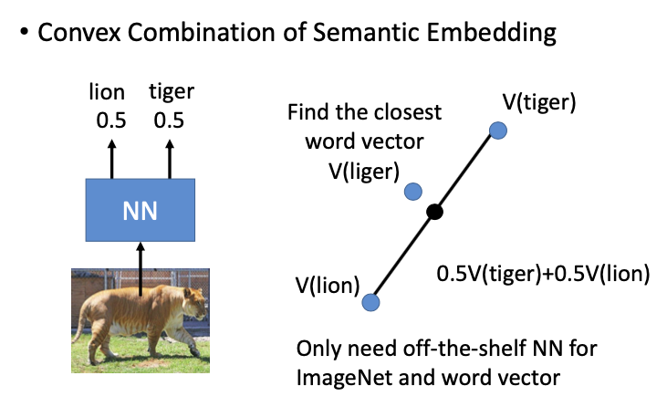

这里是这个方法的实验结果，ConSE即是Convex Combination of Semantic Embedding，第一只海狮取得了不错的效果，

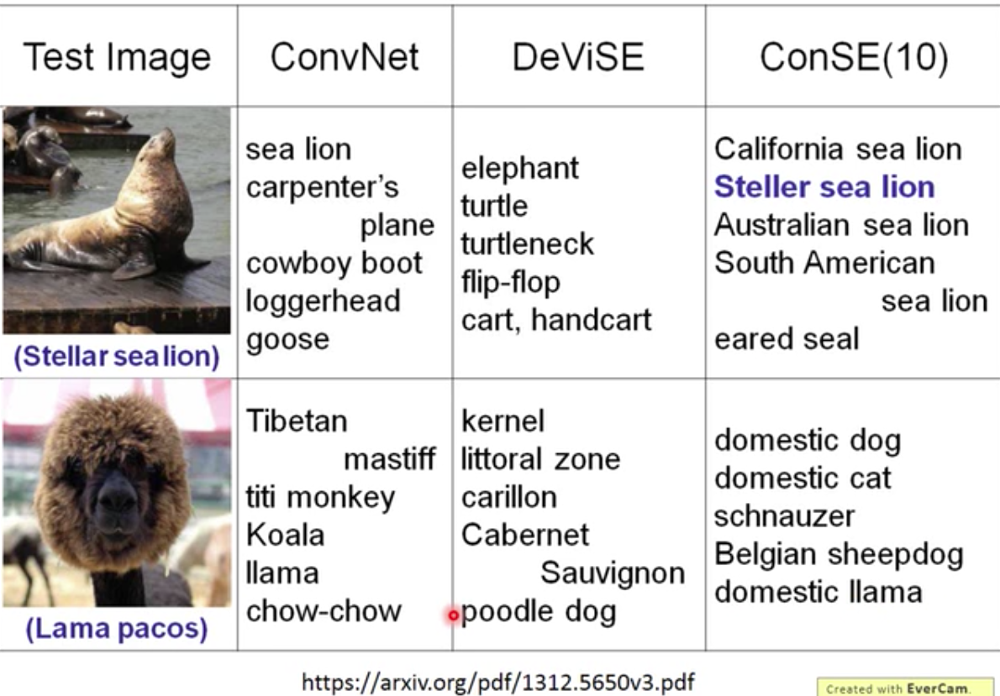

还有关于翻译的例子，训练数据只有English到Japanese、Korean等，但没有Japanese到Korean的数据，通过transfer learning的思想，也可以对这两种语言进行翻译。

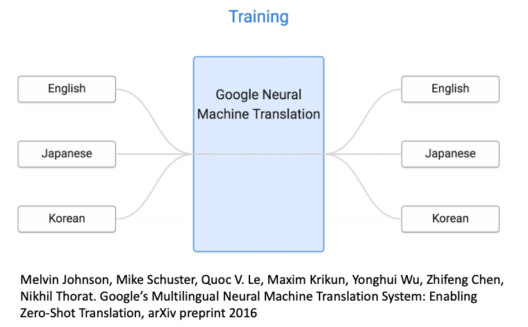

#### Self-taught learning

刚才讲了很多source data都有label的情况，现在我们来叙述source data是unlabeled，target data是label的情况，即self-taught learning。

现在我们有足够多的source data，即使是unlabeled，可以学习一个feature extractor，再去target data上抽取feature。

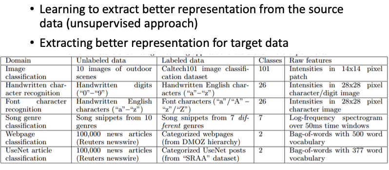