> 本文主要叙述了meta learning的核心思想，对比了machine learning和meta learning的三个步骤；接着介绍了meta learning一般会用到的数据集Omniglot；除了meta learning，本文还讲了transfer learning的其他两个技术：MAML和Reptile。

#### Introduction

Meta learning可以让机器学习如何去learn；机器现在学习了几个task，由于机器已经学会了如何去learn，根据过去的经验，机器在新任务上学习的效果会更好；

比如现在有task：speech recognition、image recognition，在将来有另外一个task 101: text classification，虽然文字辨识和前面的100个task都没什么关系，但机器学习到了一些learning skills，就可以让文字辨识做的更好，新的任务也会学习得更快。

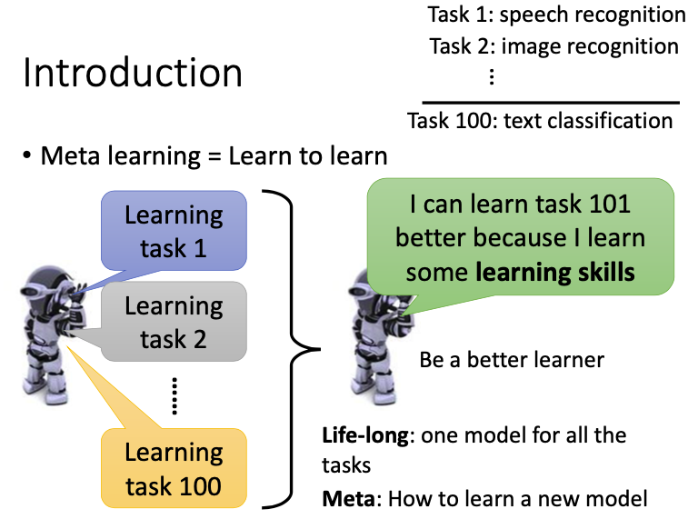

**life-long learning**（终身学习）：只用一个模型来学习不同的task；

meta learning：每个task都有自己的模型，我们希望机器从以前的模型中来学习，使将来要训练的模型可以训练得更快更好。

在下图中，先回忆一下machine learning，我们希望学习出一个learning algorithm进行猫狗分类，算法的输入是training data，这个算法可以学习出一个function f；现在我们用一张图像输入这个函数f，就可以得出具体的类别；

在meta learning里，我们也可以把这个learning algorithm看成是一个function F，输入training data $D_{train}$，输出另外一个function $f^*$，这个函数就可以用来做猫狗辨识；即
$$
f^*=F(D_{train})
$$
meta learning的任务就是找到这样一个function F。

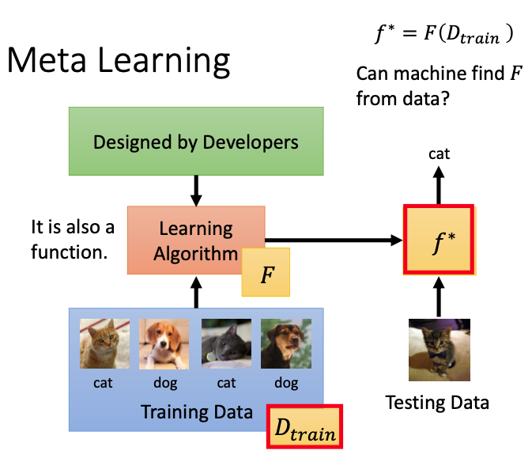

再来总结下machine leaning和meta learning的区别。

+ machine learning，是要机器有能力根据training data找出一个函数f；

+ meta learning则是要机器有能力去找一个函数F，这个F可以找出函数f，f可以用在machine learning里面，比如来进行图像辨识；模型的输出是另外一个function $f^*$，也就是一个neural network的参数；

machine 和meta learning都是要找一个function，只是这个function的作用不同。

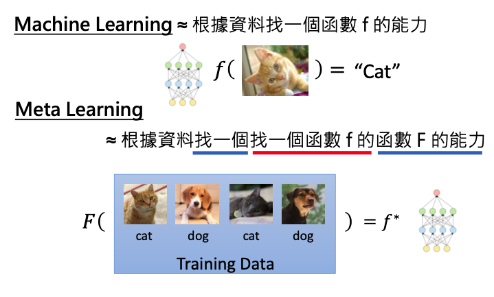

#### Three Steps

我们再来回忆下machine learning的三个步骤，

+ Step 1: define a set of function；
+ Step 2: goodness of function，定义一个loss function；
+ Step 3: pick the best function，使用gradient descent算法，找出最好的那个function。

meta learning也是三个步骤，把上面的function f换成learning algorithm F，

+ Step 1: define a set of <u>Learning algorithm 𝐹</u>，因为我们并不知道哪一个learning algorithm最好；
+ Step 2: goodness of <u>Learning algorithm 𝐹</u>，定义一个loss function；
+ Step 3: pick the best <u>Learning algorithm 𝐹</u>，找出最好的那个algorithm。

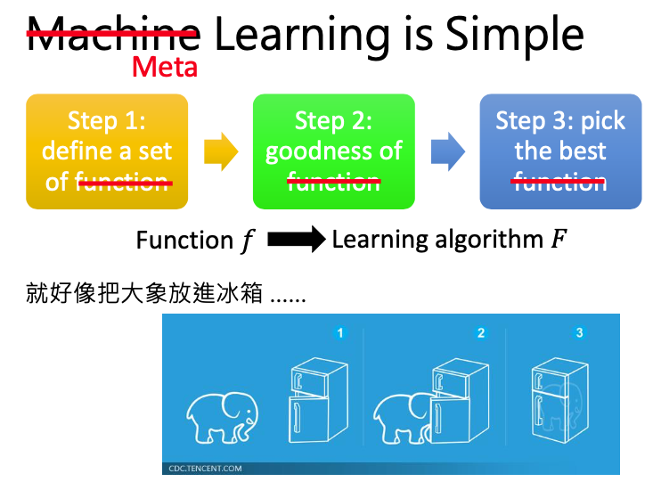

##### Step 1: define a set of learning algorithm

对于常规的一个learning algorithm，gradient descent的流程大概如下：首先要定义一个network structure，把这个网络的参数进行初始化，这里初始化为$\theta_0$；再根据training data计算gradient g，根据g来更新网络的参数；……；一直重复这个过程，直到模型收敛输出最终的参数$\hat\theta$。

在下图的方框中，红色的方块都是我们人为设计的，这些方块选择了不同的设计，也就得到了不同的learning algorithm。

那么如果用到了meta learning，我们就可以让机器来设计这些红色方块，就不用我们人为设计了；比如初始化参数这一项，不同的参数就对应不同的algorithm，现在我们就可以让机器来学习出要初始化的参数是什么，学习出来的参数就是机器认为最好的参数。

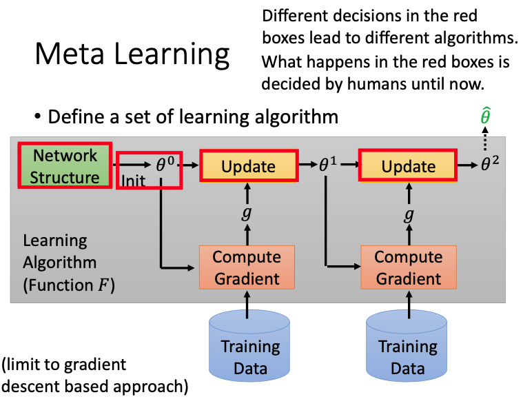

##### Step 2: goodness of a function 𝐹

定义完algorithm之后，我们就要对这些algorithm进行评价，看哪一个algorithm最好；首先需要定义一个loss function。

现在我么有一个任务Task 1:猫狗分类。先准备一些训练资料，输入我们的learning algorithm F，使其输出对应的函数$f^1$；我们还需要用测试集来评估学习出来的参数的好坏，把测试集输入这个参数$f^1$，得到的结果我们用$l^1$来表示；

machine learning需要很大的一个testing set来评估好坏，但meta learning则需要准备task sets，才能衡量learning algorithm的好坏。

现在就有另外一个Task 2：苹果和橘子的分类，来作为测试的另外一个task。把现在的训练资料输入F，输出对应的参数$f^2$；把测试数据输入$f^2$这个网络，输出的结果为$l^2$;

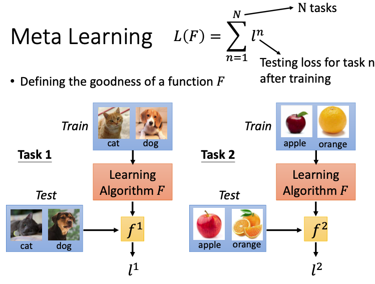

现在有两个loss值 $l^1,l^2$，我们还可以训练其他的task，也可以得到类似的loss function；假设现在测试了N个task，把所有的loss都加起来，就可以对我们的learning algorithm F进行评价，$L(F)$的值越小，说明F越好，
$$
L(F)=\sum_{n=1}^Nl^n
$$
我们再来对machine和meta learning所需要的训练、测试资料进行对比；

对于machine learning，所需的资料是training data和testing data；

对于meta learning，所需的资料则是task的集合，包括training tasks和testing tasks；每一个task里面都有训练资料和测试资料。此外还有一个额外的要求，training和testing tasks需要是不太一样的，比如training task是猫狗分类、苹果橘子分类，testing task就得是其他的，比如汽车分类，不能和training task重复；

meta learning和machine learning一样，有时也需要验证，这时把training task分一部分出来当作validation tasks即可。

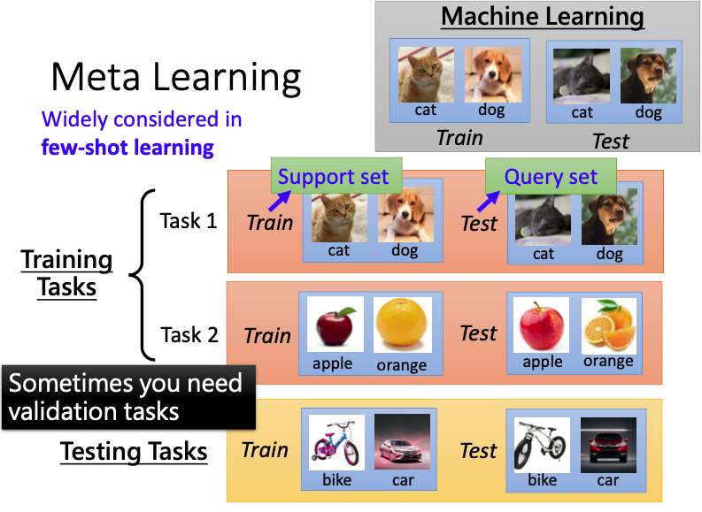

在大多数情况下，meta learning和few-shot learning都会放到一起讨论。**few-shot learning**是指在我们做任务时资料很少，比如在做图像分类任务时，每个类别只有非常少量的图像。

在few-shot learning里，对于training tesks里面的其中一个task，我们把这个task的training set叫做**support set**，把testing set叫做**query set**；这些task的support set结合起来，就是整个meta learning的training set。

##### Step 3：pick the best learning algorithm

找到loss function之后，我们就需要找一个最好的learning algorithm $F^*$，使对应的loss function取得最小值；即解一个最优化问题，找到 $F^*$，使$L(F^*)$取得最小值，
$$
F^*=arg\mathop{\rm min}_FL(F)
$$
训练完成后，就需要进行测试，测试也需要对应的support和query set。先把support set输入最好的那个learning algorithm $F^*$，输出一个函数$f^*$；把query set输入网络$f^*$，得到对应的loss l。

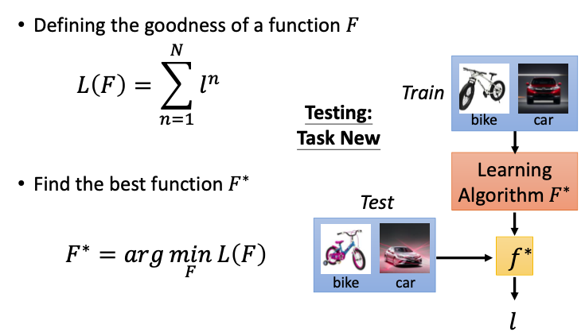

#### Datasets

在做image classification时，有很多人都会用MNIST这个数据集；在meta learning里，通常会用Omniglot这个数据集；

Omniglot中有1623种不同的符号，每个符号有20种不同的写法；在下图的右上角，就表示有20个不同的人来画这同一个符号。

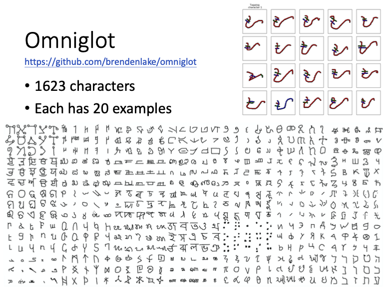

在使用时，我们通常会设计成一个few-shot classification；也就是我们要先决定分类任务有多少个ways、shot，way表示类别，shot表示example的数量；那么**N-ways K-shot classification**，就表示在每个task里，有N个类别，有K个example。

在下图中，这个task有20个类别，每个类别只提供一个训练资料。support set有20个字符，每个字符都对应一个类别；我们希望机器只看了每个类别的一个example，就可以分辨这20个不同的类别；在这个task的测试阶段，输入query set中的图像，网络能输出对应的类别。

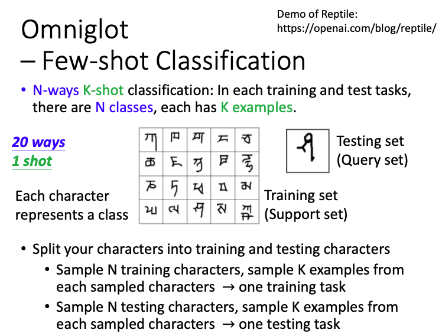

那么我们要怎么确定training/testing task呢？

我们可以把Omniglot的数据集划分成training和testing characters；从N个training example中sample出N个类别的字符，再从每个类别中sample出K个example，这就可以当作是training/testing task。

#### Techniques Today

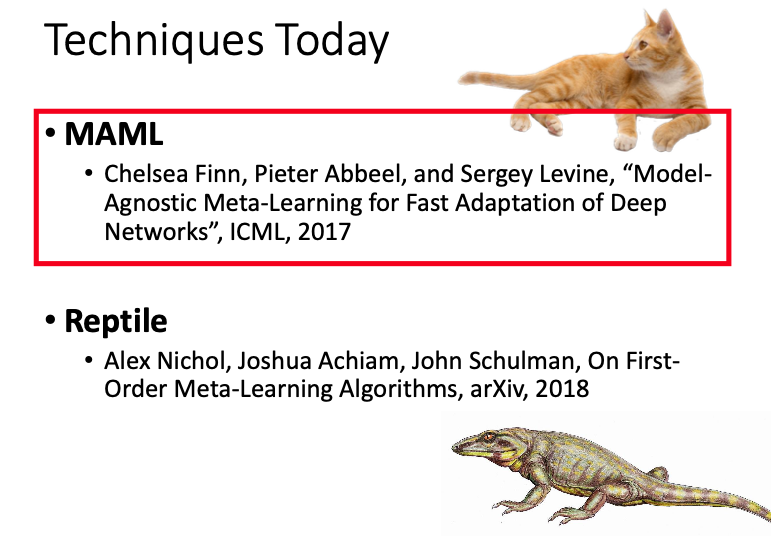

#### MAML

##### Introduction

MAML的核心思想是：学习一个初始化的规则，不像机器学习的任务是从一个distribution中sample出数据来进行初始化，而是机器自己学习出一个它认为最好的初始化参数。

首先需要定义一个loss function，来评价这个初始化参数$\phi$的好坏；
$$
L(\phi)=\sum_{n=1}^Nl^n(\hat\theta^n)
$$
其中$\phi$表示模型初始化的参数，不同的参数初始化，学习出来的模型也是不一样的，$\hat\theta^n$表示第n个task上学习出来的model，$l^n(\hat\theta^n)$表示使用$\hat\theta^n$这个model在第n个task的测试数据上的loss。

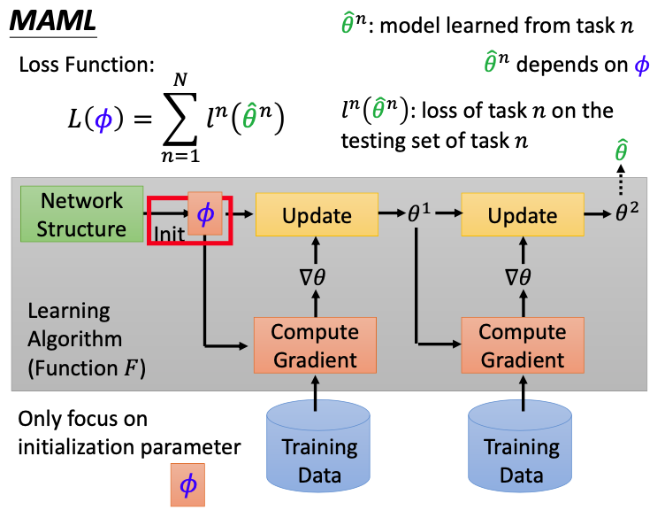

我们可以使用gradient descent算法，找出对应的$\phi$，使得loss $L(\phi)$达到最小值；
$$
\phi\leftarrow\phi-\eta\Delta_\phi L(\phi)
$$

##### Model pre-training vs MAML

在transfer learning中，如果一个task的数据很少，另一个task的数据很多，我们通常都会把model预训练到数据多的task上，然后在另一个task上用少量的资料fine-tuning，这就是**model pre-training**，其loss function为
$$
L(\phi)=\sum_{n=1}^Nl^n(\phi)
$$
 Model pre-training的**loss function**和meta learning是不一样的，meta learning是使用训练之后输出的模型$\hat\theta^n$来计算loss，但model pre-training使用最初的模型（初始化为$\phi$，其输出并不是另外一个模型的参数）来计算loss。

下面举一个更加具体的例子来说明这两者的区别。横轴表示model的变化，实际上是高维的，这里用一维表示；深绿色和浅绿色的曲线表示不同的task对应的loss和parameter之间的关系；

**MAML**

<u>我们并不关心$\phi$在training tasks上的表现，只关心用$\phi$训练出来的结果$\hat\theta^n$，在task的测试数据上的表现。</u>

在下图的**MAML**中，我们有一个初始的$\phi$，可能在task 1上表现不是很好，在task 2上表现很好（loss小）。但这是一个很好的初始值，如果沿着task 1的梯度方向移动，就找到了可以使task 1的loss最小化的参数$\hat\theta^1$；如果沿着task 2的梯度方向移动，也可以找到使task 2的loss最小化的参数$\hat\theta^2$。

 <u>虽然这个初始值刚开始表现并不好（loss有点大），但模型使用这个初始值$\phi$进行训练之后，在task 1和2上的表现都还不错，可以让这两个task都变得很强，我们就可以认为这是一个很好的初始值。</u>

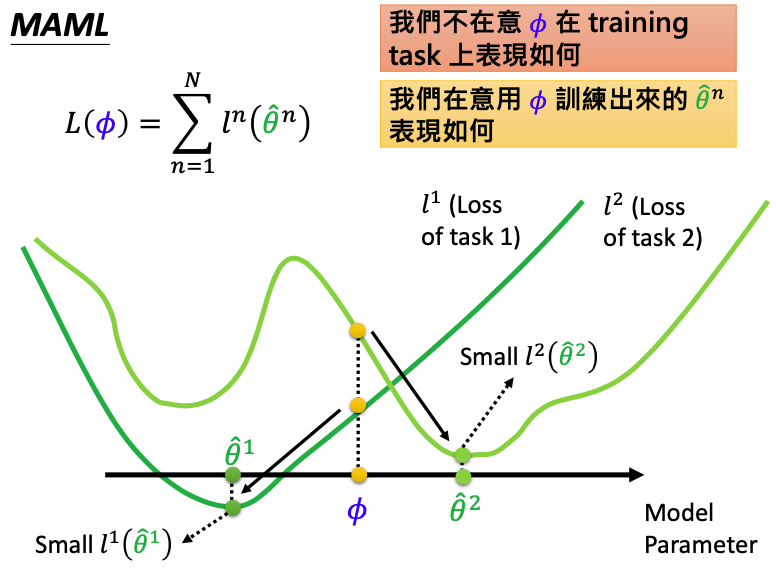

**Model Pre-training**

在下图的**Model Pre-training**中，mode pre-training的目的是找到一个初始值，这个初始值在两个任务上都要表现得很不错；但并不能保证这个初始值训练之后会得到一个更好的$\hat\theta^n$；

很可能这个$\phi$刚开始表现很好，但训练之后并不一定很好。对于下图中的初始值$\phi$，如果沿着task 1的梯度方向继续移动，会进入一个local minimum，这个loss并不小，比global minimum要高；

这个$\phi$对meta learning来说并不是一个好的初始值，但对model pre-training来说却是一个还不错的初始值，因为mode pre-training并没有把训练这件事考虑进去

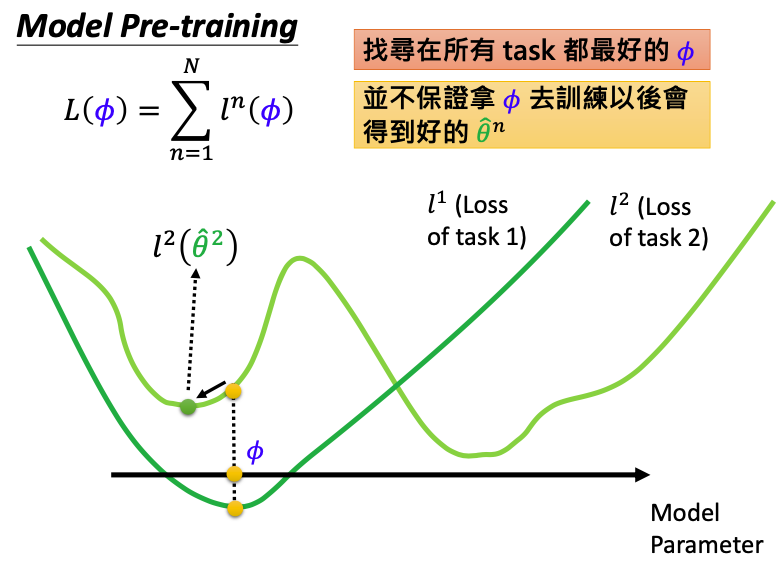

下图为一个更加形象化的对比。MAML要找到一个初始值，这个初始值可以在训练之后得到很好的performance，看中的是“**潜力**”；model pre-training则是要找到一个初始值，这个初始值可以在训练时就取得很好的performance，在乎“**现在表现如何**”。

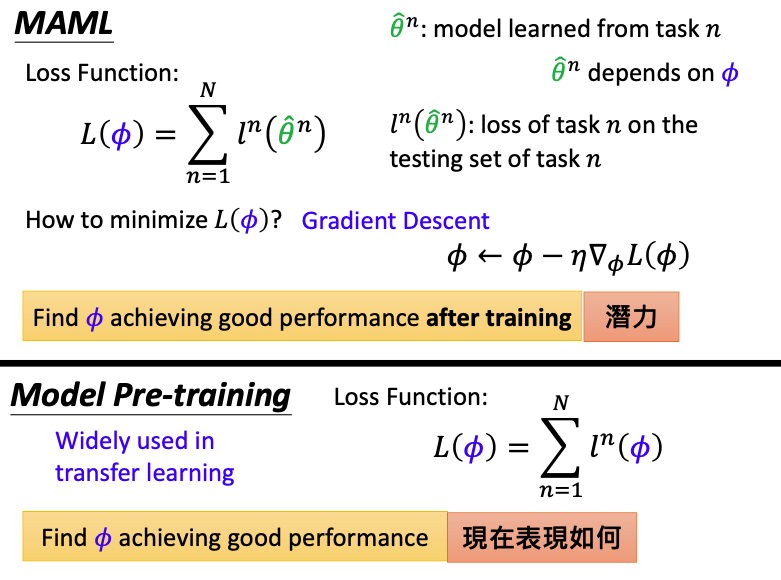

##### Practice

我们使用gradient descent来更新参数，现在这个learning algorithm只更新一次参数；即现在我们找到了初始值，这个初始值$\phi$是模型自己找出来的，经过一次gradient的更新之后，就得到了模型的训练结果$\hat\theta$;

$\hat\theta,\phi$之间的关系可以用一个式子更加直观地表示，
$$
\hat\theta=\phi-\epsilon\Delta _\phi l(\phi)
$$
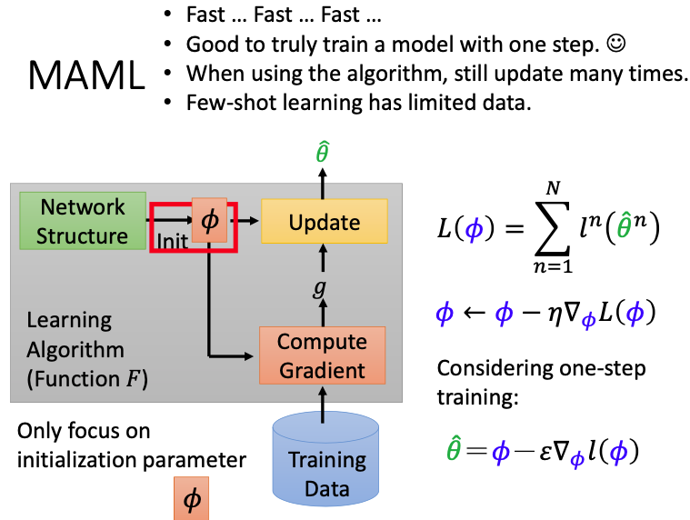

Q：为什么模型只更新一次参数呢？一般的gradient descent算法都是更新成千上万次参数。

A：原因如下：

+ meta learning训练的计算量一般都很大，每次更新参数很可能都需要1个小时，如果更新成千上万次，后果不堪设想；
+ MAML希望在训练之后，可以得到一个很好的结果，比如现在训练出了一个超级好的初始值，只需要更新一次就可以得到更好的结果，这在实际应用中是非常方便的；
+ 虽然在训练时只能更新一次参数，但在测试时可以多更新几次，即在testing task上，我们可以多更新几次，来使模型达到更好的效果；
+ few-shot learning只有很少的数据，如果更新很多次参数，很可能产生overfitting，但只更新一次就不会出现这个问题。

##### Toy Example

现在有一个toy example，展示了MAML与transfer learning的关系。

对于训练和测试要用到的每个task，现在有一个x和y的sin函数，即$y=a\ sin(x+b)$；我们从这个函数中sample K个点出来，当作训练资料，再用这K个训练资料来估计原来的function，这个function要和原来拿来做sample的y要越接近越好；

sample不同的a、b，我们就可以生成不同的task。

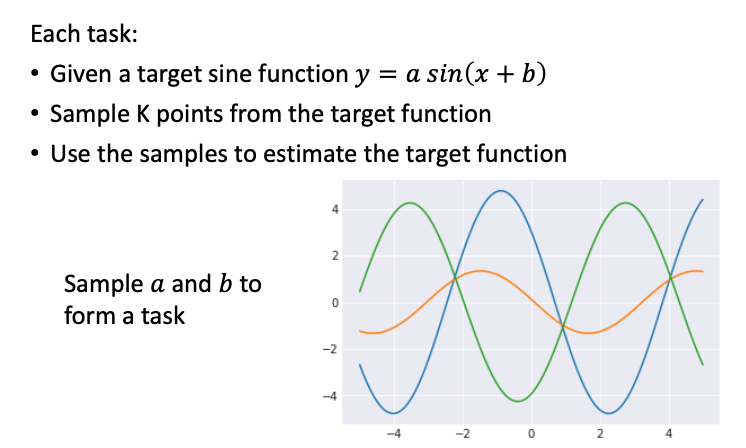

下图展示了在toy example上model pre-training和MAML的结果；

下图中橙色的曲线表示测试的task，从这个曲线中sample出10个点， 再用这些训练资料输入模型，来估计出一个function，这个function要和橙色曲线所对应的function越接近越好。

如果用**model pre-training**，即下图的右上方，会是图中水平的那个虚线；因为model pre-training的目标是找到一个初始化的参数，在所有的training task上表现都很好，这些task都是不同sin函数的集合，有的是波峰，有的是波谷，这些函数叠起来就是一条水平线；

这个水平线并不是一个很好的参数，如果使用这个水平线当作初始值，再去做fine-tuning，不管是1个step、还是10个step，训练出来的参数都是一条水平线，只是把原来的水平线进行平移了而已，结果仍然很差；

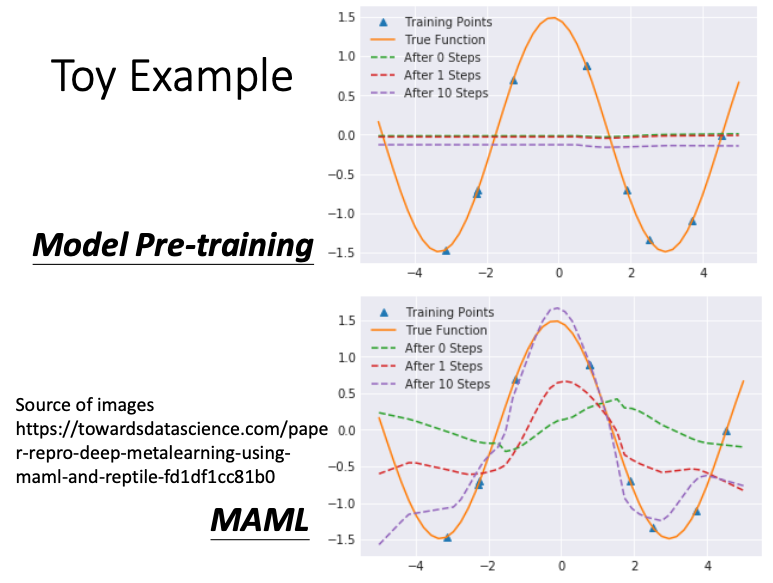

如果使用**MAML**，即上图的右下方，模型选择的初始化参数是绿色曲线，在训练过程会更新一次参数，变成红色曲线，可见红色曲线和目标函数已经有一些相似点了，波峰对应的都是波峰；在测试过程，我们可以多次更新参数，紫色曲线就是参数更新了10次的结果，和原来的橙色曲线已经非常接近了。

##### Omniglot & Mini-ImageNet

下图展示了MAML在Omniglot & Mini-ImageNet上的结果，可以看到都取得了很不错的效果。

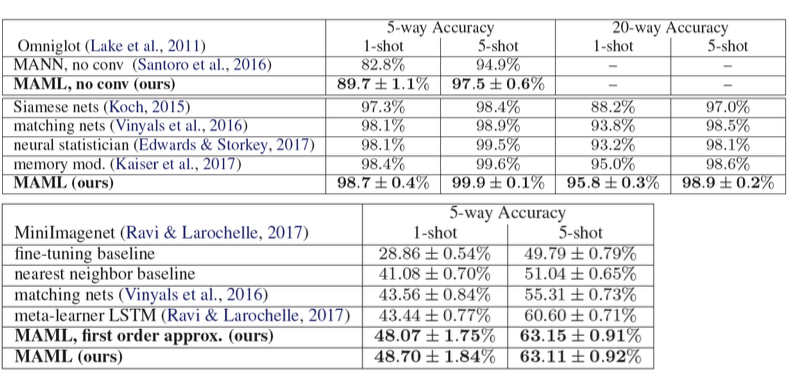

##### Warning of Math

现在我们就具体来对MAML求梯度的过程进行推导。

$\phi$可以看作是多个参数的集合，那么loss对$\phi$求梯度就可以看作，loss对其中的每个$\phi_i$求梯度，即$\frac{\partial l(\hat\theta)}{\partial\phi_i}$，那么$\Delta_\phi l(\hat\theta)$就可以看作一个vector；

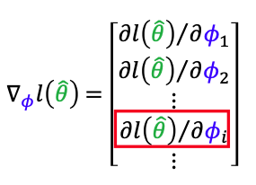

我们先看其中的一个梯度$\frac{\partial l(\hat\theta)}{\partial\phi_i}$，其物理意义是：如果我们对$\phi_i$进行小小的变化，那么$l(\hat\theta)$会产生什么样的变化。$\phi_i$是一个初始参数，这个参数会影响最终训练出来的模型参数$\hat\theta$，也就影响了模型参数中的每个参数$\hat\theta_1,\hat\theta_2,...,\hat\theta_j,...$，这些参数也就会影响最后的loss；

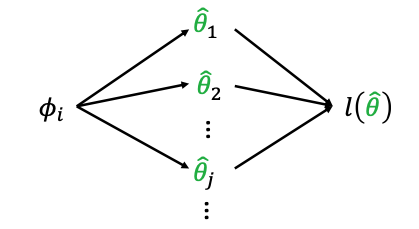

即初始参数$\phi$通过中间的每个参数$\hat\theta_j$影响了最后的loss，这里可以应用chain rule，即
$$
\frac{\partial l(\hat\theta)}{\partial\phi_i}=\sum_j\frac{\partial l(\hat\theta)}{\partial\hat\theta_j}\frac{\partial \hat\theta_j}{\partial\phi_i}
$$
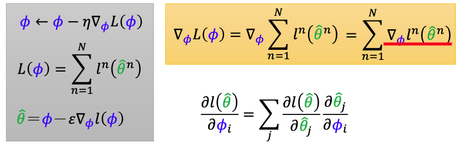

meta learning的learning rate有两个，$\eta$是每一个参数在训练时的learning rate，$\epsilon$是训练时初始化的learning rate，这两个参数也是需要调整的，
$$
\phi\leftarrow\phi-\eta\Delta_\phi L(\phi)\\
\hat\theta=\phi-\eta\Delta_\phi l(\phi)
$$
loss function可以是cross entropy，也可以是regression，这和我们训练任务里面的测试资料（query set）有关；得到loss function后，我们就可以计算出$\frac{\partial l(\hat\theta)}{\partial\hat\theta_j}$；

现在的重点是对后面一项$\frac{\partial \hat\theta_j}{\partial\phi_i}$的计算，梯度更新的公式是$\hat\theta=\phi-\epsilon\Delta_\phi l(\phi)$，我们先只考虑其中的第j个维度，
$$
\hat\theta_j=\phi_j-\epsilon\frac{\partial l(\phi)}{\partial\phi_j}
$$

对于$\frac{\partial \hat\theta_j}{\partial\phi_i}$，如果$i\not=j$，那么
$$
\frac{\partial \hat\theta_j}{\partial \phi_i}=\frac{\partial}{\partial \phi_i}\left(\phi_j-\epsilon\frac{\partial l(\phi)}{\partial\phi_j}\right)=-\epsilon\frac{\partial l(\phi)}{\partial\phi_j\partial\phi_j}
$$
如果$i=j$，那么
$$
\frac{\partial \hat\theta_j}{\partial \phi_i}=1-\epsilon\frac{\partial l(\phi)}{\partial\phi_j\partial\phi_j}
$$
但要做这个二次微分$\frac{\partial l(\phi)}{\partial\phi_j\partial\phi_j}$是非常花时间的，在MAML的原始paper里面，作者提出的想法是不算这个二次微分，直接把这个二次微分看成0，那么我们就得到了，
$$
{\rm if}\ i\not=j,\quad\frac{\partial \hat\theta_j}{\partial \phi_i}\approx0\\
{\rm if}\ i=j,\quad\frac{\partial \hat\theta_j}{\partial \phi_i}\approx1
$$
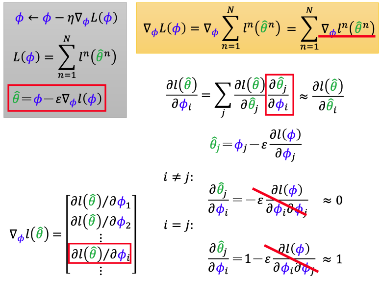

那么现在我们就可以只考虑i和j相等的情况，把原来求梯度的式子可以进行化简，
$$
\frac{\partial l(\hat\theta)}{\partial\phi_i}=\sum_j\frac{\partial l(\hat\theta)}{\partial\hat\theta_j}\frac{\partial \hat\theta_j}{\partial\phi_i}\approx\frac{\partial l(\hat\theta)}{\partial\hat\theta_i}
$$
可进一步得出，

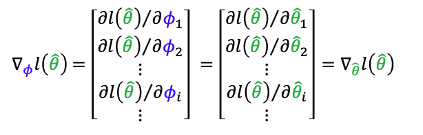

再带入求$\Delta_\phi L(\phi)$，就不再是用$\phi$求偏微分，而是直接用$\hat\theta$来求，

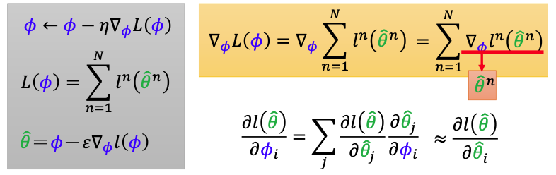

##### Real Implementation

下面我们将简要叙述MAML的具体实施过程。（$\phi_i$是一个初始参数，这个参数会影响最终训练出来的模型参数$\hat\theta$，也就影响了模型参数中的每个参数$\hat\theta_1,\hat\theta_2,...,\hat\theta_j,...$）

首先需要将初始参数$\phi$进行初始化，设其初始值为$\phi^0$；现在从training task中smaple一个task m，MAML只更新一次参数，参数更新为$\hat\theta^m$；

为了更新参数$\phi^0$，我们还需要再更新一次$\hat\theta^m$的参数，$\phi^0$更新的方向和第二次参数更新方向是一致的，由于learning rate的差异，这两者的大小会不太一样，$\phi^0$就更新成了$\phi^1$；

现在从training task中sample出一个task n，初始值是$\phi^1$，更新一次参数后就变成了$\hat\theta^n$；为了更新参数$\phi^1$，我们还需要再更新一次$\hat\theta^n$的参数，$\phi^1$更新的方向和第二次参数更新的方向是一致的，只是learning rate的大小不一样，$\phi^1$就更新成了$\phi^2$；

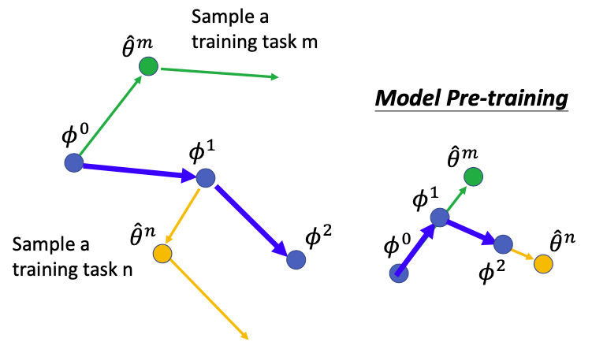

如果我们使用model pre-training来更新初始参数，首先初始化参数$\phi^0$，从training task中sample出一个task m，再计算一个偏微分$\frac{\partial l(\hat\theta^m)}{\partial \phi_0}$，偏微分的方向如图中绿色箭头所示；那么$\phi^0$更新到$\phi^1$的方向和这个偏微分的方向是一致的；$\phi^1$到$\phi^2$也有类似的更新过程。

**总结**：model pre-training初始值更新的方向，与$\phi$在每个task上算出来的gradient方向一致，即与$\frac{\partial l(\hat\theta^m)}{\partial \phi}$的方向是一致的；而MAMR则是要进行两次模型参数的更新，走两次gradient，初始值更新的方向和第二次gradient的方向是一致的。

##### Application：translation

可以把MAML用到machine translation上面。

在下图中，数据集包括18个training task，2个validation tasks，分别表示18种、2种不同的语言翻译成英文；Romanian翻译成英文这个task，是在validation里面的；Finish表示不再training task里，也不在validation task里面，是一个测试任务。MetaNMT表示meta learning，MultiNMT表示Model pre-training；

可以发现meta learning的曲线始终在model pre-training上方，效果更好。

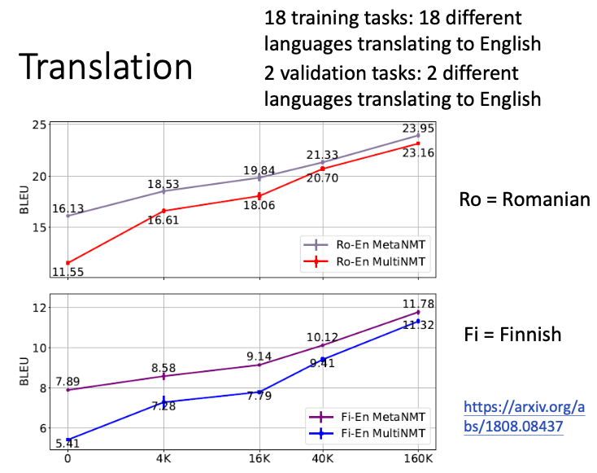

#### **Reptile**

首先需要sample一个task m出来，再把参数初始化为$\phi^0$，使用$\phi^0$来训练这个模型，经过多次的参数更新后（不像MAML只更新一次），得到更新后的参数$\hat\theta^m$；再来观察$\phi^0,\hat\theta^m$之间的差距，从$\phi^0$到$\hat\theta^m$要走哪个方向，这个方向就是$\phi^0$到$\phi^1$要走的方向；

得到更新后的参数$\phi^1$后，就可以准备下一次参数的更新；首先sample一个task n出来，用初始化的参数$\phi^1$来训练这个模型，经过多次的参数更新，得到$\hat\theta^n$，$\phi^1$到$\phi^2$的方向也就是$\phi^1$到$\hat\theta^n$的方向

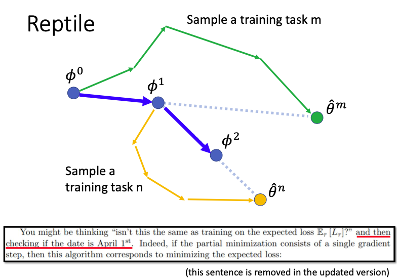

我们再来讨论一下reptile、MAML、model pre-training这三者的差别；

在下图中，有一个初始化的参数$\phi$，我们需要用这个参数来对模型进行训练，第一次参数更新的方向是$g_1$，第二次参数更新的方向是$g_2$；

如果是pre-training，参数$\phi$的更新方向是$g_1$的方向；如果是MAML，对应的方向则是$g_2$的方向；如果是Reptile，对应的方向则是$g_1+g_2$，是pre-training和MAML方向的和；

由于这里参数只进行了两次更新，如果更新更多次，Reptile的方向就不会是pre-training和MAML的和，也可以学习到更多pre-training和MAML学习不到的东西；

下图表示实验结果，准确率越高，模型效果越好；可以发现用pre-training的效果是最差的。

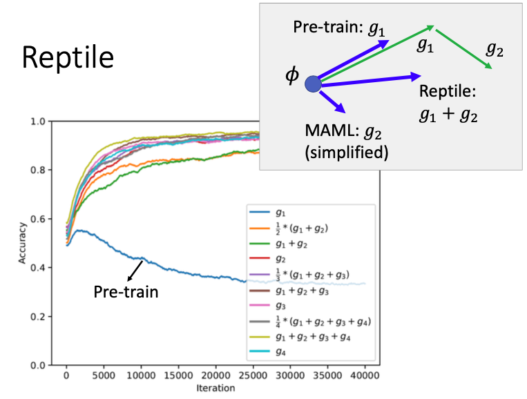

#### **More ...**

前文讲的MAML和reptile都只针对初始化的参数，我们也可以用其他方法学习出网络的architecture和activation function，或者学习出如何调整learning rate的规则；要用network来生成network，显然是没办法进行微分的，这时就需要用到reinforce learning，来训练一个可以生成network的network。

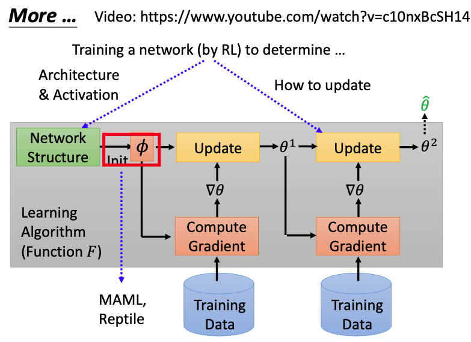