Life long learning又可以叫做终身学习；对于人类自身而言，我们每次都是用同一个脑来学习机器学习的每一堂课，每次的作业也都需要训练不同的神经网络，那么我们可不可以每次作业都使用同一个神经网络呢？

life long learning可简称为LLL，也可被称作Continuous Learning, Never Ending Learning, Incremental Learning；

我们可以让机器先学会task 1，再学第二个任务task 2，这时机器就学会了2项技能，……

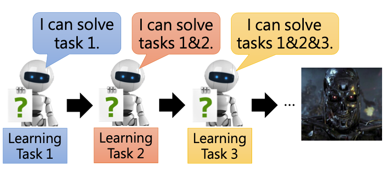

那么要让机器学会这么多的技能，到底要学会什么样的技能呢？

主要有以下三点：

+ Knowledge retention，即怎么样让机器把学过的东西记下来，
+ knowledge transfer，
+ model expansion，

#### Knowledge Retention

##### Example – Image

现在有一个2层的network，每层都50个neural，我们希望这个network可以学习这两个task，task 1和2都是关于手写数字识别的，但task 1的数据加上了一些杂讯；

先用task 1的训练数据来对network进行训练，训练完成后，再分别对两个task的测试数据进行测试，task 1的测试数据得到了90%的准确率，而task 2的测试数据得到了96%的准确率；虽然network并没有看到过task 2的训练数据，但由于task 1和2是很接近的，因此学习到的东西可以transfer到task 2上，network在task 2的数据上也表现得很好；

如果现在把task 1训练好的参数作为task 2的network的初始值，再用task 2的训练数据继续训练下去，训练完成后，分别在task 1和2的测试集上进行测试；task 2的准确率上升到97%，但却忘记了task 1要怎么做，task 1的准确率下降到80%；

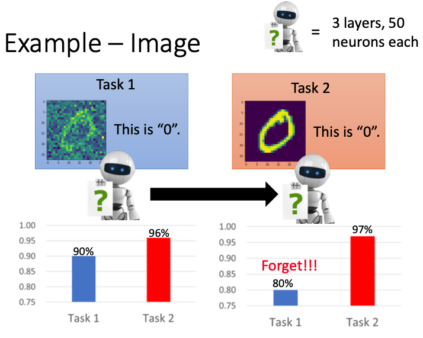

现在我们可以让task 1和2同时进行学习，即把这两者的训练资料都混合到一起，可以发现学习的效果还不错，在task 1上的准确率是89%，在task 2上的准确率是98%；

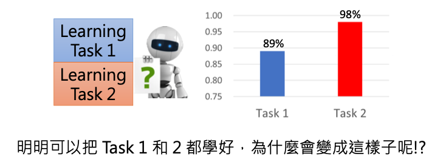

两个任务同时学习的效果还不错，但这两个任务分开学习，就会忘记之前学习过的内容。

##### Example – Question Answering

再举一个知识问答的例子；给出一个document，根据这个document来回答提出的问题；这里用到的数据集是bAbi，一共包括20个不同类型的问题；

现在就有两个选择，这20个task分开进行训练，也可以把这20个task同时训练

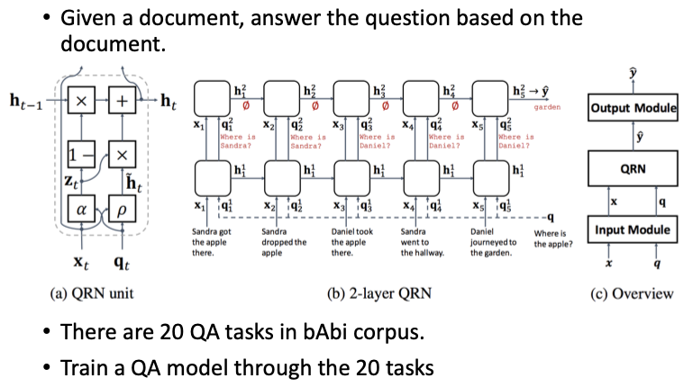

如果我们选择分开训练，先训练task 1，在训练task 2，……；每个task训练完，我们都来观察题型5（who）正确率的变化，在题型1，2，3，4上正确率都很低，在题型5上正确率就突然到了100%，但做完题型6后，又不会做题型5了，忘记了之前学习的结果。

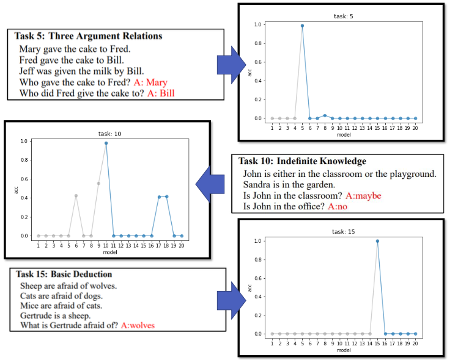

如果我们选择把所有题型的数据进行混合，只用一个network，来一起训练，可以发现结果正确率还不错。

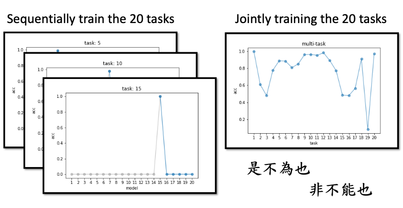

##### Multi-task training

我们可以把所有任务的训练数据都进行混合，再输入数据network进行训练；这种训练方式就不会忘记之前学过的东西；

但这种学习方式会出现一个新问题，我们之前已经把999个task的数据进行混合，也把这个模型训练好了；但现在来了一个新的task 1000，如果还使用这种训练方式，我们就必须把前面999个task的训练资料一直保存，再将1000个task的数据重新混合，重新进行训练；

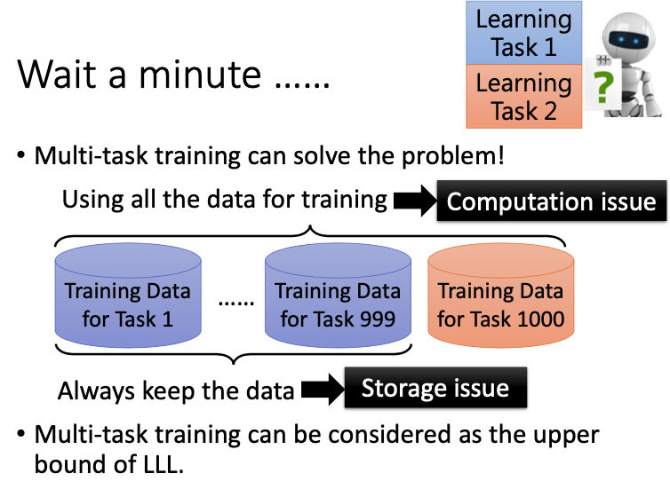

那么我们可不可以通过一种方式，使机器不要重新读取之前的任务数据，就可以保存机器过去学过的东西，这也就是life long learning要探讨的问题；

##### Elastic Weight Consolidation (EWC)

我们可以通过一种经典的解法，EWC来解决这个问题；有一些weight对上一个task是非常重要的，如果这些weight发生了变化，机器就会忘记过去的任务要怎么做了；我们可以把这些重要的参数保护起来，只改变那些不重要的参数。

$\theta^b$表示前面任务学习完的模型参数，其中的每一个参数$\theta_i^b$都有一个guard $b_i$，来说明这个参数的重要性；

现在我们就有了一个新的loss function $L'(\theta)$，

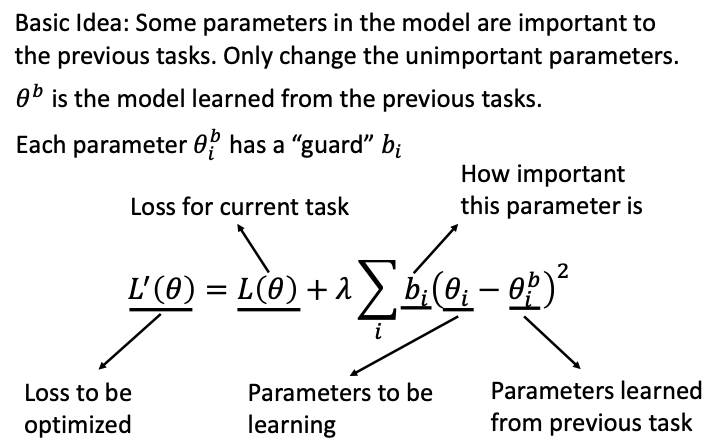

如果$b_i=0$，那么参数$\theta_i$就可以不受任何的限制，可以任意调整$\theta_i$的值；

如果$b_i=\infty$，就表示$\theta_i$已经被强烈地保护起来了，不可以对$\theta_i$的值进行变化。

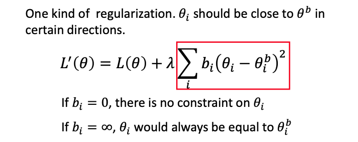

loss function中的$\sum b_i(\theta_i-\theta_i^b)^2$表示一种正则化，由于$b_i$的存在，我们希望$\theta_i,\theta_i^b$之间的距离有时候越近越好，有时候什么距离都可以。

我们再举一个具体的例子来叙述EWC。

下图表示有两个task，参数分别也只有两个$\theta_1,\theta_2$，颜色表示error surface的变化，颜色越深，表示loss越小；

假设task 1之前没有其他的训练任务，在训练task 1时，首先进行随机初始化，初始参数$\theta^0$在途中所示位置，沿着梯度下降的方向走，到了$\theta^b$；

现在进行task 2的训练，把$\theta^b$的值复制到task 2上，沿着梯度下降的方向走，走到loss最小的地方，到了图中$\theta^*$的位置；

这时我们会发现task 2的学习结果完全忘记了task 1，现在的$\theta^*$会得到很高的loss。

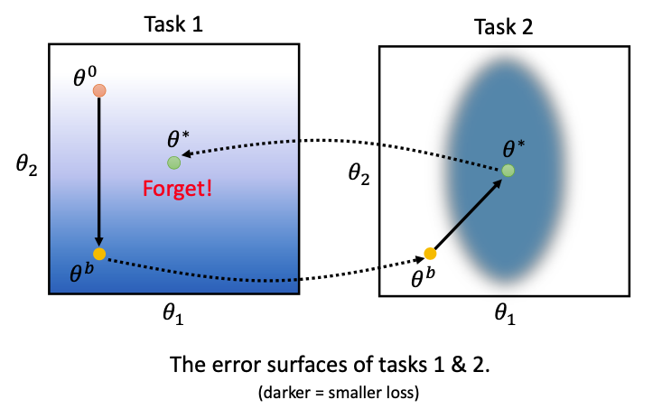

在使用EWC之后，我们会为每个参数设置一个$b_i$，不同文章有不同的做法；一个比较简单的做法是，算每个参数的二次微分，得到下图中右边的曲线图；

在task 1上，对于其中的一个参数$\theta_1$，其值对loss的结果影响不大，我们可以把$b_1$设置为一个很小的值；但$\theta_2$的变化对loss的影响就很大，就必须要给$\theta_2$一个很大的$b_2$，在下一个task时，就尽量不要对这个参数进行变化。

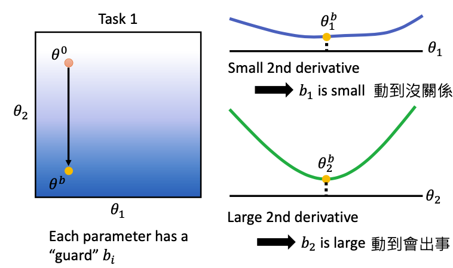

我们再来看task 2，现在参数移动的方向就发生了变化，为了保证不对$\theta_2$进行变化，task 2的参数更新方向只能是水平的，只改变$\theta_1$的值，不改变$\theta_2$的值。如果在这个方向进行变化，就算我们训练好了task 2，也不会对task 1的精确度造成太大影响。

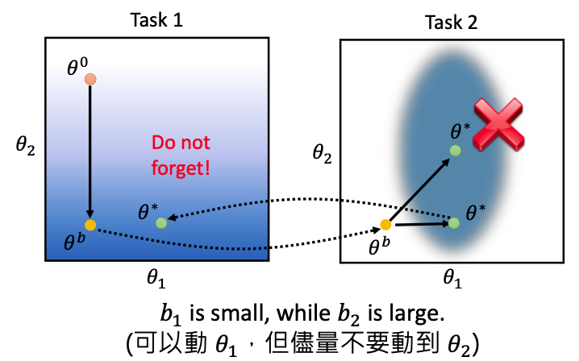

这是原论文中的训练结果，

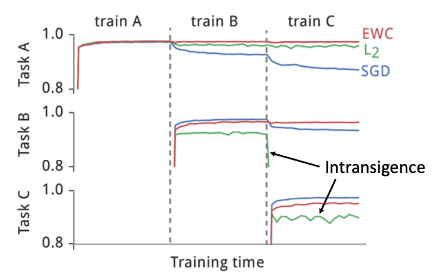

还有一些最新的研究，

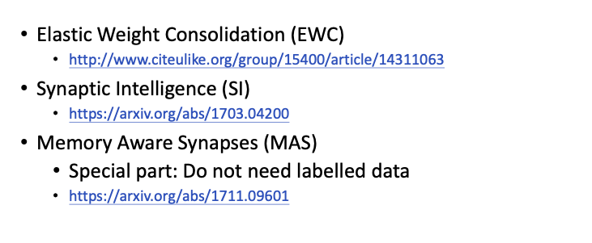

##### **Generating Data**

在进行multi-task learning时，既然memory是有限的，那么我们可不可以训练一个模型，来产生以前的训练资料呢？

实际上是可以的，首先需要训练一个generator，来生成task 1的训练数据，那么现在就可以丢掉task 1的数据；接下来就可以把task 1和2的训练数据进行混合，一起学习出新的模型

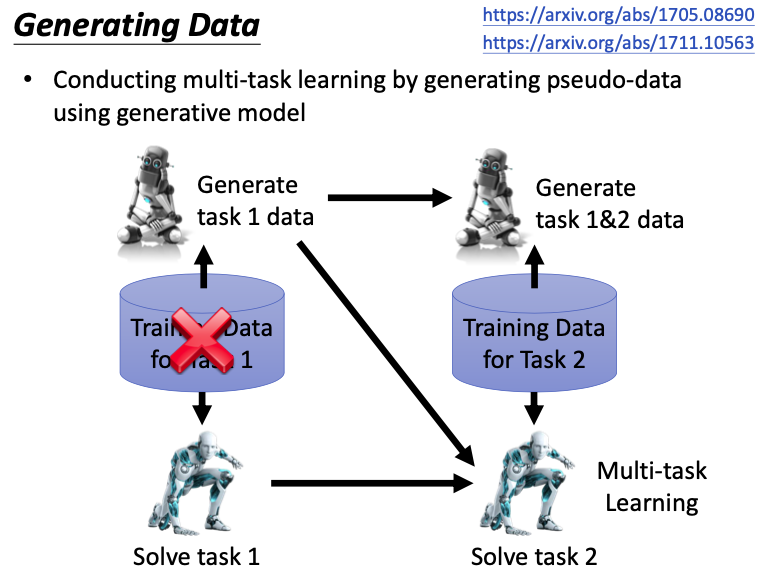

但generator生成一些很高清的图像，是有很大难度的。

##### Adding New Classes

对于之前我们叙述的任务，都是网络结构不需要调整的；如果现在有一个任务是进行10个类别的分类，另一个任务是进行20个类别的分类，就需要修改网络的结构，下图展示了一些修改网络结构的方法；

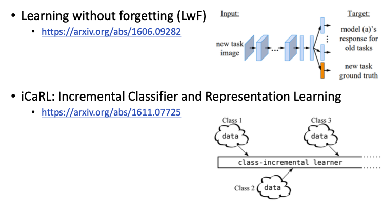

#### Knowledge Transfer

我们希望机器不仅能记住knowledge， 还可以把不同任务之间的knowledge进行transfer；

如果对于每个task，我们都单独学习一个模型，就不会遗忘过去训练的模型了；但这种做法没有考虑不同模型之间的knowledge的转换，而且我们并不能把所有的模型都存储下来。

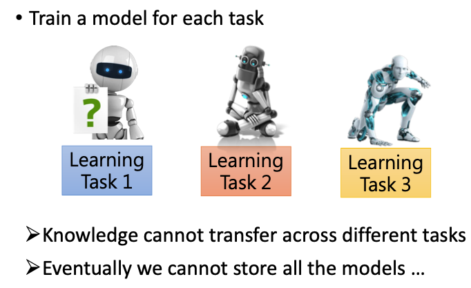

##### Life-Long v.s. Transfer

transfer learning是先训练好一个模型task 1，在进行fine-tune得到另外一个模型task 2，并不会再重新回去学习task 1；

life long learning比transfer learning多考虑了一步，希望不忘记过去学到的东西。

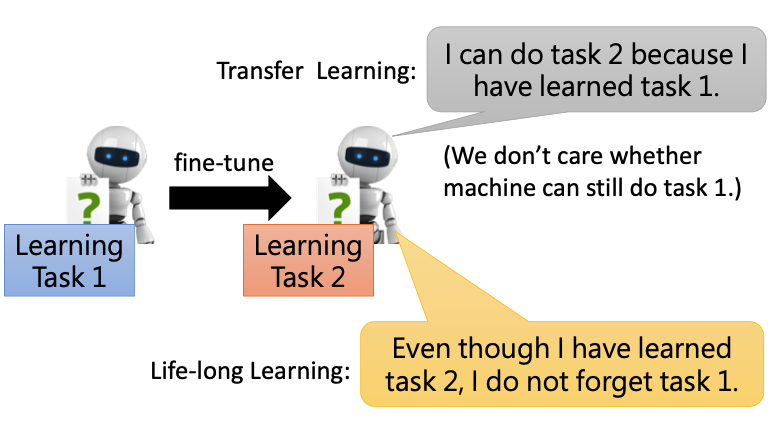

##### **Evaluation**

下面我们介绍如何来对life long learning进行评价，评价的方式有很多种，这里只说一个大概的方向。

一般都会画一个矩阵出来，纵轴表示在task上的performance，第一行表示学完task 1之后，在每个task上的performance；其中$R_{i,j}$表示在训练完task i之后，在task j上的performance；

如果$i>j$，表示在训练任务i之前，已经学完了第j个任务，$R_{i,j}$则表示学任务i之后，之前的任务j到底忘记了多少；

如果$i<j$，表示机器学习了第i个任务，但还没学到第j个任务，$R_{i,j}$则表示前i个任务能不能transfer到第j个任务上；

在这个矩阵的基础上，我们就可以定义各式各样的标准，比如我们可以算Accuracy，表示在第T个任务学习完后，在第1到T个任务上的performance的平均值，即把矩阵最后一行的performance都平均起来，
$$
{\rm Accuracy}=\frac{1}{T}\sum_{i=1}^TR_{T,i}
$$
如果想知道机器有多会做knowledge retention，我们就可以定义一个Backward Transfer， 先看机器在学完第一个task的performance $R_{1,1}$，再看一直学习到T个task之后，在task 1上的performance $R_{T,1}$，再计算这两者之间的差距；
$$
{\rm Backward\ Transfer}=\frac{1}{T-1}\sum_{i=1}^{T-1}R_{T,i}-R_{i,i}
$$
这个值一般是负值，在刚开始时准确率最高，学习到后面的task之后，就慢慢忘记了前面task 1，在task 1上的performance就变小了，

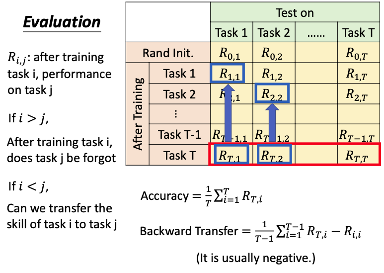

##### Gradient Episodic Memory (GEM)

对于现在在训练的task 2，如果我们修改其梯度的方向，就可以提高之前学习完的task 1的performance；

在下图中，现在要训练的模型是$\theta$，再计算出参数更新的方向g；同时，我们还需要一些前面task的训练资料，再根据这些资料计算出前面task的梯度反方向，也就是前面task参数更新的方向$g^1,g^2$，

如果$g^1,g^2$和g的内积分别都是正的（左），那么我们参数更新的方向就是现在的g；

但也有可能这个内积的负的（右），现在$g^1,g$之间的内积就是负的，如果继续往g的方向更新参数，很可能会对$g^1$这个方向的task造成伤害；我们可以把g的方向稍微变换一下，变成$g'$的方向，使$g'\cdot g^1\geq0,g'\cdot g^2\geq0$，这样进行参数的更新，就不会对之前的task 1和2造成伤害，很可能还会提高其performance；

但g的方向不能变化太大，不能伤害到现在的task。

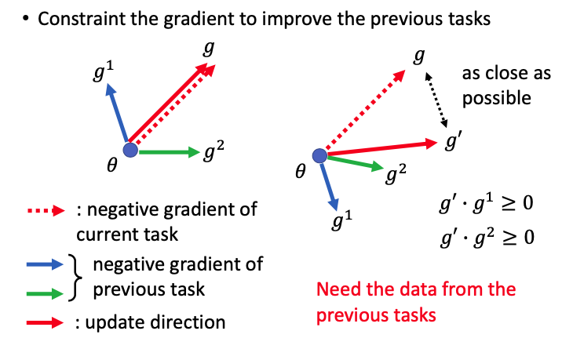

下面是实验结果展示，GEM算法的正确率都还不错。

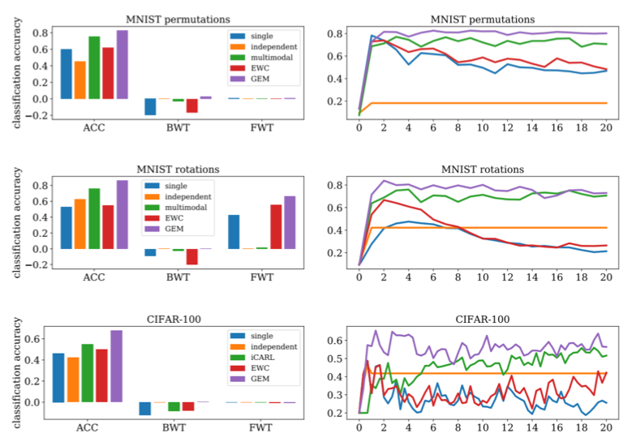

#### Model Expansion

network也可以学习自动扩张，比如扩充一些神经元，但这个扩张并不是毫无限制的，我们希望这个扩张是有效率的，模型扩张的速度最好不要和task加进来的速度成正比。

##### Progressive Neural Networks

首先需要训练task 1，再用新的model来训练task 2，由于要进行knowledge transfer，前一个task的hidden layer的输出，会作为task 2的后面几层的输入；

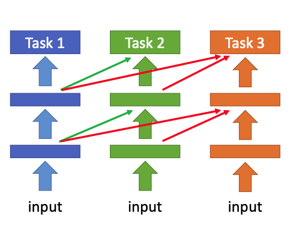

##### Expert Gate

每个task还是需要训练自己的模型，如果进来一个新的任务，会去和旧的任务进行比较，看哪一个旧任务和这个任务最接近；选择最接近的任务来作为新任务的初始化参数；

每次新加入一个任务，都会新加入一个模型，模型的数量和任务的数量是成正比的。

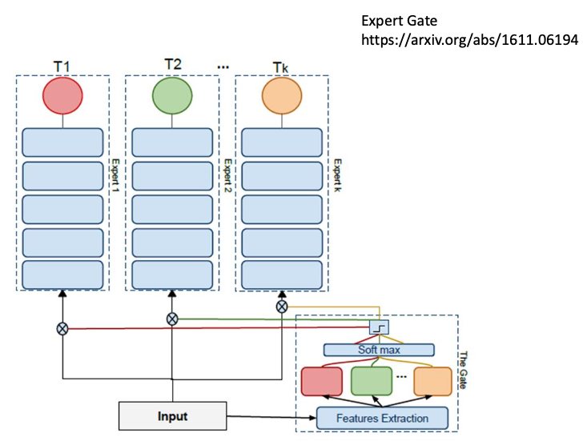

##### Net2Net

如果要把network进行扩张，就需要新加入一些neural，这些新加入的neural很可能会对之前的任务造成影响，很可能会忘记过去学习到的技能。那么怎么加入新的neural，而不忘记过去的技能呢？

如下图所示，要扩张的新神经元是$h[3]$，可以发现扩张之后的网络要做的事和扩张之前是一样的；

但这样做可能有一个问题，这两个网络是完全一样的，我们可以在扩张之后的network加一些noise，使这两个network有区别，但又不会影响原来network已经学习到的技能

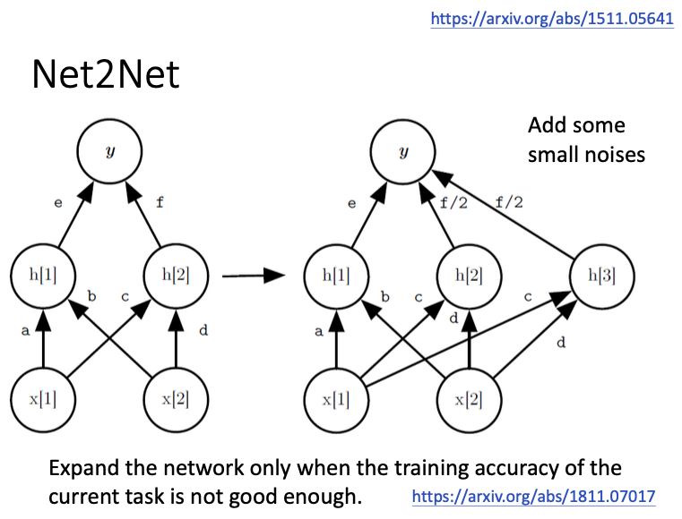