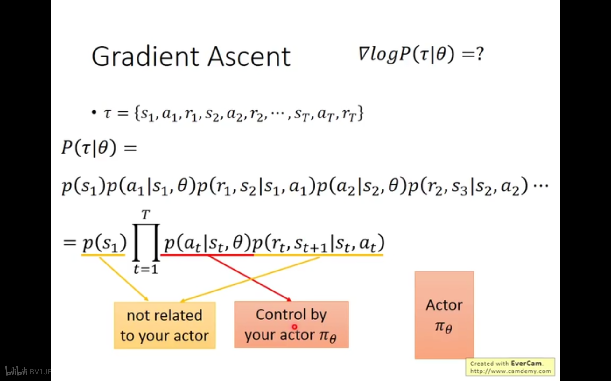
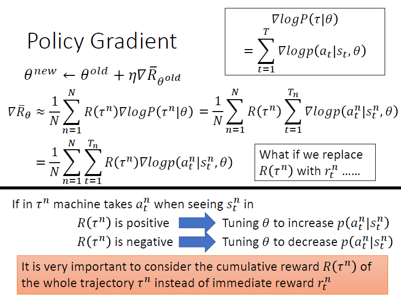
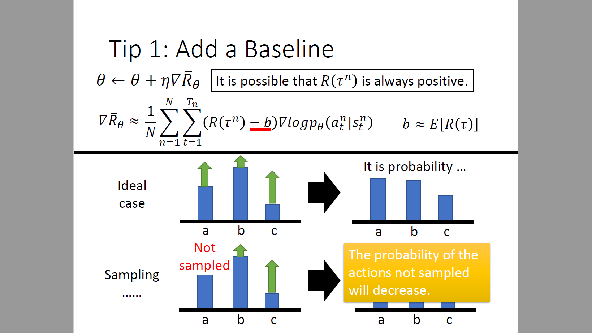
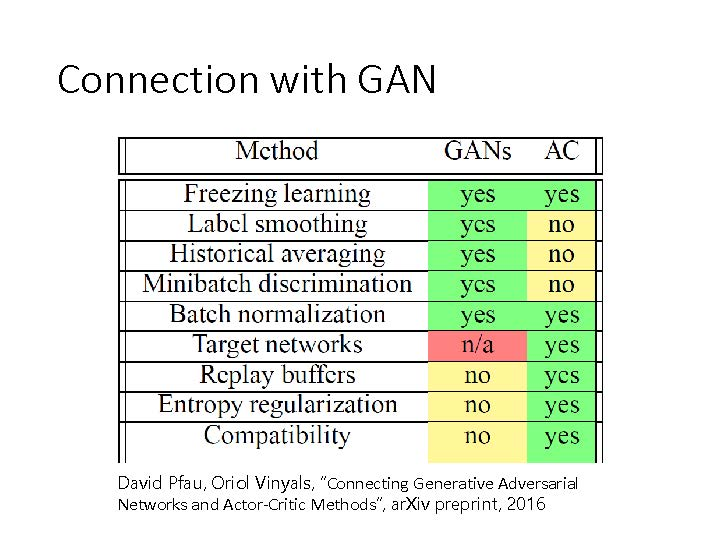
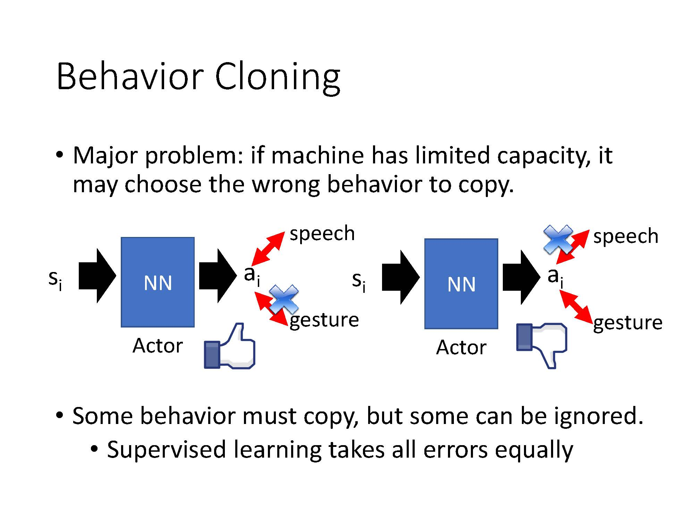

# Deep Reinforcement Learning

深度强化学习可以看做是深度学习加上强化学习

## 1 Scenario of Reinforcement Learning

State可以看做是环境的状态，即Machine看到的状态，这里要注意的是，机器不可能感受到所有的状态。机器做出的Action会影响环境，因为对环境造成了影响，会得到一个reward。例如看到一杯水，打翻了水，得到一个反馈，不要这么做。这时候看到的状态就是水杯打翻的状态，继而采取擦地等动作。

因此Agent的目的是学习如何采取动作获得最大收益。以AlphaGo为例，如果取胜，则reward为1，如果失败，reward为-1。难点在于，很多动作的reward为0。因此需要大量的训练才行。

对比监督学习和强化学习。如果采用监督学习，那么需要告诉机器，下一步应该怎么做。但现实情况是很多情况下人都不知道怎么做。如果采用强化学习，那么它可以在互相下棋的过程中推断（挖掘）哪些策略会比较好。

强化学习还可以用在训练对话机器人场景中。不像围棋有明确的规则，训练对话机器人需要克服如何判断对话的质量。此外还可以用在信息检索、无人机、自动驾驶、文本生成、游戏AI等场景中。

## 2 Difficulties of Reinforcement Learning

+ 反馈是延迟的
+ Agent的行为会影响后续感受到的数据，因此Agent要学会探索。

## 3 现有强化学习的类别

Actor负责做事，Critic不做事，只负责批评。现在最强的方法是A3C(Asynchronous Advantage Actor-Critic)。现在的AlphaGo用了多种方法混合二乘。

### 3.1 Policy-based Approach

Policy-based 方法的目的就是学习一个Function(Actor, Policy)，能够针对一系列输入(Observation)做出一系列输出(Action)。

+ 第一步决定Actor的样式
+ 第二步决定Function的优劣
+ 第三步挑选最好的Function

#### 3.1.1 Neural network as Actor

通常用神经网络作为Actor，因为它的泛化性更好，如果用查找表，那么不可能满足所有的情况（尤其是电子竞技AI）。

#### 3.1.2 Goodness of Actor

在监督学习情况下，看预测值和真实值之间的loss来衡量。而在强化学习中，则是要最大化Total Reward的期望值。

由于穷举所有的情况是不可能的，因此可以让Actor去运行N次，然后去采样 $\tau$ 的后验概率 $P(\tau | \theta)$。

#### 3.1.3 Gradient Ascent

> 这里标红是因为，$\sum_{\tau}P(\tau|\theta)=1$

> 这里解释了为什么要变为log，一方面是为了便于计算；另一方面是因为这样可以做一个Normalization， 消除出现次数不同带来的影响。如下图所示，Action a 明显更优，但由于Action b 出现的次数更多，可能会导致更倾向于选 b 。 

由于采样差异会导致采样少的部分收益会变低。因此需要设计Reward有正有负，可以减去一个偏置，部分消除采样带来的影响。

### 3.2 Critic-based Approach

## 4 Proximal Policy Optimization
是OpenAI的默认强化学习训练方法，包含三个部分
+ Policy Gradient
+ On policy-> Off policy
+ Add constraint

### 4.1 Policy Gradient

通常情况下Enviroment无法控制，只能控制Action。而且为了消除采样带来的影响，计算Reward的期望。用Gradient Ascent算法求解

> 整场游戏结果不好，不等于每个动作都不好。因此这里是给每个动作赋予Credit

> 这里是试图减去未来的Reward，计算更准确

### 4.2 On Policy and Off Policy

> Policy Gradient是On Policy的，Sample一次，只能Gradient Ascent一次，效率很低。所以考虑将On-policy变为Off-policy。因此引入重要性采样，来进行计算期望。

> 这里 $\frac{p_\theta}{p_{\theta^{'}}}$ 可以约掉是因为无法计算

### 4.3 Add Constrians

> 这里相当于是要两个分部差距不是很大，即KL散度小于一定值

> clip相当于设定上下界为$[1-\epsilon, 1+\epsilon]$ 当A>0时，我们希望 $\frac{p_\theta}{p_{\theta^k}}$ 越大越好，但不能超过 $1+\epsilon$。 同理，当$A<0$时，最小值不能小于$1-\epsilon$

## 5 Q-Learning

### 5.1 Introduction of Q-Learning
Q-Learning 是Critic-bsaed  Approach. 我们可以这么理解：根据收益决定当前应当采取什么动作。关键是如何计算收益。可以采用MC和TD两种方法。MC需要遍历所有操作，TD则不需要。

### 5.2 Tips of Q-Learning
 
#### 5.2.1 DQN

> 下图可以解释，Q-Learning容易被高估。因为它总是选择最大的Q Value

> 下图定义了两个Network，第一个网络决定哪个action的Q-value最大。实际选哪个action的时候是用第二个网络算出来的。类似行政与立法的概念。第一个只是提议选哪个action，第二个才真正去算Q-Value。在实际情况中，是有两个network的。一个是更新的Update网络，一个是Target网络（不会动的）。用Update网络提议，Target计算。

#### 5.2.2 Dueling DQN
> Dueling DQN 改变了网络架构。分成两个path, 下面是向量每一个action都有一个value，v(s)是标量，与输入有关。这里要注意，矩阵A(s,a)每一列和为0

#### 5.2.3 Noisy Net

#### 5.2.4 Distributional Q-Function

### 5.3 Q-Learning for Continuous Actions

## 6 A3C (Asynchronous Advantage Action and Critic)

>这里是认为中间项可以化为期望。简单理解A3C可以将偏置b替换为$V^{\pi_\theta}(s_t^n)$, 但这样做会导致需要采样两个网络，难度较大。

> A3C 的核心是训练很多Worker，然后集成

## 6 Sparse Reward

> 假定环境有一个固定的Reward。但这样不易于训练，因此可以设计一个Reward引导训练。

> 这里是解释说要逐步提高训练标准。就好比不能给小孩一开始就讲微积分

>这里是删除不合适Reward的状态

## 7 Imitation Learning
无法直接共环境中得到Reward。

### 7.1 Behavior Cloning
和Supervised Learning类似。Expert做什么，机器就做一样的事情。但这样也有一些问题：

+ 潜在样本空间可能非常大，难以完全遍历。
+ 机器会模仿无关的动作

### 7.2 Inverse Reinforcement Learning
原本是由Reward Function推断什么动作是最好的。现在是反过来，由动作推断潜在Reward Function。 但有一个准则，Expert的Reward永远大于Machine的Reward

